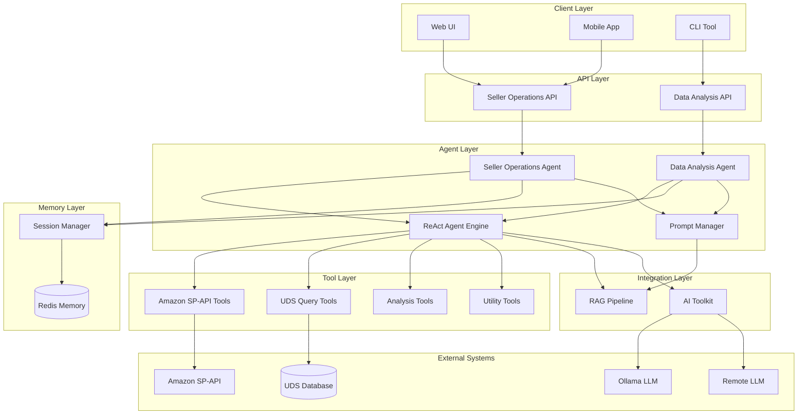

# Design Document: Agent Integration

## Overview

This design document describes the architecture and implementation approach for integrating AI Agent capabilities into the IC-RAG-Agent project. The integration transforms the system from a document retrieval platform into a comprehensive AI agent ecosystem for Amazon cross-border e-commerce operations.

### System Architecture

The agent system consists of four major components built in phases:

1. **ReAct Agent Foundation** (Phase 1): Core agent reasoning engine with tool calling capabilities
2. **Seller Operations Agent** (Phase 2): Amazon SP-API integration for seller operations
3. **Data Analysis Agent** (Phase 3): UDS database querying and business intelligence reporting
4. **Prompt Engineering System** (Phase 4): Dynamic prompt management and optimization

All components integrate with the existing RAG system for knowledge retrieval and use the AI Toolkit for LLM interactions.

### Design Principles

- **Modularity**: Each agent component is independent and can be deployed separately
- **Extensibility**: Tool ecosystem allows easy addition of new capabilities
- **Security**: Sensitive data stays local; remote LLMs only for general knowledge
- **Performance**: Caching, connection pooling, and streaming for scalability
- **Observability**: Comprehensive logging, metrics, and tracing

## Architecture

### High-Level Architecture



### Component Interaction Flow

**Seller Operations Flow:**
1. User sends query via API → Seller Operations Agent
2. Agent classifies intent and retrieves conversation history from Redis
3. Agent generates thought using ReAct engine
4. ReAct engine selects appropriate SP-API tool
5. Tool executes API call to Amazon SP-API
6. Observation returned to ReAct engine
7. Agent generates response and updates conversation memory
8. Response streamed back to user

**Data Analysis Flow:**
1. User sends analysis request via API → Data Analysis Agent
2. Task Planner decomposes request into subtasks
3. User approves task plan
4. For each subtask:
   - ReAct engine selects appropriate UDS tool
   - Tool executes SQL query or analysis
   - Results passed to next subtask
5. Report Generator compiles results
6. Report saved and returned to user

## Components and Interfaces

### Phase 1: ReAct Agent Foundation

#### ReAct Agent Engine

**Purpose**: Core reasoning engine that implements the Thought → Action → Observation loop.

**Dependencies**: Uses Tool base class, ToolExecutor, and ToolResult from ai-toolkit agent-tools-infrastructure.

**Interface**:
```python
from ai_toolkit.tools import BaseTool, ToolExecutor, ToolResult

class ReActAgent:
    def __init__(self, llm: LLM, tools: List[BaseTool], max_iterations: int = 10):
        """Initialize ReAct agent with LLM and tools."""
        self.tool_executor = ToolExecutor()
        
    def run(self, query: str, context: Optional[Dict] = None) -> AgentResponse:
        """Execute ReAct loop until query is resolved or max iterations reached."""
        
    def step(self, state: AgentState) -> AgentState:
        """Execute single ReAct step: generate thought, select action, observe result."""
        
    def register_tool(self, tool: BaseTool) -> None:
        """Register a new tool for the agent to use."""
```

**Key Methods**:
- `_generate_thought()`: Use LLM to generate reasoning about current state
- `_select_action()`: Choose tool based on thought and available tools
- `_execute_action()`: Invoke selected tool using ToolExecutor from ai-toolkit
- `_observe()`: Capture tool output and update state
- `_should_continue()`: Determine if loop should continue

#### Tool Base Class

**Note**: The Tool base class is provided by ai-toolkit agent-tools-infrastructure. All custom tools in IC-RAG-Agent inherit from `ai_toolkit.tools.BaseTool`.

**Reference Interface** (from ai-toolkit):
```python
from ai_toolkit.tools import BaseTool, ToolParameter, ToolResult

class BaseTool(ABC):
    name: str
    description: str
    parameters: Dict[str, ParameterSpec]
    
    @abstractmethod
    def execute(self, **kwargs) -> Any:
        """Execute the tool with given parameters."""
        
    def validate_parameters(self, **kwargs) -> None:
        """Validate parameters before execution."""
        
    def to_schema(self) -> Dict:
        """Return tool schema for LLM function calling."""
```

#### Tool Executor

**Note**: The ToolExecutor is provided by ai-toolkit agent-tools-infrastructure. It handles error handling, retry logic, and timeout management automatically.

**Reference Interface** (from ai-toolkit):
```python
from ai_toolkit.tools import ToolExecutor, ToolResult

class ToolExecutor:
    def __init__(self):
        self.tools: Dict[str, BaseTool] = {}
        
    def register(self, tool: BaseTool) -> None:
        """Register a tool."""
        
    def get_tool(self, name: str) -> Optional[BaseTool]:
        """Retrieve tool by name."""
        
    def execute(self, tool: BaseTool, timeout: Optional[float] = None, **kwargs) -> ToolResult:
        """Execute tool with error handling and retry logic."""
        
    def execute_chain(self, tools: List[BaseTool], initial_input: Any, timeout: Optional[float] = None) -> ToolResult:
        """Execute a chain of tools."""
```

### Phase 2: Seller Operations Agent

#### Seller Operations Agent

**Purpose**: Specialized agent for Amazon seller operations.

**Interface**:
```python
class SellerOperationsAgent:
    def __init__(
        self,
        react_agent: ReActAgent,
        memory: ConversationMemory,
        workflow: LangGraphWorkflow,
        rag_pipeline: RAGPipeline
    ):
        """Initialize seller operations agent."""
        
    async def chat(
        self,
        message: str,
        session_id: str,
        stream: bool = False
    ) -> Union[AgentResponse, AsyncIterator[str]]:
        """Process user message and return response."""
        
    def classify_intent(self, message: str) -> Intent:
        """Classify user intent (SP-API query, UDS query, general)."""
```

#### LangGraph Workflow

**Purpose**: Orchestrates multi-step seller operations workflows.

**Workflow Nodes**:
- `greeting`: Welcome user and initialize session
- `intent_classification`: Determine query type
- `sp_api_execution`: Execute Amazon SP-API tools
- `uds_query_execution`: Execute UDS query tools
- `rag_retrieval`: Retrieve knowledge from RAG system
- `response_generation`: Generate final response
- `error_handling`: Handle errors and retry

**Interface**:
```python
class SellerOperationsWorkflow:
    def __init__(self, agent: SellerOperationsAgent):
        self.graph = self._build_graph()
        
    def _build_graph(self) -> StateGraph:
        """Build LangGraph workflow."""
        
    async def execute(self, input: WorkflowInput) -> WorkflowOutput:
        """Execute workflow from start to end."""
```

**State Definition**:
```python
@dataclass
class WorkflowState:
    message: str
    intent: Optional[Intent]
    conversation_history: List[Message]
    tool_results: List[ToolResult]
    rag_context: Optional[str]
    response: Optional[str]
    error: Optional[str]
```

#### Conversation Memory

**Purpose**: Redis-based memory for multi-turn conversations.

**Interface**:
```python
class ConversationMemory:
    def __init__(self, redis_client: Redis):
        self.redis = redis_client
        
    def create_session(self) -> str:
        """Create new session and return session ID."""
        
    def add_turn(self, session_id: str, user_msg: str, agent_msg: str, metadata: Dict) -> None:
        """Add conversation turn to session."""
        
    def get_history(self, session_id: str, n_turns: int = 5) -> List[Message]:
        """Retrieve recent conversation history."""
        
    def get_user_context(self, session_id: str) -> Dict:
        """Retrieve user context (preferences, frequently queried data)."""
        
    def clear_session(self, session_id: str) -> None:
        """Clear session data."""
```

#### Amazon SP-API Tools

**Tools Implemented**:

1. **Product_Catalog**: Retrieve product details by ASIN/SKU
2. **Inventory_Summary**: Get inventory levels across fulfillment centers
3. **Order_Details**: Query order information
4. **Inbound_Shipment_Status**: Track inbound shipments
5. **Shipment_Items**: List items in shipment
6. **FBA_Fees_Estimate**: Calculate FBA fees
7. **Listing_Status**: Check product listing status
8. **Returns_Report**: Get return data
9. **Sales_Metrics**: Retrieve sales data
10. **Marketplace_Participation**: List active marketplaces

**Example Tool Implementation**:
```python
class ProductCatalogTool(Tool):
    name = "product_catalog"
    description = "Retrieve product details by ASIN or SKU"
    parameters = {
        "identifier": ParameterSpec(type="string", required=True),
        "identifier_type": ParameterSpec(type="string", enum=["ASIN", "SKU"], required=True),
        "marketplace_id": ParameterSpec(type="string", required=False)
    }
    
    def __init__(self, sp_api_client: SPAPIClient):
        self.client = sp_api_client
        
    def execute(self, identifier: str, identifier_type: str, marketplace_id: Optional[str] = None) -> ToolResult:
        try:
            if identifier_type == "ASIN":
                result = self.client.catalog_items.get_catalog_item(asin=identifier)
            else:
                result = self.client.catalog_items.search_catalog_items(keywords=identifier)
            
            return ToolResult(
                success=True,
                output=result,
                metadata={"identifier": identifier, "type": identifier_type}
            )
        except SPAPIException as e:
            return ToolResult(
                success=False,
                output=None,
                error=f"SP-API error: {e.code} - {e.message}"
            )
```

#### SP-API Client Wrapper

**Purpose**: Wrapper around Amazon SP-API SDK with rate limiting and retry logic.

**Interface**:
```python
class SPAPIClient:
    def __init__(self, credentials: SPAPICredentials):
        self.credentials = credentials
        self.rate_limiter = RateLimiter()
        self.cache = TTLCache(maxsize=1000, ttl=300)
        
    def call_api(self, endpoint: str, method: str, **kwargs) -> Dict:
        """Call SP-API with rate limiting and caching."""
        
    def handle_rate_limit(self, retry_after: int) -> None:
        """Handle rate limit with exponential backoff."""
```

### Phase 3: Data Analysis Agent

#### Data Analysis Agent

**Purpose**: Specialized agent for UDS data analysis and reporting.

**Interface**:
```python
class DataAnalysisAgent:
    def __init__(
        self,
        react_agent: ReActAgent,
        task_planner: TaskPlanner,
        rag_pipeline: RAGPipeline
    ):
        """Initialize data analysis agent."""
        
    async def analyze(
        self,
        query: str,
        auto_approve: bool = False
    ) -> AnalysisResult:
        """Analyze data based on natural language query."""
        
    def generate_report(
        self,
        analysis_result: AnalysisResult,
        format: str = "markdown"
    ) -> Report:
        """Generate report from analysis results."""
```

#### Task Planner

**Purpose**: Decomposes complex analysis requests into executable subtasks.

**Interface**:
```python
class TaskPlanner:
    def __init__(self, llm: LLM, tools: List[Tool]):
        self.llm = llm
        self.tools = tools
        
    def plan(self, query: str) -> TaskPlan:
        """Generate task plan from query."""
        
    def validate_plan(self, plan: TaskPlan) -> bool:
        """Validate that plan is executable."""
        
    def execute_plan(self, plan: TaskPlan) -> PlanResult:
        """Execute task plan step by step."""
```

**Task Plan Structure**:
```python
@dataclass
class Task:
    id: str
    description: str
    tool: str
    parameters: Dict
    dependencies: List[str]
    estimated_time: int

@dataclass
class TaskPlan:
    query: str
    tasks: List[Task]
    execution_order: List[str]
    total_estimated_time: int
```

#### UDS Query Tools

**Tools Implemented**:

1. **UDS_SQL_Query**: Generate and execute SQL queries
2. **UDS_Schema_Inspector**: Retrieve schema information
3. **Data_Aggregation**: Perform aggregations
4. **Trend_Analysis**: Identify trends over time
5. **Comparison_Report**: Compare metrics
6. **Visualization**: Create charts
7. **Report_Generator**: Compile reports
8. **Data_Export**: Export results

**Example Tool Implementation**:
```python
class UDSSQLQueryTool(Tool):
    name = "uds_sql_query"
    description = "Generate and execute SQL query against UDS database"
    parameters = {
        "query_description": ParameterSpec(type="string", required=True),
        "tables": ParameterSpec(type="array", required=False),
        "filters": ParameterSpec(type="object", required=False)
    }
    
    def __init__(self, uds_client: UDSClient, llm: LLM):
        self.client = uds_client
        self.llm = llm
        
    def execute(self, query_description: str, tables: Optional[List[str]] = None, filters: Optional[Dict] = None) -> ToolResult:
        # Get schema information
        schema = self.client.get_schema(tables)
        
        # Generate SQL using LLM
        sql = self._generate_sql(query_description, schema, filters)
        
        # Validate SQL
        if not self._validate_sql(sql):
            return ToolResult(success=False, error="Invalid SQL generated")
        
        # Execute query
        try:
            result = self.client.execute_query(sql)
            return ToolResult(
                success=True,
                output=result,
                metadata={"sql": sql, "row_count": len(result)}
            )
        except Exception as e:
            return ToolResult(success=False, error=str(e))
```

#### UDS Database Client

**Purpose**: Connection and query execution for UDS database.

**Interface**:
```python
class UDSClient:
    def __init__(self, connection_params: Dict):
        self.connection_pool = self._create_pool(connection_params)
        self.schema_cache = TTLCache(maxsize=100, ttl=3600)
        
    def execute_query(self, sql: str, params: Optional[Dict] = None) -> List[Dict]:
        """Execute SQL query with parameterization."""
        
    def get_schema(self, tables: Optional[List[str]] = None) -> Dict:
        """Retrieve schema information with caching."""
        
    def stream_query(self, sql: str) -> Iterator[Dict]:
        """Stream large query results."""
```

#### Report Generator

**Purpose**: Compiles analysis results into formatted reports.

**Interface**:
```python
class ReportGenerator:
    def __init__(self, template_dir: str):
        self.templates = self._load_templates(template_dir)
        
    def generate_markdown(self, analysis_result: AnalysisResult) -> str:
        """Generate Markdown report."""
        
    def generate_pdf(self, analysis_result: AnalysisResult, output_path: str) -> str:
        """Generate PDF report using ReportLab."""
        
    def add_visualization(self, report: Report, chart: Chart) -> Report:
        """Embed visualization in report."""
```

### Phase 4: Prompt Engineering System

#### Template Manager

**Purpose**: Manages prompt templates with versioning.

**Interface**:
```python
class TemplateManager:
    def __init__(self, storage_path: str):
        self.storage = TemplateStorage(storage_path)
        
    def save_template(self, name: str, content: str, domain: str, version: Optional[str] = None) -> str:
        """Save template and return version ID."""
        
    def get_template(self, name: str, version: Optional[str] = None) -> Template:
        """Retrieve template by name and optional version."""
        
    def list_templates(self, domain: Optional[str] = None) -> List[TemplateInfo]:
        """List available templates."""
        
    def rollback(self, name: str, version: str) -> None:
        """Rollback template to previous version."""
```

**Template Structure**:
```python
@dataclass
class Template:
    name: str
    content: str
    domain: str
    version: str
    created_at: datetime
    variables: List[str]
```

#### Dynamic Prompt Generator

**Purpose**: Generates prompts dynamically based on context.

**Interface**:
```python
class DynamicPromptGenerator:
    def __init__(self, template_manager: TemplateManager, rag_pipeline: RAGPipeline):
        self.templates = template_manager
        self.rag = rag_pipeline
        
    def generate(
        self,
        template_name: str,
        context: Dict,
        include_examples: bool = True
    ) -> str:
        """Generate prompt from template and context."""
        
    def add_few_shot_examples(self, prompt: str, query: str, n_examples: int = 3) -> str:
        """Add few-shot examples to prompt."""
        
    def add_chain_of_thought(self, prompt: str) -> str:
        """Add Chain-of-Thought instructions to prompt."""
```

#### Few-Shot Example Manager

**Purpose**: Manages and retrieves few-shot examples.

**Interface**:
```python
class FewShotExampleManager:
    def __init__(self, storage_path: str, embedding_model: EmbeddingModel):
        self.storage = ExampleStorage(storage_path)
        self.embedder = embedding_model
        self.vector_store = ChromaDB()
        
    def add_example(self, example: Example) -> None:
        """Add example and embed it."""
        
    def retrieve_examples(
        self,
        query: str,
        domain: Optional[str] = None,
        n_examples: int = 3,
        min_similarity: float = 0.7
    ) -> List[Example]:
        """Retrieve relevant examples by similarity."""
        
    def validate_example(self, example: Example) -> bool:
        """Validate example format."""
```

**Example Structure**:
```python
@dataclass
class Example:
    id: str
    domain: str
    task_type: str
    input: str
    output: str
    reasoning: Optional[str]
    tags: List[str]
```

## Data Models

### Agent State

```python
@dataclass
class AgentState:
    query: str
    thoughts: List[str]
    actions: List[Action]
    observations: List[Observation]
    iteration: int
    max_iterations: int
    is_complete: bool
    final_answer: Optional[str]
```

### Action

```python
@dataclass
class Action:
    tool_name: str
    parameters: Dict
    reasoning: str
    timestamp: datetime
```

### Observation

```python
@dataclass
class Observation:
    action_id: str
    result: ToolResult
    timestamp: datetime
```

### Message

```python
@dataclass
class Message:
    role: str  # "user" or "agent"
    content: str
    timestamp: datetime
    metadata: Dict
```

### Intent

```python
class Intent(Enum):
    SP_API_QUERY = "sp_api_query"
    UDS_QUERY = "uds_query"
    HYBRID = "hybrid"
    GENERAL = "general"
    UNKNOWN = "unknown"
```

### Analysis Result

```python
@dataclass
class AnalysisResult:
    query: str
    task_plan: TaskPlan
    task_results: List[TaskResult]
    visualizations: List[Chart]
    summary: str
    execution_time: float
```

### Report

```python
@dataclass
class Report:
    title: str
    summary: str
    sections: List[ReportSection]
    visualizations: List[Chart]
    metadata: ReportMetadata
    format: str  # "markdown" or "pdf"
```

### Configuration Models

```python
@dataclass
class SPAPICredentials:
    refresh_token: str
    client_id: str
    client_secret: str
    region: str

@dataclass
class UDSConnectionParams:
    host: str
    port: int
    database: str
    username: str
    password: str
    driver: str  # "postgresql", "mysql", or "clickhouse"

@dataclass
class RedisConfig:
    host: str
    port: int
    password: Optional[str]
    db: int
    ttl: int  # Session TTL in seconds
```


## Correctness Properties

A property is a characteristic or behavior that should hold true across all valid executions of a system—essentially, a formal statement about what the system should do. Properties serve as the bridge between human-readable specifications and machine-verifiable correctness guarantees.

The following properties are derived from the acceptance criteria in the requirements document. Each property is universally quantified and references the specific requirements it validates.

### Phase 1: ReAct Agent Foundation Properties

**Property 1: Thought Generation Completeness**
*For any* user query provided to the ReAct Agent, the agent should generate a non-empty thought string that provides reasoning about how to approach the query.
**Validates: Requirements 1.1**

**Property 2: Tool Selection Consistency**
*For any* generated thought and set of available tools, the agent should select a tool whose description or capabilities match the intent expressed in the thought.
**Validates: Requirements 1.2**

**Property 3: Observation Capture**
*For any* tool execution, the resulting observation should be captured in the agent state and include the tool output, success status, and timestamp.
**Validates: Requirements 1.3**

**Property 4: Loop Continuation**
*For any* ReAct Agent execution, the agent should continue the Thought → Action → Observation loop until either the query is resolved or the maximum iteration count is reached.
**Validates: Requirements 1.4**

**Property 5: Error Recovery**
*For any* tool execution that fails, the agent should continue operation by selecting a different tool or approach rather than terminating.
**Validates: Requirements 1.6**

**Property 6: Tool Inheritance**
*For any* tool registered in the system, the tool should be an instance of the base Tool class.
**Validates: Requirements 1.10**

**Property 7: Tool Parameter Validation**
*For any* tool invocation with invalid parameters, the tool should return a ToolResult with success=False and a descriptive error message without executing the tool logic.
**Validates: Requirements 2.9, 2.12**

**Property 8: Tool Output Structure**
*For any* tool invocation with valid parameters, the tool should return a ToolResult object with success, output, and metadata fields.
**Validates: Requirements 2.10**

**Property 9: Tool Chaining**
*For any* sequence of tool executions where tool B depends on tool A's output, the output from tool A should be successfully passed as input to tool B.
**Validates: Requirements 2.11**

**Property 10: Timeout and Retry**
*For any* tool that makes external API calls, if the call exceeds the configured timeout, the tool should retry with exponential backoff up to a maximum number of attempts.
**Validates: Requirements 2.13**

**Property 11: Rate Limit Handling**
*For any* Amazon SP-API tool that encounters a rate limit response (HTTP 429), the tool should implement exponential backoff before retrying the request.
**Validates: Requirements 2.14, 6.12**


### Phase 2: Seller Operations Agent Properties

**Property 12: Session Creation**
*For any* new conversation initiated by a user, the system should create a unique session ID and initialize conversation memory in Redis.
**Validates: Requirements 3.2, 5.2**

**Property 13: Conversation History Retrieval**
*For any* user message in an existing session, the system should retrieve the N most recent conversation turns (where N is configurable, default 5) from memory.
**Validates: Requirements 3.3, 5.4**

**Property 14: Intent Classification and Routing**
*For any* user query, the system should classify the intent (SP-API, UDS, hybrid, or general) and route to the appropriate workflow node.
**Validates: Requirements 3.4, 4.2**

**Property 15: RAG Integration**
*For any* query that requires domain knowledge (SP-API documentation, best practices), the agent should query the RAG Pipeline and include retrieved context in the prompt.
**Validates: Requirements 3.5**

**Property 16: Context Preservation**
*For any* multi-turn conversation, the agent should maintain context by referencing information from previous turns when generating responses.
**Validates: Requirements 3.7**

**Property 17: Memory Persistence**
*For any* conversation turn, the system should persist the turn to Redis with a session-based key, TTL, and all required fields (timestamp, user message, agent response, metadata).
**Validates: Requirements 3.8, 5.1, 5.3**

**Property 18: Clarification Behavior**
*For any* ambiguous query (where intent confidence is below a threshold), the agent should generate a clarifying question before executing tools.
**Validates: Requirements 3.9**

**Property 19: Workflow State Transitions**
*For any* workflow execution, when a node completes, the system should transition to the next node based on the node's output and the workflow graph definition.
**Validates: Requirements 4.4**

**Property 20: Error Node Transition**
*For any* workflow execution where a node raises an exception, the system should transition to the error handling node.
**Validates: Requirements 4.5**

**Property 21: Conditional Branching**
*For any* workflow with conditional branches, the system should evaluate the condition based on intermediate results and follow the correct branch.
**Validates: Requirements 4.6**

**Property 22: Workflow Pause and Resume**
*For any* workflow that requires human intervention, the system should pause execution, wait for human input, and resume from the paused state.
**Validates: Requirements 4.7**

**Property 23: Parallel Node Execution**
*For any* workflow with independent nodes (no dependencies between them), the system should execute those nodes in parallel rather than sequentially.
**Validates: Requirements 4.9**

**Property 24: Workflow Response Completeness**
*For any* completed workflow, the response should include all intermediate results from each node execution.
**Validates: Requirements 4.10**

**Property 25: User Context Separation**
*For any* session, user context information (preferences, frequently queried data) should be stored separately from conversation history in Redis.
**Validates: Requirements 5.5**

**Property 26: Session Archival**
*For any* session that expires (TTL reached), the conversation history should be archived to long-term storage before being removed from Redis.
**Validates: Requirements 5.6**

**Property 27: Session Resumption**
*For any* archived session, when a user returns and references the session, the system should load the archived conversation history.
**Validates: Requirements 5.7**

**Property 28: Stateless Fallback**
*For any* memory storage operation that fails, the system should continue in stateless mode (without conversation history) and log the error.
**Validates: Requirements 5.8**

**Property 29: Memory Compression**
*For any* conversation history stored in Redis, the compressed size should be smaller than the uncompressed size.
**Validates: Requirements 5.9**

**Property 30: SP-API Authentication**
*For any* SP-API tool execution, the tool should retrieve credentials from secure storage and include them in the API request.
**Validates: Requirements 6.11**

**Property 31: SP-API Error Parsing**
*For any* SP-API error response, the system should parse the error code and return a user-friendly error message.
**Validates: Requirements 6.13**

**Property 32: SP-API Response Caching**
*For any* SP-API request for frequently accessed data, if a cached response exists and is not expired (within TTL), the system should return the cached response without making an API call.
**Validates: Requirements 6.14**

**Property 33: API Streaming**
*For any* API request with streaming enabled, the system should send multiple Server-Sent Events (SSE) as the response is generated.
**Validates: Requirements 7.3, 7.4**

**Property 34: API Rate Limiting**
*For any* user making requests to the API, if the request rate exceeds the configured limit, the system should return HTTP 429 (Too Many Requests).
**Validates: Requirements 7.11**

**Property 35: API Error Response Structure**
*For any* API error, the response should include a structured error object with an error code, message, and appropriate HTTP status code.
**Validates: Requirements 7.12**

**Property 36: CORS Support**
*For any* cross-origin request to the API, the response should include appropriate CORS headers (Access-Control-Allow-Origin, etc.).
**Validates: Requirements 7.13**


### Phase 3: Data Analysis Agent Properties

**Property 37: Natural Language Query Processing**
*For any* natural language query about business data, the Data Analysis Agent should accept and process the query without requiring SQL knowledge from the user.
**Validates: Requirements 8.1**

**Property 38: Task Decomposition**
*For any* complex analysis query, the Task Planner should generate a task plan with at least 3 executable subtasks.
**Validates: Requirements 8.2, 9.1**

**Property 39: Dependency Detection**
*For any* generated task plan, the system should identify dependencies between subtasks (which subtasks require outputs from other subtasks).
**Validates: Requirements 8.3, 9.2**

**Property 40: Dependency-Based Execution Order**
*For any* task plan with dependencies, subtasks should execute in an order that ensures all dependencies are satisfied (dependent tasks execute after their prerequisites).
**Validates: Requirements 8.4, 9.7**

**Property 41: Data Flow Between Subtasks**
*For any* subtask that depends on another subtask's output, the output from the prerequisite subtask should be passed as input to the dependent subtask.
**Validates: Requirements 8.5**

**Property 42: Analysis Error Messaging**
*For any* analysis task that fails, the system should provide a detailed error message explaining what went wrong and suggest potential corrections.
**Validates: Requirements 8.7**

**Property 43: Task State Persistence**
*For any* task plan execution, the system should persist the execution state (completed tasks, pending tasks, intermediate results) to allow resumption after interruptions.
**Validates: Requirements 8.8**

**Property 44: UDS RAG Integration**
*For any* data analysis query, the agent should query the RAG Pipeline to retrieve UDS schema documentation and query examples to inform SQL generation.
**Validates: Requirements 8.9**

**Property 45: Multi-Format Report Generation**
*For any* completed analysis, the system should be able to generate reports in both Markdown and PDF formats.
**Validates: Requirements 8.10, 12.1, 12.2**

**Property 46: Task Plan Validation**
*For any* generated task plan, all subtasks should reference tools that are available and registered in the system.
**Validates: Requirements 9.3**

**Property 47: Task Plan Approval**
*For any* generated task plan, the system should present the plan to the user and wait for approval before beginning execution.
**Validates: Requirements 9.4**

**Property 48: Task Plan Regeneration**
*For any* task plan that is rejected by the user, the system should generate a new plan incorporating the user's feedback.
**Validates: Requirements 9.5**

**Property 49: Execution Time Estimation**
*For any* generated task plan, each subtask should include an estimated execution time in seconds.
**Validates: Requirements 9.6**

**Property 50: Parallel Subtask Execution**
*For any* task plan with independent subtasks (no dependencies between them), the system should execute those subtasks in parallel.
**Validates: Requirements 9.8**

**Property 51: Failure Handling in Task Plans**
*For any* subtask failure during execution, the Task Planner should determine whether the overall plan can continue (if the failed task is optional) or must abort (if the failed task is critical).
**Validates: Requirements 9.9**

**Property 52: SQL Query Validation**
*For any* SQL query generated by the UDS_SQL_Query tool, the system should validate the query syntax before executing it against the database.
**Validates: Requirements 10.9**

**Property 53: Missing Value Handling**
*For any* dataset processed by the Data_Aggregation tool, the tool should handle missing values (NULL, NaN) without raising exceptions.
**Validates: Requirements 10.10**

**Property 54: Automatic Chart Type Selection**
*For any* visualization request, the Visualization tool should select an appropriate chart type (bar, line, pie, scatter, etc.) based on the data characteristics (categorical vs. numerical, time series, etc.).
**Validates: Requirements 10.11**

**Property 55: Large Dataset Handling**
*For any* dataset exceeding a size threshold (configurable, default 10,000 rows), the system should implement pagination or sampling to prevent memory overflow.
**Validates: Requirements 10.12**

**Property 56: UDS Authentication**
*For any* connection to the UDS database, the system should authenticate using the configured username and password.
**Validates: Requirements 11.2**

**Property 57: Multi-Schema Support**
*For any* UDS session, the system should support querying multiple schemas or databases without requiring reconnection.
**Validates: Requirements 11.3**

**Property 58: Query Timeout**
*For any* SQL query execution, if the query exceeds the configured timeout (default 30 seconds), the system should cancel the query and return a timeout error.
**Validates: Requirements 11.4**

**Property 59: Result Streaming**
*For any* SQL query that returns a large result set (exceeding a threshold), the system should stream results rather than loading them entirely into memory.
**Validates: Requirements 11.5**

**Property 60: Schema Introspection**
*For any* UDS database connection, the system should be able to retrieve schema information (list of tables, columns, data types) through introspection.
**Validates: Requirements 11.6**

**Property 61: Schema-Based Validation**
*For any* generated SQL query, the system should validate table and column names against the retrieved schema information before execution.
**Validates: Requirements 11.7**

**Property 62: Parameterized Queries**
*For any* SQL query with user-provided values, the system should use parameterized queries (prepared statements) to prevent SQL injection.
**Validates: Requirements 11.8**

**Property 63: UDS Connection Retry**
*For any* UDS connection failure, the system should retry the connection with exponential backoff up to a maximum number of attempts.
**Validates: Requirements 11.9**

**Property 64: UDS Schema Caching**
*For any* schema introspection request, if cached schema information exists and is not expired (within TTL), the system should return the cached schema without querying the database.
**Validates: Requirements 11.11**

**Property 65: Report Structure Completeness**
*For any* generated report, the report should include all required sections: title, executive summary, data sources, analysis results, and conclusions.
**Validates: Requirements 12.3**

**Property 66: Visualization Embedding**
*For any* report with visualizations, the visualizations should be embedded as images within the report document.
**Validates: Requirements 12.4**

**Property 67: Report Template Support**
*For any* report generation request with a specified template, the generated report should follow the structure and formatting defined in that template.
**Validates: Requirements 12.5**

**Property 68: Report Metadata Inclusion**
*For any* generated report, the report should include metadata (generation timestamp, data sources, query parameters, UDS tables used).
**Validates: Requirements 12.7**

**Property 69: Report File Saving**
*For any* generated report, the report file should be saved to the configured output directory with a unique filename.
**Validates: Requirements 12.8**

**Property 70: Cloud Storage Export**
*For any* report generation with cloud storage configured, the report should be uploaded to the configured cloud storage location (S3, Google Drive).
**Validates: Requirements 12.9**

**Property 71: Scheduled Report Generation**
*For any* configured report schedule, the system should automatically generate and save reports at the specified intervals.
**Validates: Requirements 12.11**


### Phase 4: Prompt Engineering System Properties

**Property 72: Template Versioning**
*For any* prompt template update, the system should create a new version while preserving all previous versions for rollback.
**Validates: Requirements 13.1, 13.2**

**Property 73: Dynamic Placeholder Replacement**
*For any* prompt generation from a template, all placeholders in the template should be replaced with context-specific values.
**Validates: Requirements 13.3**

**Property 74: Few-Shot Example Retrieval**
*For any* prompt generation request with few-shot learning enabled, the system should retrieve relevant examples using vector similarity search.
**Validates: Requirements 13.4, 14.3**

**Property 75: Few-Shot Example Count**
*For any* prompt with few-shot examples, the prompt should include at least 3 examples (or fewer if insufficient examples exist).
**Validates: Requirements 13.5**

**Property 76: Chain-of-Thought Inclusion**
*For any* complex reasoning task, the generated prompt should include Chain-of-Thought instructions that guide the LLM to show its reasoning steps.
**Validates: Requirements 13.6**

**Property 77: Template Domain Organization**
*For any* template storage system, templates should be organized by domain (seller_operations, uds, general) with separate directories or namespaces.
**Validates: Requirements 13.7**

**Property 78: Template Version Selection**
*For any* template retrieval request, if a specific version is requested, that version should be returned; otherwise, the latest version should be returned.
**Validates: Requirements 13.8**

**Property 79: A/B Testing Metrics**
*For any* template used in production, the system should track metrics (success rate, user satisfaction, task completion) to enable A/B testing.
**Validates: Requirements 13.9**

**Property 80: Example Storage Format**
*For any* few-shot example stored in the system, the example should be in JSON format with all required fields (id, domain, task_type, input, output).
**Validates: Requirements 14.1**

**Property 81: Example Embedding Consistency**
*For any* few-shot example stored in the system, the example should be embedded using the same embedding model as the RAG system.
**Validates: Requirements 14.2**

**Property 82: Example Filtering**
*For any* example retrieval request with filters (domain, task_type, tags), only examples matching all specified filters should be returned.
**Validates: Requirements 14.4**

**Property 83: Example Fallback**
*For any* example retrieval request where no relevant examples are found (all similarity scores below threshold), the system should return a default set of general examples.
**Validates: Requirements 14.5**

**Property 84: Example Hot-Reloading**
*For any* new example added to the system, the example should be immediately available for retrieval without requiring a system restart.
**Validates: Requirements 14.6**

**Property 85: Example Domain Separation**
*For any* example storage system, examples for seller operations and data analysis should be stored in separate databases or collections.
**Validates: Requirements 14.7**

**Property 86: Example Similarity Threshold**
*For any* example retrieval request, only examples with similarity scores above the configured threshold should be returned.
**Validates: Requirements 14.8**

**Property 87: Example Validation**
*For any* example added to the system, the example should be validated to ensure it follows the expected format (has required fields, correct data types) before being stored.
**Validates: Requirements 14.9**


## Error Handling

### Error Categories

The system handles four categories of errors:

1. **Tool Execution Errors**: Failures in tool execution (API errors, timeouts, invalid responses)
2. **LLM Errors**: Failures in LLM calls (rate limits, invalid responses, hallucinations)
3. **Infrastructure Errors**: Failures in supporting systems (Redis, UDS, RAG)
4. **User Input Errors**: Invalid or malicious user inputs

### Error Handling Strategies

#### Tool Execution Errors

**Strategy**: Retry with exponential backoff, fallback to alternative tools, graceful degradation.

```python
class ToolExecutor:
    async def execute_with_retry(self, tool: Tool, **kwargs) -> ToolResult:
        max_retries = 3
        base_delay = 1.0
        
        for attempt in range(max_retries):
            try:
                result = await tool.execute(**kwargs)
                if result.success:
                    return result
                    
                # Handle specific error types
                if "rate_limit" in result.error.lower():
                    delay = base_delay * (2 ** attempt)
                    await asyncio.sleep(delay)
                    continue
                else:
                    # Non-retryable error
                    return result
                    
            except Exception as e:
                if attempt == max_retries - 1:
                    return ToolResult(
                        success=False,
                        output=None,
                        error=f"Tool execution failed after {max_retries} attempts: {str(e)}"
                    )
                await asyncio.sleep(base_delay * (2 ** attempt))
```

#### LLM Errors

**Strategy**: Retry with different prompts, fallback to simpler models, use cached responses.

```python
class LLMErrorHandler:
    async def call_with_fallback(self, prompt: str) -> str:
        try:
            # Try primary LLM
            response = await self.primary_llm.generate(prompt)
            return response
        except RateLimitError:
            # Wait and retry
            await asyncio.sleep(60)
            return await self.primary_llm.generate(prompt)
        except Exception as e:
            # Fallback to secondary LLM
            logger.warning(f"Primary LLM failed: {e}, falling back to secondary")
            return await self.secondary_llm.generate(prompt)
```

#### Infrastructure Errors

**Strategy**: Graceful degradation, stateless fallback, circuit breaker pattern.

```python
class CircuitBreaker:
    def __init__(self, failure_threshold: int = 5, timeout: int = 60):
        self.failure_count = 0
        self.failure_threshold = failure_threshold
        self.timeout = timeout
        self.last_failure_time = None
        self.state = "closed"  # closed, open, half-open
        
    async def call(self, func, *args, **kwargs):
        if self.state == "open":
            if time.time() - self.last_failure_time > self.timeout:
                self.state = "half-open"
            else:
                raise CircuitBreakerOpenError("Circuit breaker is open")
                
        try:
            result = await func(*args, **kwargs)
            if self.state == "half-open":
                self.state = "closed"
                self.failure_count = 0
            return result
        except Exception as e:
            self.failure_count += 1
            self.last_failure_time = time.time()
            if self.failure_count >= self.failure_threshold:
                self.state = "open"
            raise e
```

#### User Input Errors

**Strategy**: Input validation, sanitization, parameterized queries.

```python
class InputValidator:
    def validate_sql_query(self, query: str) -> bool:
        # Check for SQL injection patterns
        dangerous_patterns = [
            r";\s*DROP",
            r";\s*DELETE",
            r";\s*UPDATE",
            r"--",
            r"/\*",
            r"xp_cmdshell"
        ]
        for pattern in dangerous_patterns:
            if re.search(pattern, query, re.IGNORECASE):
                raise SecurityError(f"Potentially dangerous SQL pattern detected: {pattern}")
        return True
        
    def sanitize_user_input(self, input: str) -> str:
        # Remove control characters
        sanitized = re.sub(r'[\x00-\x1F\x7F]', '', input)
        # Limit length
        return sanitized[:10000]
```

### Error Logging and Monitoring

All errors are logged with structured logging:

```python
logger.error(
    "Tool execution failed",
    extra={
        "tool_name": tool.name,
        "parameters": kwargs,
        "error_type": type(e).__name__,
        "error_message": str(e),
        "stack_trace": traceback.format_exc(),
        "session_id": session_id,
        "user_id": user_id
    }
)
```

Critical errors trigger alerts:

```python
if isinstance(e, CriticalError):
    alerting_service.send_alert(
        severity="critical",
        message=f"Critical error in {component}: {str(e)}",
        metadata={"component": component, "error": str(e)}
    )
```

## Testing Strategy

### Dual Testing Approach

The system uses both unit tests and property-based tests for comprehensive coverage:

- **Unit Tests**: Verify specific examples, edge cases, and error conditions
- **Property Tests**: Verify universal properties across all inputs

Both approaches are complementary and necessary. Unit tests catch concrete bugs in specific scenarios, while property tests verify general correctness across a wide range of inputs.

### Unit Testing

Unit tests focus on:
- Specific examples that demonstrate correct behavior
- Integration points between components
- Edge cases and error conditions
- Mocked external dependencies (SP-API, UDS, LLM)

**Example Unit Test**:
```python
def test_product_catalog_tool_with_valid_asin():
    """Test ProductCatalogTool with a valid ASIN."""
    mock_client = Mock()
    mock_client.catalog_items.get_catalog_item.return_value = {
        "asin": "B08N5WRWNW",
        "title": "Example Product",
        "brand": "Example Brand"
    }
    
    tool = ProductCatalogTool(mock_client)
    result = tool.execute(identifier="B08N5WRWNW", identifier_type="ASIN")
    
    assert result.success == True
    assert result.output["asin"] == "B08N5WRWNW"
    assert "title" in result.output
```

### Property-Based Testing

Property tests verify universal properties using randomized inputs. Each property test:
- Runs a minimum of 100 iterations
- References the design document property
- Uses a PBT library (Hypothesis for Python, fast-check for TypeScript)

**Property Test Configuration**:
```python
from hypothesis import given, settings
from hypothesis.strategies import text, integers, lists

@settings(max_examples=100)
@given(query=text(min_size=1, max_size=1000))
def test_property_1_thought_generation_completeness(query):
    """
    Feature: agent-integration, Property 1: Thought Generation Completeness
    For any user query, the agent should generate a non-empty thought string.
    """
    agent = ReActAgent(llm=mock_llm, tools=[])
    state = AgentState(query=query, thoughts=[], actions=[], observations=[], iteration=0, max_iterations=10, is_complete=False, final_answer=None)
    
    new_state = agent.step(state)
    
    assert len(new_state.thoughts) > 0
    assert new_state.thoughts[-1] != ""
    assert len(new_state.thoughts[-1]) > 10  # Meaningful thought
```

**Property Test Tags**:
Each property test includes a comment tag referencing the design property:
```python
# Feature: agent-integration, Property 1: Thought Generation Completeness
```

### Integration Testing

Integration tests verify interactions between components:
- RAG + Agent integration
- Memory + Agent integration
- Tool chain execution
- Workflow orchestration

**Example Integration Test**:
```python
@pytest.mark.integration
async def test_seller_agent_with_rag_integration():
    """Test Seller Operations Agent integrating with RAG Pipeline."""
    rag_pipeline = RAGPipeline.build()
    agent = SellerOperationsAgent(
        react_agent=ReActAgent(llm=llm, tools=tools),
        memory=ConversationMemory(redis_client),
        workflow=SellerOperationsWorkflow(),
        rag_pipeline=rag_pipeline
    )
    
    response = await agent.chat(
        message="What are the FBA fees for ASIN B08N5WRWNW?",
        session_id="test-session"
    )
    
    assert response.success
    assert "FBA" in response.message
    # Verify RAG was queried
    assert rag_pipeline.query_count > 0
```

### End-to-End Testing

E2E tests verify complete workflows:
- Complete seller operations scenarios
- Complete data analysis workflows
- Multi-turn conversations
- Report generation

**Example E2E Test**:
```python
@pytest.mark.e2e
async def test_complete_uds_workflow():
    """Test complete data analysis workflow from query to report."""
    agent = DataAnalysisAgent(
        react_agent=ReActAgent(llm=llm, tools=uds_tools),
        task_planner=TaskPlanner(llm=llm, tools=uds_tools),
        rag_pipeline=rag_pipeline
    )
    
    # Submit analysis query
    result = await agent.analyze(
        query="Show me sales trends for the last 3 months by product category",
        auto_approve=True
    )
    
    assert result.success
    assert len(result.task_results) >= 3
    assert len(result.visualizations) > 0
    
    # Generate report
    report = agent.generate_report(result, format="markdown")
    assert "Sales Trends" in report.title
    assert len(report.sections) >= 4
    assert report.format == "markdown"
```

### Performance Testing

Performance tests measure response time benchmarks:
- Agent response time (target: <3s for 90% of queries)
- Tool execution time
- Database query time
- Report generation time

**Example Performance Test**:
```python
@pytest.mark.performance
async def test_seller_agent_response_time():
    """Test that 90% of queries respond within 3 seconds."""
    agent = SellerOperationsAgent(...)
    queries = generate_test_queries(100)
    response_times = []
    
    for query in queries:
        start = time.time()
        await agent.chat(message=query, session_id=f"perf-test-{uuid.uuid4()}")
        response_times.append(time.time() - start)
    
    p90 = np.percentile(response_times, 90)
    assert p90 < 3.0, f"P90 response time {p90}s exceeds 3s target"
```

### Load Testing

Load tests verify concurrent request handling:
- 100 concurrent conversations for Seller Operations Agent
- 10 concurrent analysis tasks for Data Analysis Agent

**Example Load Test**:
```python
@pytest.mark.load
async def test_concurrent_conversations():
    """Test 100 concurrent conversations."""
    agent = SellerOperationsAgent(...)
    
    async def conversation(session_id: str):
        for i in range(5):
            await agent.chat(
                message=f"Query {i}",
                session_id=session_id
            )
    
    sessions = [f"load-test-{i}" for i in range(100)]
    tasks = [conversation(session_id) for session_id in sessions]
    
    start = time.time()
    await asyncio.gather(*tasks)
    duration = time.time() - start
    
    assert duration < 60, f"100 concurrent conversations took {duration}s, expected <60s"
```

### Test Coverage Requirements

- Minimum 80% code coverage for all agent modules
- 100% coverage for critical paths (authentication, SQL injection prevention, error handling)
- All correctness properties must have corresponding property tests
- All edge cases identified in requirements must have unit tests

