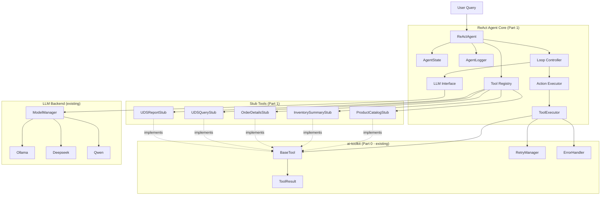
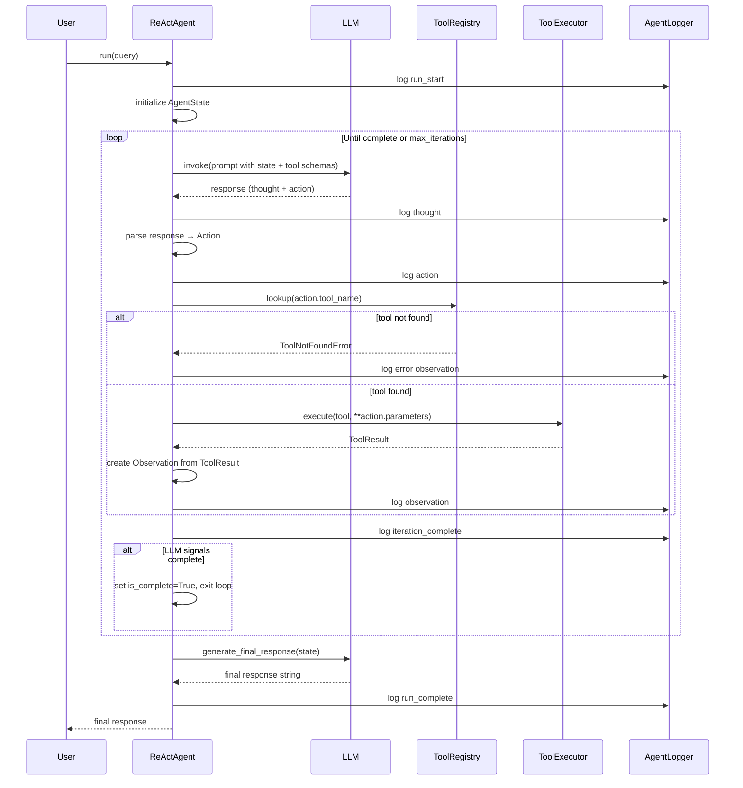

# Design Document: ReAct Agent Core

## Overview

The ReAct Agent Core is the reasoning engine for the IC-Agent system. It implements the Thought → Action → Observation loop, enabling autonomous task resolution through iterative LLM reasoning and tool execution. The design builds entirely on the existing ai-toolkit infrastructure — `BaseTool`, `ToolExecutor`, `ToolResult` — and adds the agent-layer concerns: state management, loop control, tool registry, structured logging, and LLM prompt orchestration.

The agent is intentionally model-agnostic (works with Ollama, Deepseek, Qwen, GLM via ModelManager) and tool-agnostic (any `BaseTool` subclass can be registered). This makes it the stable foundation for Part 2 (SP-API Agent) and Part 3 (UDS Agent), which will replace stub tools with real integrations.

## Architecture

### Component Diagram



### ReAct Loop Sequence



## Components and Interfaces

### 1. Data Models (`models.py`)

```python
from dataclasses import dataclass, field
from typing import Any, Dict, List, Optional, Tuple
import json

@dataclass
class Action:
    tool_name: str                    # Name of the tool to invoke
    parameters: Dict[str, Any]        # Parameters to pass to the tool
    reasoning: str                    # LLM's reasoning for choosing this action

    def to_dict(self) -> Dict[str, Any]:
        return {
            "tool_name": self.tool_name,
            "parameters": self.parameters,
            "reasoning": self.reasoning,
        }

@dataclass
class Observation:
    tool_name: str                    # Tool that produced this observation
    success: bool                     # Whether the tool execution succeeded
    output: Optional[Any] = None      # Tool output (None if failed)
    error: Optional[str] = None       # Error message (None if succeeded)

    def to_dict(self) -> Dict[str, Any]:
        return {
            "tool_name": self.tool_name,
            "success": self.success,
            "output": self.output,
            "error": self.error,
        }

@dataclass
class AgentState:
    query: str
    iteration: int = 0
    is_complete: bool = False
    # Each history entry: (thought: str, action: Action, observation: Observation)
    history: List[Tuple[str, Action, Observation]] = field(default_factory=list)

    def append_history(self, thought: str, action: Action, observation: Observation) -> None:
        self.history.append((thought, action, observation))

    def increment_iteration(self) -> None:
        self.iteration += 1

    def to_dict(self) -> Dict[str, Any]:
        return {
            "query": self.query,
            "iteration": self.iteration,
            "is_complete": self.is_complete,
            "history": [
                {"thought": t, "action": a.to_dict(), "observation": o.to_dict()}
                for t, a, o in self.history
            ],
        }
```

### 2. Custom Exceptions (`exceptions.py`)

```python
from typing import List, Optional

class AgentError(Exception):
    """Base exception for all ReAct Agent errors."""
    pass

class MaxIterationsError(AgentError):
    """Raised when the agent reaches max_iterations without completing the task."""
    def __init__(self, message: str, state: "AgentState", iterations_completed: int):
        super().__init__(message)
        self.state = state
        self.iterations_completed = iterations_completed

class ToolNotFoundError(AgentError):
    """Raised when the LLM selects a tool not present in the Tool Registry."""
    def __init__(self, requested_tool: str, available_tools: List[str]):
        super().__init__(
            f"Tool '{requested_tool}' not found. Available: {available_tools}"
        )
        self.requested_tool = requested_tool
        self.available_tools = available_tools
```

### 3. ReActAgent Core (`react_agent.py`)

```python
from typing import Any, Dict, List, Optional
from ai_toolkit.tools import BaseTool, ToolExecutor, ToolResult

class ReActAgent:
    def __init__(
        self,
        llm: Any,                          # ModelManager-compatible LLM instance
        tools: List[BaseTool],
        max_iterations: int = 10,
        logger: Optional["AgentLogger"] = None,
        executor: Optional[ToolExecutor] = None,
    ):
        # Validate no duplicate tool names
        # Build tool registry: {tool.name: tool}
        # Initialize ToolExecutor (from ai-toolkit)
        # Initialize AgentLogger

    def register_tool(self, tool: BaseTool) -> None:
        """Add a tool to the registry. Raises AgentError if name already exists."""

    def unregister_tool(self, tool_name: str) -> None:
        """Remove a tool from the registry."""

    def list_tools(self) -> List[Dict[str, Any]]:
        """Return list of tool schemas for all registered tools."""

    def run(self, query: str) -> str:
        """Execute the full ReAct loop and return the final response."""

    def step(self, state: AgentState) -> AgentState:
        """Execute exactly one Thought → Action → Observation iteration."""

    def _build_prompt(self, state: AgentState) -> str:
        """Build the LLM prompt from current state and tool schemas."""

    def _parse_llm_response(self, response: str) -> Tuple[str, Optional[Action], bool]:
        """Parse LLM output into (thought, action, is_complete)."""

    def _execute_action(self, action: Action) -> Observation:
        """Execute an action via ToolExecutor and return an Observation."""
```

**LLM Prompt Format:**

```
You are a ReAct agent. Reason step by step and use tools to answer the query.

Available tools:
{tool_schemas_json}

Conversation history:
{history}

Current query: {query}

Respond in this exact format:
Thought: <your reasoning>
Action: <tool_name>
Parameters: <json parameters>

Or if the task is complete:
Thought: <your reasoning>
Final Answer: <your answer>
```

**Response Parsing:**
- If response contains `Final Answer:` → set `is_complete=True`, no action
- If response contains `Action:` and `Parameters:` → parse tool name and JSON parameters
- Otherwise → log WARNING, create error Observation with `parsing_error`

### 4. AgentLogger (`agent_logger.py`)

```python
import json
import logging
from datetime import datetime, timezone
from typing import Any, Dict, Optional

class AgentLogger:
    def __init__(self, level: int = logging.INFO, output_path: Optional[str] = None):
        # Configure Python logging with JSON formatter
        # Write to stdout by default, file if output_path provided

    def log_thought(self, iteration: int, thought: str) -> None:
        """Log a thought entry."""
        # {"timestamp": ..., "level": "INFO", "event": "agent_thought",
        #  "iteration": ..., "thought": ...}

    def log_action(self, iteration: int, action: Action) -> None:
        """Log an action entry."""
        # {"timestamp": ..., "level": "INFO", "event": "agent_action",
        #  "iteration": ..., "tool_name": ..., "parameters": ..., "reasoning": ...}

    def log_observation(self, iteration: int, observation: Observation) -> None:
        """Log an observation entry."""
        # {"timestamp": ..., "level": "INFO", "event": "agent_observation",
        #  "iteration": ..., "tool_name": ..., "success": ..., "output"/"error": ...}

    def log_run_complete(self, state: AgentState, execution_time: float) -> None:
        """Log run completion summary."""
        # {"timestamp": ..., "level": "INFO", "event": "agent_run_complete",
        #  "total_iterations": ..., "is_complete": ..., "execution_time_s": ...}
```

### 5. Stub Tools (`tools/sp_api_stubs.py`, `tools/uds_stubs.py`)

Each stub inherits from `BaseTool` and follows this pattern:

```python
from ai_toolkit.tools import BaseTool, ToolParameter, ToolResult
from ai_toolkit.errors.exception_types import ValidationError

class ProductCatalogToolStub(BaseTool):
    def __init__(self):
        super().__init__(
            name="product_catalog",
            description="Retrieves product details by ASIN or SKU (stub)"
        )

    def execute(self, asin: str = None, sku: str = None) -> Dict[str, Any]:
        # Return realistic mock product data
        return {"asin": asin or sku, "title": "Mock Product", "price": 29.99, ...}

    def validate_parameters(self, asin: str = None, sku: str = None, **kwargs) -> None:
        if not asin and not sku:
            raise ValidationError("Either asin or sku is required", field_name="asin")

    def _get_parameters(self) -> List[ToolParameter]:
        return [
            ToolParameter(name="asin", type="string", description="Amazon ASIN", required=False),
            ToolParameter(name="sku", type="string", description="Seller SKU", required=False),
        ]
```

All stub tools include `"stub": True` in their ToolResult metadata (injected by overriding `execute` to return a dict that ToolExecutor wraps, or by the agent layer adding it to the Observation).

**Stub tool summary:**

| Class | Tool Name | Required Params | Mock Return |
|---|---|---|---|
| `ProductCatalogToolStub` | `product_catalog` | `asin` or `sku` | Product dict with title, price, category |
| `InventorySummaryToolStub` | `inventory_summary` | `sku` | Inventory dict with quantity, fulfillment_center |
| `OrderDetailsToolStub` | `order_details` | `order_id` | Order dict with status, items, shipping |
| `UDSQueryToolStub` | `uds_query` | `query` | List of mock result rows |
| `UDSReportGeneratorToolStub` | `uds_report` | `report_type` | Markdown report string |

## Data Models

### AgentState

| Field | Type | Description |
|---|---|---|
| `query` | `str` | The original user query |
| `iteration` | `int` | Current iteration count (starts at 0) |
| `is_complete` | `bool` | Whether the task has been resolved |
| `history` | `List[Tuple[str, Action, Observation]]` | Ordered list of (thought, action, observation) tuples |

### Action

| Field | Type | Description |
|---|---|---|
| `tool_name` | `str` | Name of the tool to invoke |
| `parameters` | `Dict[str, Any]` | Parameters to pass to the tool |
| `reasoning` | `str` | LLM's reasoning for choosing this action |

### Observation

| Field | Type | Description |
|---|---|---|
| `tool_name` | `str` | Name of the tool that produced this observation |
| `success` | `bool` | Whether the tool execution succeeded |
| `output` | `Optional[Any]` | Tool output (None if failed) |
| `error` | `Optional[str]` | Error message (None if succeeded) |

## Correctness Properties

*A property is a characteristic or behavior that should hold true across all valid executions of a system — essentially, a formal statement about what the system should do. Properties serve as the bridge between human-readable specifications and machine-verifiable correctness guarantees.*

### Property 1: Data model field completeness
*For any* AgentState, Action, or Observation instance created with valid inputs, all required fields must be present and have the correct types (str, int, bool, dict, list as specified).
**Validates: Requirements 1.1, 1.2, 1.3**

### Property 2: AgentState initialization invariant
*For any* query string, a newly created AgentState must have `iteration == 0`, `is_complete == False`, and `history == []`.
**Validates: Requirements 1.4**

### Property 3: AgentState history append invariant
*For any* AgentState and any (thought, action, observation) tuple, after calling `append_history`, the history length must increase by exactly 1 and the last entry must equal the appended tuple.
**Validates: Requirements 1.5**

### Property 4: AgentState iteration increment invariant
*For any* AgentState with iteration count N, after calling `increment_iteration`, the iteration count must equal N+1.
**Validates: Requirements 1.6**

### Property 5: Data model serialization round-trip
*For any* AgentState, Action, or Observation instance, calling `to_dict()` must produce a dictionary that is JSON-serializable (via `json.dumps`) and contains all fields with their correct values.
**Validates: Requirements 1.7, 1.8, 1.9**

### Property 6: Tool registry consistency
*For any* list of tools with unique names, after initializing ReActAgent, the tool registry must contain exactly those tools indexed by their names, and each tool must be retrievable by name.
**Validates: Requirements 2.2, 2.6**

### Property 7: Duplicate tool name rejection
*For any* two tools with the same name, attempting to register both (either at initialization or via `register_tool`) must raise an `AgentError`.
**Validates: Requirements 2.3, 2.7**

### Property 8: list_tools schema completeness
*For any* set of registered tools, `list_tools()` must return exactly one schema per registered tool, and each schema must match the tool's own `to_schema()` output.
**Validates: Requirements 2.8**

### Property 9: Agent always terminates
*For any* query and any max_iterations value N ≥ 1, the `run()` method must terminate after at most N iterations and return a string result (never hang or raise an unhandled exception to the caller).
**Validates: Requirements 3.7**

### Property 10: step() advances state by exactly one iteration
*For any* AgentState with iteration count N and history length H, calling `step()` must return a state with iteration count N+1 and history length H+1.
**Validates: Requirements 3.8, 3.5**

### Property 11: Failed tool execution produces error Observation
*For any* tool execution that returns a failure ToolResult (success=False), the resulting Observation must have `success=False` and a non-None `error` field, and the ReAct loop must continue to the next iteration rather than raising an exception.
**Validates: Requirements 5.4, 5.5**

### Property 12: ToolNotFoundError contains context
*For any* tool name not present in the registry, raising ToolNotFoundError must include the requested tool name and the list of all currently available tool names.
**Validates: Requirements 6.5, 4.4**

### Property 13: Log entries contain required fields
*For any* thought, action, or observation logged by AgentLogger, the resulting JSON log entry must contain `timestamp`, `level`, `event`, and `iteration` fields, plus the event-specific fields (thought content / tool_name+parameters / tool_name+success+output_or_error).
**Validates: Requirements 7.4, 7.5, 7.6**

### Property 14: Stub tools return success with mock data for valid inputs
*For any* stub tool (ProductCatalogToolStub, InventorySummaryToolStub, OrderDetailsToolStub, UDSQueryToolStub, UDSReportGeneratorToolStub) executed with valid parameters, the ToolResult must have `success=True`, a non-None output, and metadata containing `"stub": True`.
**Validates: Requirements 8.1, 8.2, 8.3, 8.4, 8.5, 8.8**

### Property 15: LLM prompt contains required context
*For any* AgentState, the prompt built by `_build_prompt()` must contain the original query, the serialized conversation history, the JSON schemas of all registered tools, and the ReAct format instructions.
**Validates: Requirements 9.2, 9.3**

### Property 16: LLM response parsing correctness
*For any* well-formed LLM response string containing `Thought:`, `Action:`, and `Parameters:` fields, `_parse_llm_response()` must extract the correct thought string, tool name, and parameters dict without error.
**Validates: Requirements 9.4**

## Error Handling

### Error Classification

| Error Type | Source | Handling |
|---|---|---|
| `AgentError` | Agent layer | Base class; caught at run() boundary |
| `MaxIterationsError` | Agent loop | Raised when iteration == max_iterations; includes partial state |
| `ToolNotFoundError` | Tool registry lookup | Logged as error Observation; loop continues |
| `ValidationError` (ai-toolkit) | Tool parameter validation | ToolExecutor returns failure ToolResult; becomes error Observation |
| `TimeoutError` (ai-toolkit) | Tool execution timeout | ToolExecutor retries then returns failure ToolResult |
| `LLM parse error` | Response parsing | Logged as WARNING; creates error Observation with `parsing_error` |

### Error Flow

```
run(query)
  └─ loop iteration
       ├─ LLM invocation fails → log ERROR, raise AgentError
       ├─ LLM response unparseable → log WARNING, create error Observation, continue loop
       ├─ tool not in registry → ToolNotFoundError → create error Observation, continue loop
       ├─ tool execution fails (transient) → ToolExecutor retries → failure ToolResult → error Observation, continue loop
       ├─ tool execution fails (fatal) → ToolExecutor returns failure immediately → error Observation, continue loop
       └─ max_iterations reached → raise MaxIterationsError with partial state
```

The `run()` method catches `MaxIterationsError` internally and returns a partial result string rather than propagating the exception to the caller, unless the caller explicitly wants to handle it.

## Testing Strategy

### Dual Testing Approach

**Unit tests** (`test_models.py`, `test_react_agent.py`, `test_agent_logger.py`, `test_tools.py`):
- Specific examples of correct behavior
- Edge cases: empty query, zero-length history, single tool, max_iterations=1
- Error conditions: duplicate tool names, unknown tool, unparseable LLM response
- Mock LLM responses for deterministic loop testing
- Mock ToolExecutor for isolated agent logic testing

**Property-based tests** (`test_properties.py` using `hypothesis`):
- Universal properties across randomly generated inputs
- Minimum 100 iterations per property test (`@settings(max_examples=100)`)
- Generators: arbitrary strings, arbitrary dicts, arbitrary tool lists

### Property-Based Testing Configuration

- **Library**: `hypothesis` (Python)
- **Minimum iterations**: 100 per property (`@settings(max_examples=100)`)
- **Tag format**: `# Feature: react-agent-core, Property {N}: {property_title}`

Each correctness property above maps to exactly one `@given`-decorated test function in `test_properties.py`.

### Test File Mapping

| File | Tests |
|---|---|
| `test_models.py` | AgentState, Action, Observation construction, serialization, mutation methods |
| `test_react_agent.py` | Initialization, register/unregister/list tools, run() with mock LLM, step() |
| `test_agent_logger.py` | JSON output format, required fields, log levels, file output |
| `test_tools.py` | All 5 stub tools: valid params, invalid params, metadata |
| `test_properties.py` | All 16 correctness properties using hypothesis |

### Coverage Target

≥ 80% line coverage across `src/agent/` measured with `pytest-cov`.
