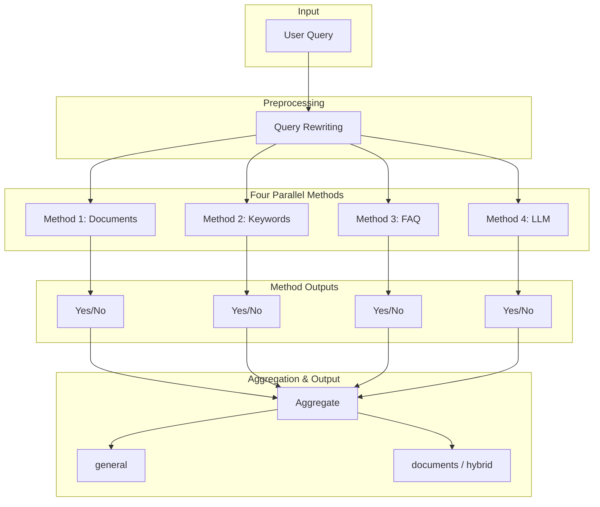
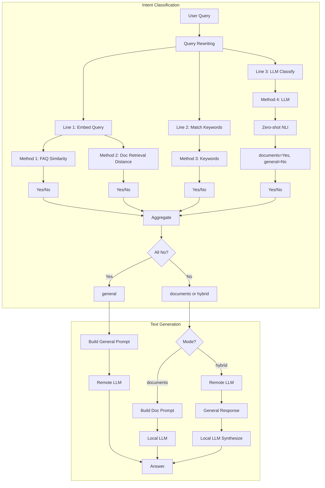
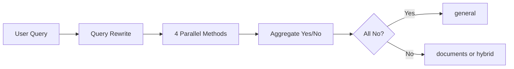

# IC-RAG Agent

**Intent Classification + Retrieval-Augmented Generation System**

An intelligent RAG system with automatic intent classification, supporting three answer modes (documents, general, hybrid) with data leakage prevention.

---

## Project Status

| Component | Status | Version | Last Updated |
|-----------|--------|---------|--------------|
| **UDS Agent** | Production Ready (pending manual testing) | 1.0.0 | 2026-03-06 |
| IC-RAG (Intent + RAG) | Active | - | - |

**UDS Agent:** Business Intelligence agent for Amazon seller data. 16 tools, REST API, 113 test frameworks. Ready for production deployment on Alibaba Cloud ECS pending manual test execution (`ssh len`).

---

## UDS Agent Quick Start

### Prerequisites

- Python 3.10+ (3.11 recommended)
- ClickHouse (UDS data)
- Ollama or remote LLM
- Optional: Redis (caching)

### Run Locally

```bash
# Install
pip install -r requirements.txt

# Configure (.env)
# UDS_CH_HOST, UDS_CH_PORT, UDS_CH_USER, UDS_CH_PASSWORD, UDS_CH_DATABASE
# UDS_LLM_PROVIDER=ollama, UDS_LLM_MODEL=qwen3:1.7b

# Start API
uvicorn src.uds.api:app --host 0.0.0.0 --port 8000

# Test
curl http://localhost:8000/health
curl -X POST http://localhost:8000/api/v1/uds/query \
  -H "Content-Type: application/json" \
  -d '{"query": "What were total sales in October?"}'
```

### Run with Docker

```bash
cd docker
docker compose -f docker-compose.uds.yml up -d
```

### Documentation

**Essential Guides:**
- [User Guide](docs/guides/UDS_USER_GUIDE.md) - 50+ query examples, best practices, FAQ
- [Developer Guide](docs/guides/UDS_DEVELOPER_GUIDE.md) - Architecture, 16 tools, tool creation
- [API Reference](docs/guides/UDS_API_REFERENCE.md) - 11 endpoints, schemas, examples
- [Deployment Guide](docs/guides/UDS_DEPLOYMENT_GUIDE.md) - Local, Docker, Alibaba Cloud ECS
- [Operations Manual](docs/OPERATIONS.md) - Monitoring, troubleshooting, maintenance, and incident response

**Project & Operations:**
- [Project Documentation](docs/PROJECT.md) - Complete project summary, metrics, architecture decisions
- [Business Glossary](docs/BUSINESS_GLOSSARY.md) - Amazon seller terminology
- [API Spec](specs/UDS_API_SPEC.yaml) - OpenAPI specification

**Historical:** See [docs/archive/](docs/archive/) for planning documents and historical references.

---

## Unified Gateway

The gateway routes queries to RAG, UDS, and SP-API backends. Route LLM (clarification, rewrite, workflow classification) uses Ollama (local or ECS).

### Start Stack with Chat UI

```bash
# Full stack (gateway, UDS, RAG, SP-API, UI)
./bin/project_stack.sh start --with-ui

# Route-only (gateway + UI, no downstream workers) - for testing Route LLM
./bin/project_stack.sh start --route-only --with-ui
```

### ECS Ollama

When running gateway locally against ECS backends, use ECS Ollama for Route LLM. Add to `.env`:

```bash
GATEWAY_REWRITE_OLLAMA_URL=http://${CH_HOST}:11434/api/generate
GATEWAY_REWRITE_OLLAMA_MODEL=qwen3:1.7b
GATEWAY_ROUTE_LLM_OLLAMA_URL=http://${CH_HOST}:11434
GATEWAY_ROUTE_LLM_OLLAMA_MODEL=qwen3:1.7b
```

Where `CH_HOST` is the ECS host already set in `.env`. Test connectivity: `./bin/test_ecs_ollama_connection.sh`

### Auth (Login / Register)

The Gradio chat UI supports user registration and sign-in. Users are stored in ClickHouse table `ic_agent.ic_rag_agent_user`.

**Environment variables:**

| Variable | Default | Description |
|----------|---------|-------------|
| `AUTH_JWT_SECRET` | (required in prod) | Secret for JWT signing; use a strong random value in production |
| `AUTH_JWT_EXPIRE_SECONDS` | 86400 | Token expiry in seconds (24h) |
| `GATEWAY_AUTH_REQUIRED` | false | When true, `/api/v1/query` and `/api/v1/rewrite` require `Authorization: Bearer <token>` |
| `AUTH_PASSWORD_MIN_LENGTH` | 8 | Minimum password length; must include at least one letter and one digit |

**API endpoints:**
- `POST /api/v1/auth/register` - Register new user
- `POST /api/v1/auth/signin` - Sign in, returns JWT + user info
- `POST /api/v1/auth/signout` - Sign out (client discards token)
- `GET /api/v1/auth/me` - Get current user from JWT

**Database:** Run `db/auth/create_user_table.sql` for non-Docker setups. Docker init includes the table.

---

## Features

### 🎯 Intelligent Intent Classification
- **Four Parallel Methods**: Documents retrieval, Keywords matching, FAQ similarity, LLM classification
- **Automatic Mode Selection**: Aggregates signals to choose optimal answer mode
- **Query Rewriting**: Lightweight term expansion and standardization

### 🔒 Data Security
- **Dual-LLM Architecture**: Local LLM for documents, Remote LLM for general knowledge
- **Zero Data Leakage**: Documents never sent to remote APIs
- **Hybrid Mode Security**: Local synthesis of document + remote general knowledge

### 📚 Three Answer Modes
1. **Documents Mode**: Answers from proprietary documents only (local LLM)
2. **General Mode**: General knowledge only (remote LLM, no documents)
3. **Hybrid Mode**: Combines document knowledge with general context (secure 2-step flow)

### ⚡ Performance Optimized
- Parallel intent classification (4 methods simultaneously)
- Configurable LLM providers (Ollama, Deepseek, Qwen, GLM)
- Efficient vector search with ChromaDB
- **Query caching** with Redis to reuse intents and results across requests
- **Automatic schema caching** to minimize metadata lookups

### 🛠️ Performance Improvements & Setup
To further accelerate ClickHouse queries, two auxiliary tools are included:

1. `db/uds/create_indexes.sql` – contains recommended **secondary index definitions** for the dataset. Run against the database during maintenance windows.
2. `tools/optimize_queries.py` – a lightweight profiler that executes a list of example queries, reports execution times, and highlights slow statements.

The agent itself instantiates a global `UDSCache` (Redis) and wires it into the
client, intent classifier, and agent layers.  You can tune TTLs and prefixes in
`src/uds/cache_config.py` or disable caching by passing `cache=None` when
initializing the `UDSAgent`.

---

## Architecture

### 2.1 Overall Architecture (Parallel Four-Strategy)

User Query goes through query rewriting, then four methods execute in parallel, each returning Yes/No, aggregated to determine the final answer mode.



### 2.2 Main Workflow



**Explanation:**
- **Intent Classification**: After query rewriting, splits into 3 lines. Embed line contains FAQ and Docs sub-methods, totaling 4 independent methods, each returning Yes/No.
- **Text Generation**:
  - **general**: Remote LLM generates (no document context, no data leakage).
  - **documents**: Local LLM generates (with retrieved documents, data stays local).
  - **hybrid**: ① Remote LLM receives question only → general response; ② Local LLM synthesizes documents + general response + question → final answer. Documents never sent to remote. Falls back to general when retrieval is empty.

### 2.3 Four Methods and Yes Conditions

| Method | Description | Yes Condition | No Condition |
|--------|-------------|---------------|--------------|
| **1. Documents** | Chroma retrieval, vector distance | min_dist ≤ threshold | min_dist > threshold |
| **2. Keywords** | Match domain keywords/phrases | query hits keywords | no match |
| **3. FAQ** | FAQ question similarity | faq_min_dist < threshold | faq_min_dist ≥ threshold |
| **4. LLM** | Zero-shot NLI binary classification | outputs documents | outputs general |

**LLM Branch**: Zero-shot NLI (e.g., `distilbert-base-uncased-finetuned-mnli`) outputs only documents or general, documents maps to Yes, general maps to No.

### 2.4 Aggregation Rules

| Aggregation Result | Final Mode | Config |
|--------------------|------------|--------|
| All four are No | general / documents / hybrid | `RAG_AGGREGATE_NO_MODE` |
| At least one Yes | documents or hybrid | `RAG_AGGREGATE_YES_MODE` |

### 2.5 Simplified High-Level Flow



---

## Quick Start

### Prerequisites

```bash
# Python 3.11+
python --version

# Install dependencies
pip install -r requirements.txt

# Install Ollama (for local LLM)
# macOS: brew install ollama
# Linux: curl -fsSL https://ollama.com/install.sh | sh

# Pull local model
ollama pull qwen3:1.7b
```

### Configuration

Copy `.env.example` to `.env` and configure:

```bash
# LLM Providers
RAG_DOCUMENTS_LLM_PROVIDER=ollama          # Local (secure)
RAG_DOCUMENTS_LLM_MODEL=qwen3:1.7b
RAG_GENERAL_LLM_PROVIDER=deepseek          # Remote (optional)
RAG_GENERAL_LLM_MODEL=deepseek-chat

# API Keys (for remote LLMs)
DEEPSEEK_API_KEY=your_key_here
QWEN_API_KEY=your_key_here
GLM_API_KEY=your_key_here

# Intent Classification
RAG_AUTO_MODE_ENABLED=true
RAG_USE_PARALLEL_INTENT=true
RAG_LLM_CLASSIFY_ENABLED=true

# Chroma & Documents
CHROMA_DOCUMENTS_PATH=data/chroma_db/documents
CHROMA_COLLECTION_NAME=documents

# Domain Keywords
RAG_DOMAIN_KEYWORDS=FBA,FBM,Amazon,eBay,inventory
```

### Ingest Documents

```bash
# Load documents into ChromaDB (prints chunk count on success)
python scripts/load_to_chroma/load_documents_to_chroma.py
```

### Run Queries

```bash
# Interactive mode
python scripts/query_rag.py --interactive

# Single query
python scripts/query_rag.py --query "What is FBA?"

# Specify mode
python scripts/query_rag.py --mode documents --query "FBA fees"
python scripts/query_rag.py --mode general --query "What is RAG?"
python scripts/query_rag.py --mode hybrid --query "Amazon FBA"
```

### Run Evaluation

```bash
# Full evaluation (retrieval + generation + UMAP + HTML report)
python scripts/run_evaluation.py --limit 10

# Skip UMAP for faster runs
python scripts/run_evaluation.py --limit 5 --skip-umap

# Custom output directory
python scripts/run_evaluation.py --limit 10 --output ./eval_results
```

Prerequisites: `amazon_fqa.csv` at `RAG_FAQ_CSV` or `data/intent_classification/fqa/`, Chroma populated (`load_documents_to_chroma.py`), and LLM API keys for generation eval.

### Start API Server

```bash
# Start FastAPI server
./bin/run_rag_api.sh

# Or directly
uvicorn src.rag.rag_api:app --host 0.0.0.0 --port 8000

# Test API
curl -X POST http://localhost:8000/query \
  -H "Content-Type: application/json" \
  -d '{"question": "What is FBA?", "mode": "auto"}'
```

---

## Project Structure

```
IC-RAG-Agent/
├── src/uds/                    # UDS Agent (Business Intelligence)
│   ├── api.py                  # REST API (FastAPI)
│   ├── uds_agent.py            # ReAct agent
│   ├── uds_client.py           # ClickHouse client
│   ├── intent_classifier.py    # Intent classification
│   ├── task_planner.py         # Task planning
│   ├── result_formatter.py     # Response formatting
│   ├── cache.py                # Redis caching
│   ├── tools/                  # 16 UDS tools
│   └── query_templates/       # Query template library
├── docker/                     # Docker & Compose
│   ├── Dockerfile
│   ├── docker-compose.uds.yml
│   └── docker-compose.prod.yml
├── monitoring/                 # Prometheus, Grafana, Alibaba CMS/SLS
├── docs/                      # Documentation
├── tests/                     # 113 test frameworks
├── scripts/                   # Python launchers and utilities
├── bin/                       # Shell entrypoints for ops/runtime
├── src/rag/
│   ├── query_pipeline.py       # Main RAG pipeline
│   ├── intent_methods.py       # Four classification methods
│   ├── intent_aggregator.py    # Signal aggregation
│   ├── intent_classifier.py    # LLM zero-shot classification
│   ├── intent_keywords.py      # Keywords matching
│   ├── query_rewriting.py     # Query preprocessing
│   ├── embeddings.py           # Embedding models
│   ├── ingest_pipeline.py      # Document ingest pipeline
│   ├── chroma_loaders.py       # Bootstrap, FAQ, CSV/doc -> Chroma
│   └── rag_api.py              # FastAPI server
├── scripts/
│   ├── load_to_chroma/              # documents + intent registry loaders
│   ├── query_rag.py                 # Query interface
│   ├── run_evaluation.py            # E2E RAG evaluation (retrieval, generation, report)
│   ├── run_gateway.py               # Unified gateway (route + dispatch)
│   └── run_unified_chat.py          # Unified Gradio chat UI (RAG/UDS/SP-API)
├── bin/
│   ├── project_stack.sh             # Start/restart gateway, UDS, RAG, SP-API, UI
│   ├── run_rag_api.sh               # RAG API launcher (backend)
│   ├── uds_ops.sh                   # deploy/rollback/status/logs/setup
│   ├── install_ollama_ecs.sh        # Install Ollama on ECS (native)
│   └── test_ecs_ollama_connection.sh # Test ECS Ollama connectivity from local
├── tests/
│   ├── test_intent_*.py        # Intent classification tests
│   ├── test_hybrid_*.py        # Hybrid mode tests
│   ├── test_remote_llm.py      # LLM integration tests
│   └── test_rag_api.py         # API tests
├── data/
│   ├── documents/              # Source documents
│   ├── chroma_db/              # Vector database (CHROMA_DOCUMENTS_PATH)
│   └── intent_classification/  # Keywords & FAQ data
├── docs/
│   └── ANSWER_MODEL_IDENTITY_NEW.md
└── .env                        # Configuration
```

---

## Intent Classification

### Four Parallel Methods

**1. Documents Method**
- Retrieves from ChromaDB
- Calculates L2 distance
- Yes if `min_distance ≤ threshold`

**2. Keywords Method**
- Matches domain keywords/phrases
- Three sources: env, CSV, FAQ-derived
- Yes if query contains keywords

**3. FAQ Method**
- Compares with FAQ questions (vector similarity)
- Yes if `faq_min_dist < RAG_FAQ_SIMILARITY_THRESHOLD`

**4. LLM Method**
- Zero-shot NLI classification
- Model: `distilbert-base-uncased-finetuned-mnli`
- Yes if output = "documents"

### Aggregation Rules

| Signals | Result Mode |
|---------|-------------|
| All No  | general     |
| ≥1 Yes  | documents or hybrid (configurable) |

---

## Answer Modes

### Documents Mode
```
User Query → Retrieve Docs → Local LLM → Answer
```
- Uses: Local LLM (Ollama)
- Input: Question + Retrieved Documents
- Security: ✅ Documents stay local

### General Mode
```
User Query → Remote LLM → Answer
```
- Uses: Remote LLM (Deepseek/Qwen/GLM)
- Input: Question only (no documents)
- Security: ✅ No data leakage

### Hybrid Mode (Secure 2-Step)
```
Step 1: User Query → Remote LLM → General Response
Step 2: Docs + General Response + Query → Local LLM → Final Answer
```
- Step 1: Remote LLM generates general knowledge (question only)
- Step 2: Local LLM synthesizes documents + remote response
- Security: ✅ Documents NEVER sent to remote

---

## Configuration

### Intent Classification

```bash
# Enable auto mode selection
RAG_AUTO_MODE_ENABLED=true

# Use parallel four-strategy
RAG_USE_PARALLEL_INTENT=true

# Distance threshold for Documents method
RAG_MODE_DISTANCE_THRESHOLD_GENERAL=1.0

# Enable FAQ similarity
RAG_FAQ_SIMILARITY_ENABLED=false
RAG_FAQ_SIMILARITY_THRESHOLD=0.9

# Enable LLM classification
RAG_LLM_CLASSIFY_ENABLED=true
RAG_INTENT_CLASSIFIER_MODEL=distilbert-base-uncased-finetuned-mnli

# Aggregation behavior
RAG_AGGREGATE_YES_MODE=hybrid    # When ≥1 Yes
RAG_AGGREGATE_NO_MODE=general    # When All No
```

### Query Rewriting

```bash
RAG_QUERY_REWRITE_ENABLED=true
RAG_QUERY_REWRITE_MIN_LENGTH=5   # Rewrite if <5 words
RAG_QUERY_REWRITE_MAX_LENGTH=10  # Skip if >10 words
```

### LLM Providers

```bash
# Documents: Always local (security)
RAG_DOCUMENTS_LLM_PROVIDER=ollama
RAG_DOCUMENTS_LLM_MODEL=qwen3:1.7b

# General: Can be remote
RAG_GENERAL_LLM_PROVIDER=deepseek
RAG_GENERAL_LLM_MODEL=deepseek-chat

# Ollama settings
OLLAMA_BASE_URL=http://localhost:11434
RAG_LLM_TIMEOUT=120
RAG_LLM_TEMPERATURE=0.3
RAG_LLM_NUM_CTX=2048
RAG_LLM_NUM_PREDICT=512
```

---

## Testing

```bash
# Run all tests
python -m pytest tests/ -v

# Test intent classification
python -m pytest tests/test_intent_*.py -v

# Test hybrid mode
python -m pytest tests/test_hybrid_*.py -v

# Test with coverage
python -m pytest tests/ --cov=src/rag --cov-report=html
```

**Test Coverage**: 120+ tests (intent, hybrid, API, remote LLM)

---

## Performance

### Timing Breakdown (Hybrid Mode)

| Step | Time | Component |
|------|------|-----------|
| Query Rewriting | ~0.01s | Lightweight |
| Intent Classification | ~0.5s | 4 parallel methods |
| Document Retrieval | ~0.03s | ChromaDB |
| Remote LLM (General) | ~6s | Deepseek API |
| Local LLM (Synthesis) | ~20s | Ollama qwen3:1.7b |
| **Total** | **~26s** | End-to-end |

### Optimization Tips

1. **Use faster local model**: Switch to smaller Ollama model
2. **Disable LLM classification**: Set `RAG_LLM_CLASSIFY_ENABLED=false` (saves ~1s)
3. **Adjust retrieval_k**: Lower `RAG_RETRIEVAL_K` for faster retrieval
4. **Use GPU**: Enable GPU acceleration for local LLM

---

## API Reference

### POST /query

```bash
curl -X POST http://localhost:8000/query \
  -H "Content-Type: application/json" \
  -d '{
    "question": "What is FBA?",
    "mode": "auto"
  }'
```

**Request Body:**
```json
{
  "question": "string (required)",
  "mode": "auto|documents|general|hybrid (optional, default: auto)"
}
```

**Response:**
```json
{
  "answer": "string",
  "source": "Document(s) (3 chunks) or General Knowledge",
  "sources": [
    {"file": "filename.pdf", "page": "1"}
  ],
  "selected_mode": "documents|general|hybrid (when mode=auto)"
}
```

### GET /health

```bash
curl http://localhost:8000/health
```

**Response:**
```json
{
  "status": "ok",
  "pipeline_ready": true,
  "chunks": 6886
}
```

---

## Security

### Data Leakage Prevention

✅ **Documents Mode**: Local LLM only, documents never leave server
✅ **General Mode**: Remote LLM only, no documents sent
✅ **Hybrid Mode**: 2-step secure flow
  - Step 1: Remote LLM receives question only
  - Step 2: Local LLM synthesizes with documents

### Configuration Enforcement

```python
# In _step3_create_llm() when purpose="documents"
prov = "ollama"  # Hardcoded - documents LLM must be local
# RAG_DOCUMENTS_LLM_PROVIDER is ignored; only RAG_DOCUMENTS_LLM_MODEL is used
```

Documents LLM is always local (Ollama) for security; remote provider config is ignored.

---

## Troubleshooting

### Ollama Connection Error

```bash
# Check Ollama is running
ollama list

# Start Ollama service
ollama serve

# Test model
ollama run qwen3:1.7b "Hello"
```

### ChromaDB Empty

```bash
# Re-ingest documents (prints chunk count on success)
python scripts/load_to_chroma/load_documents_to_chroma.py

# Ensure CHROMA_DOCUMENTS_PATH in .env points to data/chroma_db/documents
```

### Remote API Errors

```bash
# Check API keys in .env
echo $DEEPSEEK_API_KEY

# Test API directly
curl https://api.deepseek.com/v1/chat/completions \
  -H "Authorization: Bearer $DEEPSEEK_API_KEY" \
  -H "Content-Type: application/json" \
  -d '{"model":"deepseek-chat","messages":[{"role":"user","content":"test"}]}'
```

### Slow Performance

1. Check local model size: `ollama list`
2. Use smaller model: `ollama pull qwen3:0.5b`
3. Disable LLM classification: `RAG_LLM_CLASSIFY_ENABLED=false`
4. Reduce retrieval: `RAG_RETRIEVAL_K=1`

---

## Development

### Adding New Documents

```bash
# Add files to data/documents/
cp your_docs.pdf data/documents/

# Re-ingest
python scripts/load_to_chroma/load_documents_to_chroma.py
```

### Adding New Keywords

Edit `.env`:
```bash
RAG_DOMAIN_KEYWORDS=FBA,FBM,Amazon,eBay,inventory,new_keyword
```

Or add to CSV:
```bash
echo "new_phrase" >> data/intent_classification/keywords/phrases_from_titles.csv
```

Then reload into Chroma:
```bash
python scripts/load_to_chroma/load_intent_registry_to_chroma.py
```

For FAQ questions (when `RAG_FAQ_SIMILARITY_ENABLED=true`):
```bash
python scripts/load_to_chroma/load_intent_registry_to_chroma.py
```

### Custom LLM Provider

Implement in `ai_toolkit.models.ModelManager`:
```python
def create_model(self, provider: str, ...):
    if provider == "custom":
        return CustomLLM(...)
```

---

## License

[Your License Here]

---

## Contributing

1. Fork the repository
2. Create feature branch: `git checkout -b feature/amazing-feature`
3. Run tests: `pytest tests/ -v`
4. Commit changes: `git commit -m 'Add amazing feature'`
5. Push to branch: `git push origin feature/amazing-feature`
6. Open Pull Request

### Development Setup (UDS Agent)

```bash
pip install -r requirements.txt
# Configure .env (ClickHouse, LLM)
pytest tests/ -v
uvicorn src.uds.api:app --reload
```

### Code Style

- Python: PEP8, black, isort
- Comments: English, >=10% of code volume
- Docstrings: All public functions/classes

---

## Acknowledgments

- **ChromaDB**: Vector database
- **LangChain**: RAG framework
- **Ollama**: Local LLM runtime
- **Deepseek/Qwen/GLM**: Remote LLM providers
- **HuggingFace**: Embedding models and classifiers

---

## Support

- **Documentation:** [docs/](docs/)
- **UDS Agent:** [docs/guides/UDS_USER_GUIDE.md](docs/guides/UDS_USER_GUIDE.md), [docs/guides/UDS_API_REFERENCE.md](docs/guides/UDS_API_REFERENCE.md)
- **Issues:** GitHub Issues

## Contact

[Your Contact Information]

---

**Built for secure and intelligent RAG systems | UDS Agent v1.0.0**
