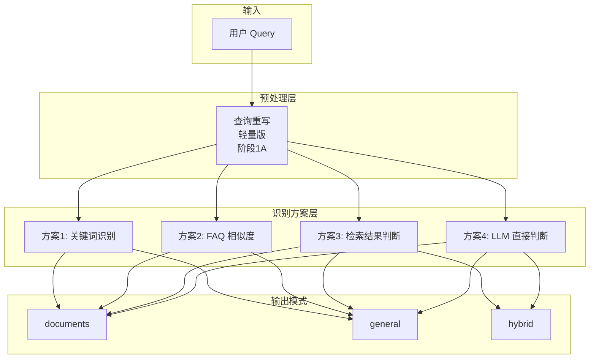
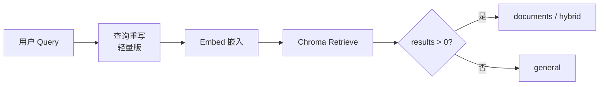
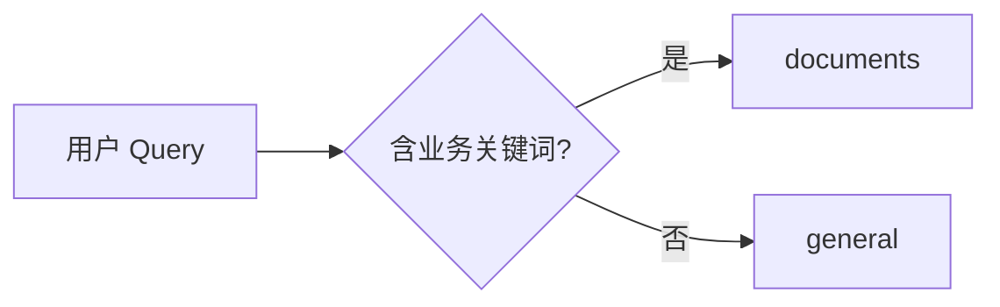
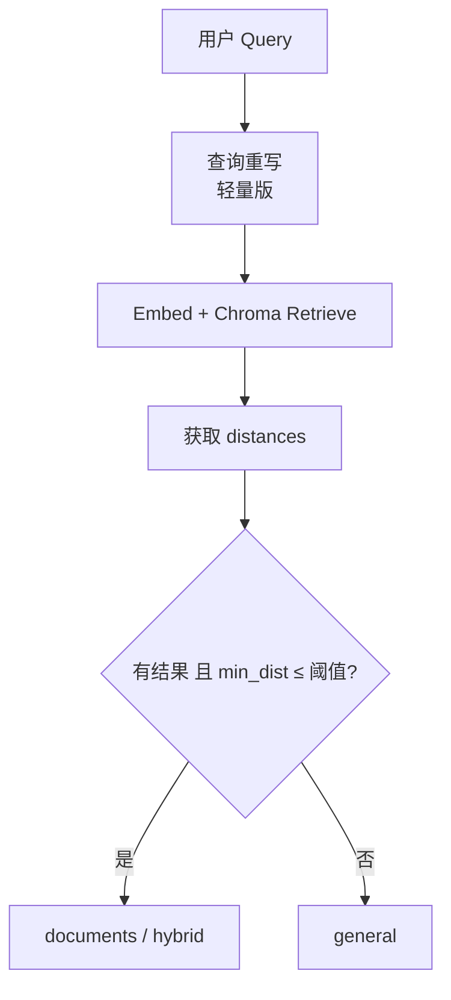
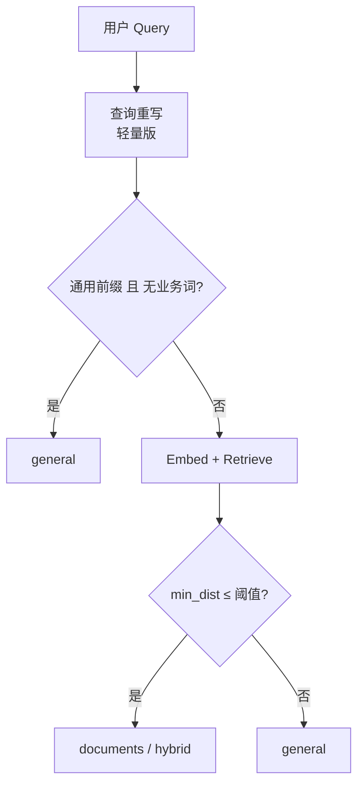
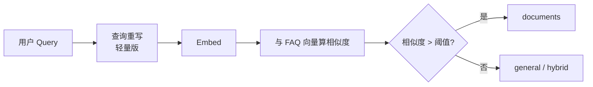
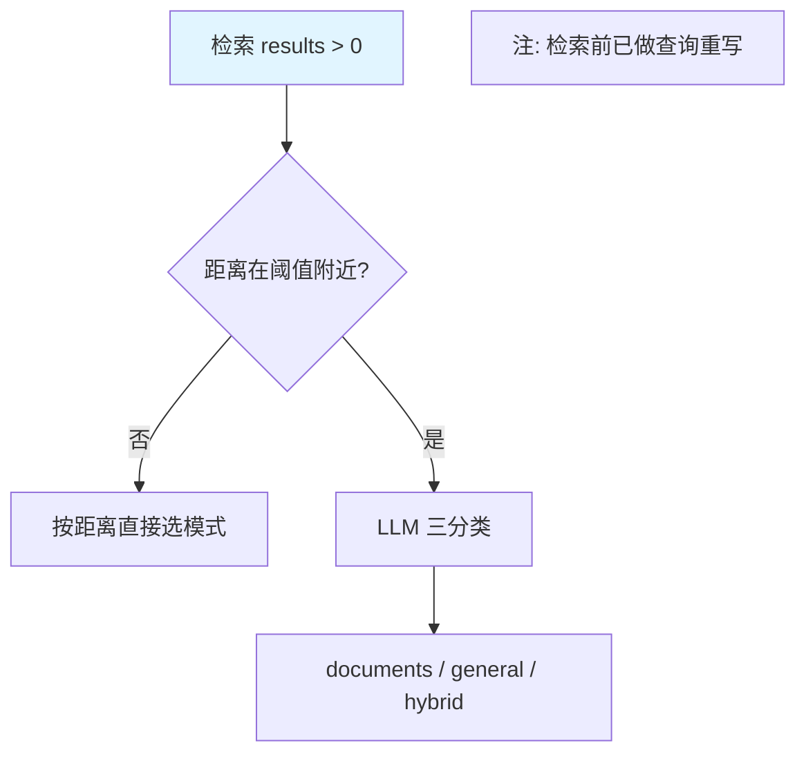
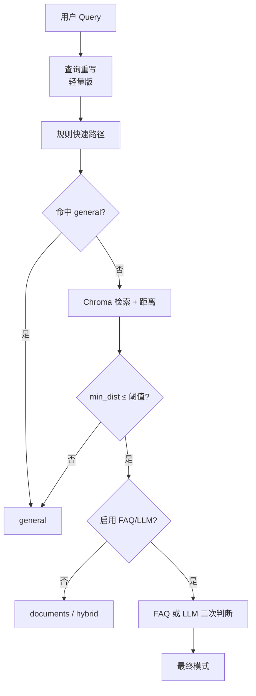

# 答案模式自动识别方案（整合优化版）

整合豆包 AI 原始方案与 RAG 实战最佳实践，按**由小到大、由粗到精**迭代，每阶段 1~2 个可选方案。

---

## 1. 豆包原始方案概览与评估

| 方案 | 思路 | 评估 |
|------|------|------|
| **1. 关键词识别** | 从 documents 提取关键词（TF-IDF、KeyBERT），query 命中则 documents | 适合冷启动；需离线构建词表，对同义表达弱 |
| **2. FAQ 相似度** | 收集 SellerCentral FAQ，LLM 算 query 与 FAQ 的相似度 | 高准确率；依赖 FAQ 质量与覆盖，有 LLM 延迟 |
| **3. 检索结果判断** | Chroma retrieve + 距离阈值，results>0→documents，=0→general；可选 LLM 二次判断 | 与现有 RAG 流程一致，易落地；阈值需调优 |
| **4. 直接 LLM 判断** | 用 LLM 直接输出 documents/general/hybrid | 灵活；每次 +1~2s 延迟，资源占用高 |

**结论**：方案 3 为最佳主路径（零额外依赖、复用检索）；方案 1 可作快速路径；方案 2、4 作为后续增强。

---

## 2. 架构与流程图

### 2.1 总体架构



### 2.2 阶段 1 工作流

**方案 A：检索结果数量（含查询重写）**



**方案 B：简单关键词**



### 2.3 阶段 2 工作流

**方案 A：检索 + 距离阈值**



**方案 B：关键词 + 检索组合**



### 2.4 阶段 3 工作流

**方案 A：FAQ 相似度**



**方案 B：LLM 二次判断**



### 2.5 阶段 4 工作流：多策略级联



---

## 3. 三种答案模式

| 模式 | 含义 |
|------|------|
| documents | 仅基于已入库文档 |
| general | 仅 LLM 通用知识 |
| hybrid | 文档 + 通用知识 |

---

## 4. 分阶段迭代方案

### 阶段 1：MVP（最小投入，快速验证）

**目标**：用现有检索流程实现自动识别，无新依赖。

| 方案 | 实现 | 适用 |
|------|------|------|
| **A. 查询重写（轻量版）** | 术语补全（FBA→Amazon FBA fee）+ 标准化（cost→fulfillment fee）；长度<5词必改写，>10词不改写 | **必做**，提升检索召回率 |
| **B. 检索结果数量** | Chroma retrieve，results>0→documents/hybrid，=0→general | 首选，零改动成本 |
| **C. 简单关键词** | query 含业务词（FBA、Amazon 等）→documents，否则→general | 无 FAQ/检索时兜底 |

**推荐顺序**：先做 A（查询重写），再做 B（检索数量判断），最后可选 C（关键词快速路径）。

**查询重写必要性**：
- 用户常问短/模糊查询（"FBA fee"、"cost?"、"how much"），直接检索召回差
- 轻量版（术语映射）零延迟、零依赖，必做
- 不做 LLM 重写、多轮改写、复杂 HyDe（资源受限场景）

---

### 阶段 2：增强（提升准确率）

**目标**：引入距离阈值，减少误判。

| 方案 | 实现 | 适用 |
|------|------|------|
| **A. 检索 + 距离阈值** | 在 `query_collection` 中 `include=["distances"]`；min(distance)>阈值→general；≤阈值→documents/hybrid | 首选，与阶段 1 兼容 |
| **B. 关键词 + 检索组合** | 规则快速路径：通用前缀（what is、define）且无业务词→general；否则走检索 | 减少对明显通用问题的检索 |

**配置**：`RAG_MODE_DISTANCE_THRESHOLD_GENERAL=1.0`（all-MiniLM-L6-v2 下 L2 距离，需按数据调优）

---

### 阶段 3：精细化（高准确率）

**目标**：引入 FAQ 或 LLM，处理边界与复杂意图。

| 方案 | 实现 | 适用 |
|------|------|------|
| **A. FAQ 相似度** | 收集 Amazon SellerCentral FAQ，embed 后与 query 算相似度；高相似→documents | 有稳定 FAQ 来源时 |
| **B. LLM 二次判断** | 当检索 results>0 且距离在阈值附近时，用 qwen3:1.7b 做三分类 | 边界 case 多时 |

**注意**：方案 B 增加 ~1s 延迟，建议默认关闭，按需开启。

---

### 阶段 4：多策略融合（可选）

**目标**：级联多信号，提升鲁棒性。

```
query → 规则快速路径(general?) → 检索+距离 → [可选]FAQ/LLM 二次判断 → 最终模式
```

---

## 5. 实施要点

### 5.1 代码改动（阶段 1~2）

**阶段 1：查询重写**
- `query_pipeline.py`：新增 `rewrite_query_lightweight(question: str) -> str`
- `_step4_embed_question()`：在 embed 前调用重写函数
- 实现：术语补全映射表（FBA→Amazon FBA fee）+ 标准化（cost→fulfillment fee）

**阶段 1~2：模式识别**
- `query_pipeline.py`：`_step5_retrieve_docs` 中 `include` 增加 `"distances"`
- 新增 `classify_answer_mode(question, distances, ...)`，实现阈值逻辑
- API/Gradio：支持 `mode="auto"` 时调用 `classify_answer_mode`

### 5.2 配置项（.env）

```ini
# 查询重写（阶段 1）
RAG_QUERY_REWRITE_ENABLED=true
RAG_QUERY_REWRITE_MIN_LENGTH=5  # <5词必改写
RAG_QUERY_REWRITE_MAX_LENGTH=10  # >10词不改写

# 答案模式自动识别
RAG_AUTO_MODE_ENABLED=true
RAG_MODE_DISTANCE_THRESHOLD_GENERAL=1.0
RAG_GENERAL_PREFIXES=what is,define,什么是
RAG_DOMAIN_KEYWORDS=FBA,FBM,Amazon,eBay,库存,政策
```

### 5.3 查询重写实现示例

```python
def rewrite_query_lightweight(question: str) -> str:
    """阶段 1：轻量查询重写 - 术语补全 + 标准化"""
    words = question.split()
    if len(words) > 10:
        return question  # 跳过改写
    
    # 术语补全映射
    term_map = {
        "FBA": "Amazon FBA",
        "FBM": "Amazon FBM",
        "fee": "Amazon FBA fee",
        "cost": "fulfillment fee",
        "charge": "fulfillment fee",
    }
    
    # 标准化映射（仅短查询）
    std_map = {
        "cost": "fulfillment fee",
        "charge": "fulfillment fee",
        "price": "fulfillment fee",
    } if len(words) < 5 else {}
    
    rewritten = question
    for term, expansion in {**term_map, **std_map}.items():
        if term.lower() in rewritten.lower():
            rewritten = rewritten.replace(term, expansion)
    
    return rewritten
```

### 5.4 关键词方案（方案 1）补充

- **TF-IDF**：从 documents 语料计算，取 top-N 作为业务词表
- **KeyBERT**：`pip install keybert`，从文档提取语义关键词
- 词表可离线生成，存入配置或 JSON，供规则快速路径使用

---

## 6. 总结

| 阶段 | 方案 | 优先级 |
|------|------|--------|
| 1 | 查询重写（轻量版） | **必做** |
| 1 | 检索结果数量（B） | 必做 |
| 1 | 简单关键词（C） | 可选 |
| 2 | 检索+距离阈值（A） | 必做 |
| 2 | 关键词+检索组合（B） | 推荐 |
| 3 | FAQ 相似度（A） | 有 FAQ 时 |
| 3 | LLM 二次判断（B） | 边界多时 |
| 4 | 多策略级联 | 可选 |

**落地顺序**：阶段 1A（查询重写）→ 1B（检索数量）→ 2A（距离阈值）→ 2B（关键词组合）→ 按需 3A/3B。

**查询重写重要性**：
- 短/模糊查询（"FBA fee"、"cost?"）直接检索召回差，必须做轻量重写
- 轻量版（术语映射）零延迟、零依赖，适合资源受限场景
- 不做 LLM 重写、多轮改写、复杂 HyDe（避免过度工程）
