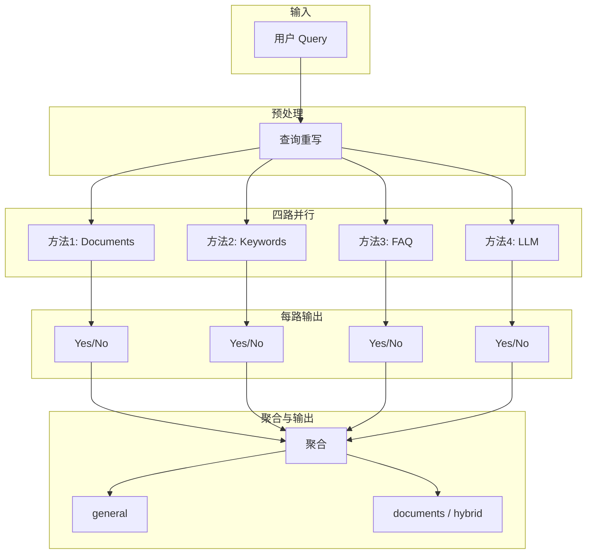
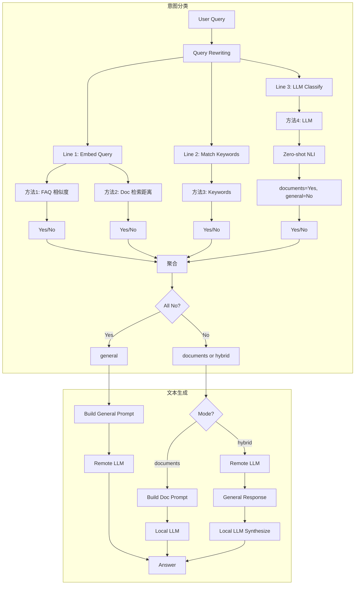
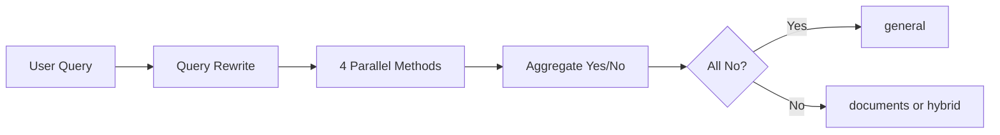

# 答案模式自动识别方案（整合优化版）

整合原始方案与 RAG 实战最佳实践，按**由小到大、由粗到精**迭代，每阶段 1~2 个可选方案。

**最后更新**：2025-02

---

## 实现状态概览

| 模块 | 状态 | 说明 |
|------|------|------|
| 查询重写 | 已实现 | `query_rewriting.py`：`rewrite_query_lightweight()` |
| 模式识别 | 已实现 | `query_pipeline.py`：`classify_answer_mode_parallel()` / `classify_answer_mode_sequential()` |
| 四路并行 | 已实现 | Documents、Keywords、FAQ、LLM 四路，`intent_methods.py` + `intent_aggregator.py` |
| 双 LLM 文本生成 | 已实现 | `RAGPipeline.build()` 创建 `llm_documents`（本地）、`llm_general`（可远程） |
| hybrid 两步流 | 已实现 | Remote 仅问题 → 通用响应；Local 文档 + 通用响应 → 合成（数据不泄露） |

---

## 1. 原始方案概览与评估

| 方案 | 思路 | 评估 |
|------|------|------|
| **1. 关键词识别** | 从 documents 提取关键词（TF-IDF、KeyBERT），query 命中则 documents | 适合冷启动；需离线构建词表，对同义表达弱 |
| **2. FAQ 相似度** | 收集 SellerCentral FAQ，LLM 算 query 与 FAQ 的相似度 | 高准确率；依赖 FAQ 质量与覆盖，有 LLM 延迟 |
| **3. 检索结果判断** | Chroma retrieve + 距离阈值，results>0→documents，=0→general；可选 LLM 二次判断 | 与现有 RAG 流程一致，易落地；阈值需调优 |
| **4. 直接 LLM 判断** | 用 LLM 直接输出 documents/general/hybrid | 灵活；每次 +1~2s 延迟，资源占用高 |

**结论**：四方案统一为**并行四策略**架构（见第 2 节）：查询重写后，FAQ、Documents、Keywords、LLM 四路并行，每路返回 Yes/No，聚合后决定答案模式。

---

## 2. 架构与流程图

### 2.1 总体架构（并行四策略）

用户 Query 经查询重写后，四路并行执行，每路返回 Yes/No，聚合后决定最终答案模式。


```mermaid
flowchart TB
    subgraph input [输入]
        Q[用户 Query]
    end

    subgraph preprocess [预处理]
        QR[查询重写]
    end

    subgraph parallel [四路并行]
        M1[方法1: Documents]
        M2[方法2: Keywords]
        M3[方法3: FAQ]
        M4[方法4: LLM]
    end

    subgraph signals [每路输出]
        S1[Yes/No]
        S2[Yes/No]
        S3[Yes/No]
        S4[Yes/No]
    end

    subgraph output [聚合与输出]
        AGG[聚合]
        GEN[general]
        DOC[documents / hybrid]
    end

    Q --> QR
    QR --> M1
    QR --> M2
    QR --> M3
    QR --> M4
    M1 --> S1
    M2 --> S2
    M3 --> S3
    M4 --> S4
    S1 --> AGG
    S2 --> AGG
    S3 --> AGG
    S4 --> AGG
    AGG --> GEN
    AGG --> DOC
```

### 2.2 主流程图


```mermaid
flowchart TD
    subgraph intent [意图分类]
        A[User Query]
        B[Query Rewriting]
        A --> B

        B --> L1
        B --> L2
        B --> L3

        L1[Line 1: Embed Query]
        L2[Line 2: Match Keywords]
        L3[Line 3: LLM Classify]

        L1 --> M1[方法1: FAQ 相似度]
        L1 --> M2[方法2: Doc 检索距离]
        M1 --> R1[Yes/No]
        M2 --> R2[Yes/No]

        L2 --> M3[方法3: Keywords]
        M3 --> R3[Yes/No]

        L3 --> M4[方法4: LLM]
        M4 --> ZS[Zero-shot NLI]
        ZS --> MAP[documents=Yes, general=No]
        MAP --> R4[Yes/No]

        R1 --> AGG
        R2 --> AGG
        R3 --> AGG
        R4 --> AGG

        AGG[聚合]
        AGG --> CHECK{All No?}
        CHECK -->|Yes| MODE_GEN[general]
        CHECK -->|No| MODE_DOC[documents or hybrid]
    end

    subgraph generation [文本生成]
        MODE_GEN --> TG_GEN[Build General Prompt]
        MODE_DOC --> TG_DOC{Mode?}

        TG_GEN --> REMOTE[Remote LLM]
        REMOTE --> OUT[Answer]

        TG_DOC -->|documents| BUILD_DOC[Build Doc Prompt]
        BUILD_DOC --> LOCAL_DOC[Local LLM]
        LOCAL_DOC --> OUT

        TG_DOC -->|hybrid| STEP1[Remote LLM]
        STEP1 --> GEN_RESP[General Response]
        GEN_RESP --> STEP2[Local LLM Synthesize]
        STEP2 --> OUT
    end
```

**说明**：
- **意图分类**：查询重写后分三路，Embed 路含 FAQ、Docs 两个子方法，共四路独立方法，每路返回 Yes/No。
- **文本生成**：
  - **general**：Remote LLM 生成（无文档上下文，无数据泄露）。
  - **documents**：Local LLM 生成（含检索文档，数据保留本地）。
  - **hybrid**：① Remote LLM 仅接收问题 → 通用响应；② Local LLM 将文档 + 通用响应 + 问题合成最终答案。文档不发送至远程。检索为空时退化为 general。

### 2.3 四路方法及 Yes 条件

| 方法 | 说明 | Yes 条件 | No 条件 |
|------|------|----------|---------|
| **1. Documents** | Chroma 检索，计算向量距离 | min_dist ≤ 阈值 | min_dist > 阈值 |
| **2. Keywords** | 匹配业务关键词/短语 | query 命中关键词 | 未命中 |
| **3. FAQ** | 与 FAQ 问题算相似度 | faq_min_dist < 阈值 | faq_min_dist ≥ 阈值 |
| **4. LLM** | Zero-shot NLI 二分类 | 输出 documents | 输出 general |

**LLM 分支**：zero-shot NLI（如 `distilbert-base-uncased-finetuned-mnli`）仅输出 documents 或 general，documents 映射为 Yes，general 映射为 No。

### 2.4 聚合规则

| 聚合结果 | 最终模式 | 配置项 |
|----------|----------|--------|
| 四路全为 No | general / documents / hybrid | `RAG_AGGREGATE_NO_MODE` |
| 至少一路为 Yes | documents 或 hybrid | `RAG_AGGREGATE_YES_MODE` |

### 2.5 简化流程图（高层）


```mermaid
flowchart LR
    A[User Query] --> B[Query Rewrite]
    B --> C[4 Parallel Methods]
    C --> D[Aggregate Yes/No]
    D --> E{All No?}
    E -->|Yes| F[general]
    E -->|No| G[documents or hybrid]
```

---

## 3. 三种答案模式

| 模式 | 含义 | 实现 |
|------|------|------|
| documents | 仅基于已入库文档 | Local LLM（Ollama），文档不离开本地 |
| general | 仅 LLM 通用知识 | Remote LLM，无文档上下文 |
| hybrid | 文档 + 通用知识 | ① Remote 仅问题 → 通用响应；② Local 文档 + 通用响应 + 问题 → 合成。文档不发送至远程 |

---

## 4. 分阶段迭代方案

### 阶段 1：MVP（已实现）

**目标**：用现有检索流程实现自动识别，无新依赖。

| 方案 | 实现 | 状态 |
|------|------|------|
| **A. 查询重写（轻量版）** | 术语补全 + 标准化；长度<5词必改写，>10词不改写 | 已实现 `query_rewriting.py` |
| **B. 检索结果数量** | Chroma retrieve，results>0→documents/hybrid，=0→general | 已实现 |
| **C. 简单关键词** | query 含业务词→documents，否则→general | 已实现 |

### 阶段 2：增强（已实现）

**目标**：引入距离阈值，减少误判。

| 方案 | 实现 | 状态 |
|------|------|------|
| **A. 检索 + 距离阈值** | `include=["distances"]`；min_dist>阈值→general；≤阈值→documents/hybrid | 已实现 |
| **B. 关键词 + 检索组合** | 通用前缀且无业务词→general；否则走检索 | 已实现 |

### 阶段 3：精细化（可选）

**目标**：引入 FAQ 或 LLM，处理边界与复杂意图。

| 方案 | 实现 | 适用 |
|------|------|------|
| **A. FAQ 相似度** | FAQ embed 后与 query 算相似度；高相似→documents | 有稳定 FAQ 时 |
| **B. LLM 二次判断** | 检索 results>0 且距离在阈值附近时，NLI 二分类 | 边界 case 多时 |

### 阶段 4：并行四策略融合（已实现）

**目标**：四路并行、聚合 Yes/No 决定最终模式。

```
query → 查询重写 → [FAQ | Documents | Keywords | LLM] 四路并行 → 聚合 → general / documents / hybrid
```

---

## 5. 实施要点

### 5.1 代码结构（已实现）

**查询重写**：`src/rag/query_rewriting.py` → `rewrite_query_lightweight()`，在 `_step4_embed_question` 前调用。

**模式识别**：`query_pipeline.py` → `classify_answer_mode_parallel()`（`RAG_USE_PARALLEL_INTENT=true`）或 `classify_answer_mode_sequential()`。

**文本生成**：
- `RAGPipeline.build()`：创建双 LLM（`llm_documents` 本地、`llm_general` 可远程）
- `_step6_build_rag_prompt()`：`mode="documents"`、`"general"`、`"synthesis"`
- `_step7_hybrid_dual_response()`：hybrid 两步流——① Remote 仅问题 → 通用响应；② Local 文档 + 通用响应 + 问题 → 合成（`mode="synthesis"`）

### 5.2 配置项（.env）

```ini
# 查询重写
RAG_QUERY_REWRITE_ENABLED=true
RAG_QUERY_REWRITE_MIN_LENGTH=5
RAG_QUERY_REWRITE_MAX_LENGTH=10

# 答案模式自动识别
RAG_AUTO_MODE_ENABLED=true
RAG_MODE_DISTANCE_THRESHOLD_GENERAL=1.0
RAG_GENERAL_PREFIXES=what is,define
RAG_DOMAIN_KEYWORDS=FBA,FBM,Amazon,eBay,inventory,policy
RAG_TITLE_PHRASES_CSV=data/intent_classification/keywords/phrases_from_titles.csv
RAG_FAQ_KEYWORDS_ENABLED=false
RAG_FAQ_KEYWORDS_TOP_N=50

# 聚合规则（2.4）
RAG_USE_PARALLEL_INTENT=true
RAG_AGGREGATE_YES_MODE=hybrid
RAG_AGGREGATE_NO_MODE=general

# 双 LLM（数据防泄露）
RAG_DOCUMENTS_LLM_PROVIDER=ollama
RAG_DOCUMENTS_LLM_MODEL=qwen3:1.7b
RAG_GENERAL_LLM_PROVIDER=deepseek
RAG_GENERAL_LLM_MODEL=deepseek-chat
```

**关键词来源**：RAG_DOMAIN_KEYWORDS、RAG_TITLE_PHRASES_CSV、RAG_FAQ_CSV（RAG_FAQ_KEYWORDS_ENABLED=true 时）。

**已废弃**：`RAG_HYBRID_MERGE_STRATEGY`。hybrid 现固定为 Local LLM 合成（文档 + 远程通用响应）。

### 5.3 查询重写示例

```python
def rewrite_query_lightweight(question: str) -> str:
    """轻量查询重写 - 术语补全 + 标准化"""
    words = question.split()
    if len(words) > 10:
        return question
    term_map = {
        "FBA": "Amazon FBA", "FBM": "Amazon FBM",
        "fee": "Amazon FBA fee", "cost": "fulfillment fee",
        "charge": "fulfillment fee",
    }
    std_map = {"cost": "fulfillment fee", "charge": "fulfillment fee", "price": "fulfillment fee"} if len(words) < 5 else {}
    rewritten = question
    for term, expansion in {**term_map, **std_map}.items():
        if term.lower() in rewritten.lower():
            rewritten = rewritten.replace(term, expansion)
    return rewritten
```

### 5.4 关键词方案补充

- **TF-IDF**：从 documents 语料计算，取 top-N 作为业务词表
- **KeyBERT**：`pip install keybert`，从文档提取语义关键词

---

## 6. 总结

| 方法 | 说明 | 优先级 |
|------|------|--------|
| 查询重写 | 术语补全、标准化 | **必做** |
| Documents | Chroma 检索 + 距离阈值 | 必做 |
| Keywords | 业务关键词/短语匹配 | 推荐 |
| FAQ | FAQ 相似度 | 有 FAQ 时 |
| LLM | Zero-shot NLI 二分类 | 可选 |

**架构**：并行四策略。四路全 No → general；至少一路 Yes → documents 或 hybrid。

**落地顺序**：查询重写 → Documents + Keywords → 按需加 FAQ、LLM。
