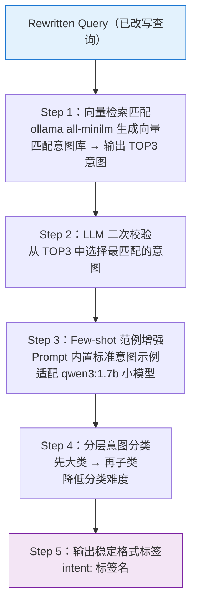

# Architecture Decisions and Design Rationale

**Version:** 1.0  
**Created:** 2026-03-08  
**Status:** Living document

This document records architecture decisions, design rationale, and improvement suggestions from design discussions.

---

## 1. Route LLM Steps (Current)

Route LLM has **6 steps** in order:

| Step | Purpose |
|------|---------|
| 1. **Clarification** (required) | Detect ambiguous queries; ask user for details before rewriting. |
| 2. **Normalize** | Trim and collapse whitespace. |
| 3. **Rewrite** | LLM rewrites query or classifies intents (Phase 1). |
| 4. **Build execution plan** | Parse planner output; route each intent to workflow; create task_groups. |
| 5. **Plan correction** | Heuristic override for LLM misclassifications. |
| 6. **Expand merged tasks** | Split tasks that contain multiple sub-questions. |

---

## 2. Why Clarification Before Rewriting

**Decision:** Clarification runs **before** rewriting.

**Rationale:**

- **Ambiguity is about missing information**, not phrasing. "Show me the fees" lacks: which fees? what period?
- **Rewriting cannot invent information.** The rewriter would have to guess, introducing bias.
- **Cost efficiency:** If ambiguous, we return early; no rewrite call needed.
- **Flow:** Clarify → User supplements → Clear query → Rewrite → Plan → Execute.

---

## 3. Role Analogy: Decision Maker vs Project Manager vs Worker

| Role | Responsibility | Module |
|------|----------------|--------|
| **Decision Maker (Reason LLM)** | Clarify needs, identify intents | Route LLM |
| **Project Manager (Supervisor)** | Task planning, assignment, supervision, result aggregation | Dispatcher |
| **Worker** | Execute tasks, report results | RAG, SP-API, UDS |

**Proposed change:** Move **Task planning** from Route LLM to Dispatcher.

- **Route LLM** output: clarified query + intent list `[intent1, intent2, ...]` (no workflow mapping).
- **Dispatcher** responsibility: intent → workflow mapping, task planning, assignment, supervision, merge.

**Rationale:** Task planning (which worker handles which intent) is execution orchestration, not understanding. The Decision Maker understands; the Project Manager executes.

**Implementation plan:** See `tasks/ROUTE_LLM_REFACTOR_PLAN.md`.

---

## 4. Example Query Walkthrough

**Query:** "what is FBA get order 112-9876543-12 which table stores fee data"

| Step | Input | Output |
|------|-------|--------|
| Clarification | Raw query | Same (clear) |
| Normalize | Raw query | Trimmed query |
| Rewrite | Trimmed query | `{"intents": ["what is FBA", "get order status for 112-9876543-12", "which ClickHouse table stores referral fee data"]}` |
| Build plan | Intents JSON | 3 tasks: amazon_docs, sp_api, uds |
| Plan correction | 3 tasks | t1: ic_docs → amazon_docs |
| Expand | 3 tasks | No change |
| **Final** | — | `task_groups` with 3 tasks for Dispatcher |

---

## 5. Improvement Suggestions

| Priority | Improvement | Rationale |
|----------|-------------|-----------|
| **High** | **Result merge (synthesize)** | Use LLM to synthesize multiple answers into coherent text when `merge_strategy=synthesize`. |
| **High** | **Retry on failure** | Retry transient failures (network, timeout) with backoff. |
| **Medium** | **Clarification + context** | Pass conversation history to clarification for multi-turn ("the first one"). |
| **Medium** | **Intent confidence** | Route LLM outputs confidence per intent; Dispatcher uses for fallback or user hint. |
| **Low** | **Task dependencies** | Use `depends_on` for DAG execution (e.g. schema before data). |
| **Low** | **Caching** | Cache read-only queries (general, amazon_docs, uds) by hash. |
| **Low** | **Worker health** | Check worker health before assignment; skip unavailable workers. |
| **Low** | **Streaming** | Stream task results as they complete (SSE). |

---

## 6. Target Architecture (Post-Refactor)

