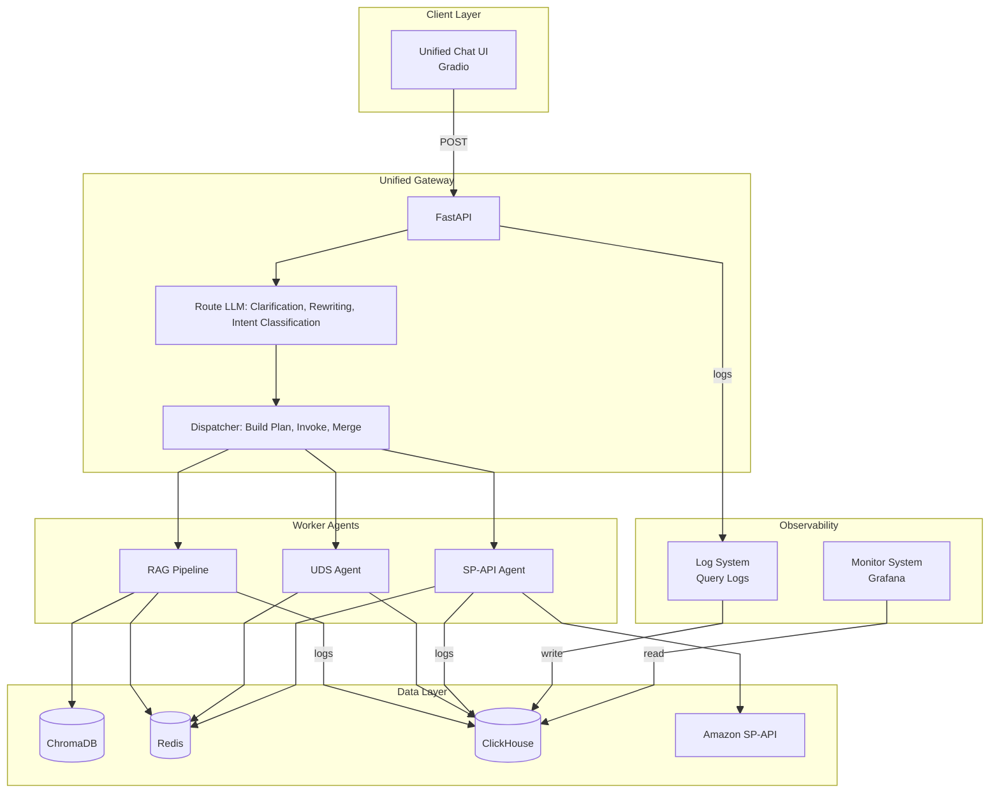
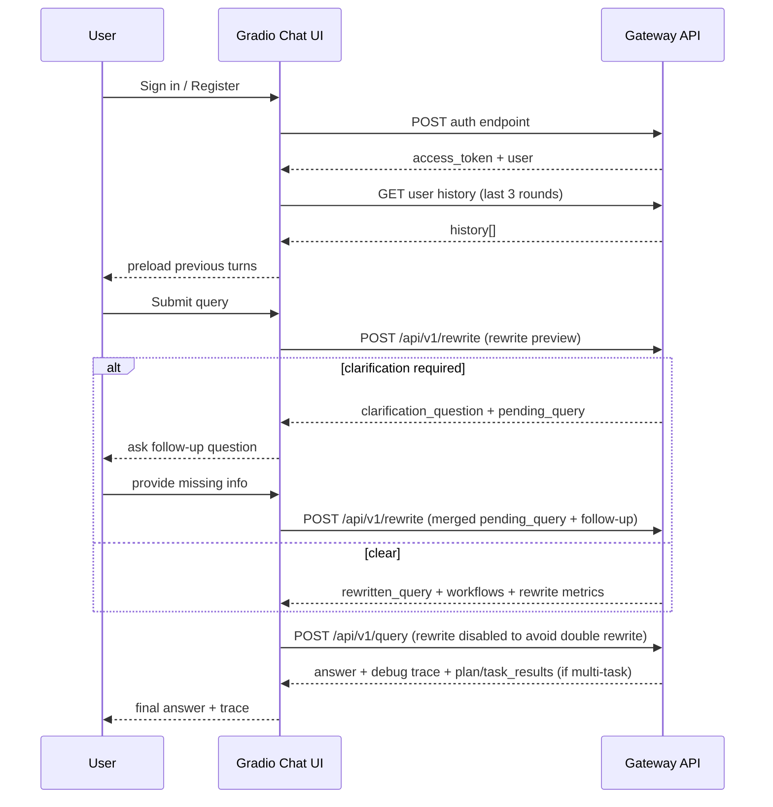
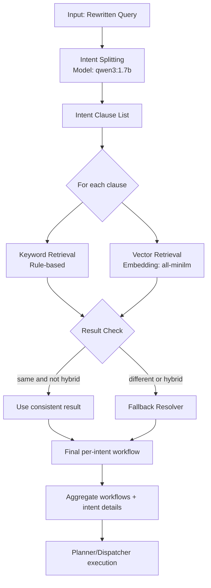

# IC-RAG-Agent System Framework

**Version:** 2.3.0  
**Last Updated:** 2026-03-08

This document describes the system framework for the IC-RAG-Agent project using Mermaid diagrams.

**How to view diagrams:** Open this file in Markdown preview mode (Mermaid rendering enabled).

---

## 1. System Overview

IC-RAG-Agent is an **Intent Classification + Retrieval-Augmented Generation** system with a **Unified Gateway** routing queries to five backend workflows:

- **Gateway** – Single entry point with Route LLM (clarification, rewriting, intent classification) and Dispatcher (build execution plan, execute worker agents, merge results)
- **UDS Agent** – Business Intelligence for Amazon seller data (ClickHouse + ReAct)
- **RAG Pipeline** – Document retrieval and hybrid generation with four parallel intent methods
- **SP-API Agent** – Seller Operations via Amazon SP-API (ReAct + LangGraph workflow)
- **Client** – Unified Gradio Chat UI calling the gateway

### 1.1 Framework

**Route LLM vs Dispatcher**

The gateway is organized into two conceptual groups:

| Group          | Responsibility                                  | Description                                                  |
| -------------- | ----------------------------------------------- | ------------------------------------------------------------ |
| **Route LLM**  | Clarification, Rewriting, Intent Classification | Three steps: (1) Clarification, (2) Rewriting (normalize, memory merge, rewrite with context), (3) Intent classification. Outputs rewritten query + intents. |
| **Dispatcher** | Build Plan, Execute, Merge                      | Builds execution plan from rewritten query + intents; invokes worker agents; executes tasks in parallel within groups; merges results. |

**Route LLM** outputs: rewritten query, intents (list of sub-questions).

**Dispatcher** inputs: rewritten query, intents. Builds execution plan (task_groups with workflow + query per task). Outputs: task_results, merged_answer, aggregated sources.

### 1.2 Roles

| Role                             | Responsibility                                               | Module           |
| -------------------------------- | ------------------------------------------------------------ | ---------------- |
| **Decision Maker (Reason LLM)**  | Clarify needs, rewrite query, identify intents               | Route LLM        |
| **Project Manager (Supervisor)** | Build execution plan, assign tasks, supervise, aggregate results | Dispatcher       |
| **Worker**                       | Execute tasks, report results                                | RAG, SP-API, UDS |

**Design:** Route LLM outputs rewritten query + intents. Dispatcher builds execution plan (intent → workflow mapping) and executes tasks.

### 1.3 Workflow

> **Note:** Route LLM outputs rewritten query + intents. Dispatcher builds execution plan (maps intents to workflows) and executes tasks.

---

**Five Workflows**

| # | Workflow | Gateway Route | Backend | Port | Data Source | Status |
|---|----------|---------------|---------|------|-------------|--------|
| 1 | General Knowledge | `general` | RAG (general mode) | 8002 | Remote LLM (DeepSeek / Ollama) | ✅ Ready |
| 2 | Amazon Document | `amazon_docs` | RAG (documents mode) | 8002 | ChromaDB retrieval | ✅ Ready |
| 3 | Enterprise/IC Document | `ic_docs` | RAG (documents mode) | 8002 | ChromaDB (not populated) | ⚠️ Placeholder |
| 4 | SP-API Agent | `sp_api` | SP-API Agent | 8003 | Amazon Seller API | ✅ Ready |
| 5 | UDS Agent | `uds` | UDS Agent | 8001 | ClickHouse (40M+ rows) | ✅ Ready |

> **IC docs:** Not ready yet — Chroma not populated. Gateway returns a friendly message; set `IC_DOCS_ENABLED=true` once populated.

## 2. Chat UI

The Chat UI is a unified Gradio front-end for authenticated multi-turn conversation with the gateway.

### 2.1 Responsibilities

| Responsibility | Behavior |
|---|---|
| Authentication | Supports sign-in and register; stores JWT in `auth_token_state`; toggles login/chat panels by auth status. |
| Session management | Maintains `session_id_state`; supports Clear Session (new UUID) and clears pending clarification cache. |
| Rewriting preview | Calls `/api/v1/rewrite` before `/api/v1/query`; displays Normalize, memory rounds, rewritten query, backend, rewrite latency, and intent classification summary. |
| Clarification follow-up | When clarification is required, stores `pending_query`; merges follow-up text with pending query on next submission. |
| User-scoped memory preload | After successful sign-in/register, fetches the last 3 rounds of conversation from Redis and preloads them into the chatbot. |
| Final answer display | Shows merged answer plus trace metadata (`routed_input`, rewrite backend/time, route source/confidence). |

### 2.2 UI Structure

- **Login Panel**
  - Tabs: `Sign In`, `Register`
  - Inputs: user name, password, optional email (register)
  - Output: status markdown message

- **Chat Panel**
  - Left column: workflow selector (`auto/general/amazon_docs/ic_docs/sp_api/uds`), user summary, session ID, clear session, gateway status
  - Right column: chatbot plus input box
  - Sign-out button at top-left of chat panel

### 2.3 Runtime State Model

| State | Purpose |
|---|---|
| `auth_token_state` | JWT token for authenticated API calls |
| `user_info_state` | user metadata (`user_id`, `user_name`, `role`) |
| `session_id_state` | conversation session identifier |
| `_pending_queries` (in-memory map) | client-side cache for clarification merge flow |

### 2.4 End-to-End Interaction

### 2.5 Chat Box UX Decisions

- Present conversation history on each login: every time the user signs in or registers, the chat box loads and displays the last 3 rounds of conversation from Redis so the user can continue in context.
- Rewriting is always enabled in UI (no toggle exposed to users).
- Rewritten query is rendered as a single-line trace value; intent splitting is handled downstream by intent classification and dispatcher.
- Chat container uses fixed-height flex layout and internal scrolling to keep input box visible.
- Auto-scroll is enforced with MutationObserver-based JavaScript to keep latest messages in view after send/receive.

## 3. ROUTE LLM

### 3.1 Query Clarification

First step of Route LLM; runs **before** rewriting. Detects ambiguous or incomplete queries and asks the user for missing information instead of guessing.

1. **Purpose**

   - Avoid rewriter and downstream guessing missing details (bias risk).
   - Get concrete identifiers (Order ID, ASIN, date range, fee type, store) so routing and execution are correct.

2. **When it runs**

   - On every rewrite/query request when clarification is enabled (default: on; configurable).
   - Same backend as rewriting (Ollama or DeepSeek).

3. **Inputs**

   - Current query (raw user message).
   - Optional conversation context: last 3–4 rounds from Redis. If present, do not ask again for info already given.

4. **Logic**

   - Skip for self-contained questions: documentation, policy, compliance, requirements, “what does Amazon say.”
   - Heuristic fast path: when no context, check known ambiguous patterns (e.g. inventory without ASIN/store, order without Order ID, fees without type/period, sales without date). Use fixed question or LLM-generated one.
   - LLM check: when context exists or heuristic does not apply, LLM decides clear vs needs_clarification and returns a short question. Output is structured (needs_clarification, clarification_question).
   - On LLM/backend failure: proceed without clarification (do not block).

5. **Outputs**

   - Clear: needs_clarification false → continue to rewriting and intent classification.
   - Ambiguous: needs_clarification true, clarification_question, pending_query. Client shows question; next user message is merged with pending_query and re-sent.

6. **What clarification does NOT do**

   - Does not rewrite the query.
   - Does not assign workflows or execute tasks.
   - Does not split intents; it only asks for missing info and returns a question.

### 3.2 Query Rewriting

Second step of Route LLM; runs **after** clarification (when the query is clear). Produces one clean, normalized sentence for downstream intent classification. Does not split intents or assign workflows.

1. **Responsibilities (from Rewriting_Responsibility)**

   - **Normalization:** lowercase, remove extra spaces and line breaks, unify punctuation, correct obvious typos (optional).
   - **Context completion:** resolve references (it / this / that → explicit entities); fill omitted information from conversation context.
   - **Rewrite for clarity:** colloquial → formal/standard; do not change meaning; **do not split sentences**.
   - **Remove useless tokens:** modal particles, polite phrases (optional).

2. **What rewriting does NOT do**

   - Does NOT split multi-intent queries into sub-questions.
   - Does NOT assign workflows or routing.
   - Does NOT output JSON or structured plans.
   - Output is always **plain text** — one clean, normalized sentence.

3. **When it runs**

   - After clarification (or when clarification is skipped). Only when rewrite is enabled (e.g. client sends rewrite_enable true).
   - Backend: Ollama or DeepSeek (same as clarification; configurable).

4. **Inputs**

   - **Current query:** normalized raw query (trim, collapse whitespace) from the previous step.
   - **Conversation context:** optional. Preloaded context (e.g. from clarification) is merged with Redis memory (user or session); turns are deduplicated and renumbered. Last N rounds (configurable) are formatted as "Turn K: User asked \"...\" -> Answer \"...\"" for the LLM.

5. **Pipeline (high level)**

   - Normalize query (trim, collapse whitespace). If empty, return empty; if rewrite disabled, return normalized.
   - Load and merge conversation context (preloaded + Redis); format for LLM.
   - Call LLM with rewrite prompt: rules (normalize, resolve refs, fill from context, clarity, preserve entities, no split, one line only). Input = context + current query.
   - Post-process: strip echoed trace/labels from LLM output; collapse newlines to one line; check responsibility compliance (plain text, no JSON/list). If non-compliant, fallback to normalized original query.
   - Return single-line rewritten query.

6. **Output**

   - One plain-text sentence. Passed to intent classification (which may split into sub-questions). On LLM/backend failure, returns normalized original query.

7. **Boundary with Intent Classification**

   - Intent splitting (multi-intent → sub-questions) is **not** part of rewriting; it is Step 1 of the Intent Classification workflow. Rewriting outputs a single sentence; the intent classifier consumes it and may split it there.

### 3.3 Intent Classification

Classify sub-intents from the rewritten query into executable workflows.

**Workflow steps**

1. Receive rewritten query (single line from 3.2) as input.
2. Split into intent clauses using qwen3:1.7b; output a list of sub-intents.
3. For each clause, run dual retrieval in parallel: keyword (rule-based) and vector (all-minilm + Chroma).
4. Compare keyword vs vector; if same and neither is `hybrid`, use that result.
5. If different or either is `hybrid`, run fallback resolver.
6. Fallback priority: keyword (if not hybrid) → vector (if not hybrid) → `general`.
7. Aggregate all final workflows into a deduplicated list plus per-intent details.
8. Pass to Planner/Dispatcher for plan build, task execution, and result merge.

**Fallback examples**

| Keyword | Vector | Final |
|---------|--------|-------|
| uds | uds | uds |
| uds | sp_api | uds |
| hybrid | sp_api | sp_api |
| amazon_docs | hybrid | amazon_docs |
| hybrid | hybrid | general |

**Runtime flags**

| Flag | Effect |
|------|--------|
| `GATEWAY_INTENT_CLASSIFICATION_ENABLED=true` | dual retrieval + fallback resolver |
| `GATEWAY_INTENT_CLASSIFICATION_ENABLED=false` | keep split list, heuristic workflow assignment |
| `GATEWAY_VECTOR_INTENT_ENABLED=true` | vector-intent path in planner execution |

Out of scope: rewriting text, clarification questions, downstream execution.

## 4. Chroma Loader

