# IC-RAG-Agent System Framework

**Version:** 2.3.0  
**Last Updated:** 2026-03-08

This document describes the system framework for the IC-RAG-Agent project using Mermaid diagrams.

**How to view diagrams:** Open this file in Markdown preview mode (Mermaid rendering enabled).

---

## 1. System Overview

IC-RAG-Agent is an **Intent Classification + Retrieval-Augmented Generation** system with a **Unified Gateway** routing queries to five backend workflows:

- **Gateway** – Single entry point with Route LLM (clarification, rewriting, intent classification) and Dispatcher (build execution plan, execute worker agents, merge results)
- **UDS Agent** – Business Intelligence for Amazon seller data (ClickHouse + ReAct)
- **RAG Pipeline** – Document retrieval and hybrid generation with four parallel intent methods
- **SP-API Agent** – Seller Operations via Amazon SP-API (ReAct + LangGraph workflow)
- **Client** – Unified Gradio Chat UI calling the gateway

### 1.1 Framework


**Route LLM vs Dispatcher**

The gateway is organized into two conceptual groups:

| Group          | Responsibility                                  | Description                                                  |
| -------------- | ----------------------------------------------- | ------------------------------------------------------------ |
| **Route LLM**  | Clarification, Rewriting, Intent Classification | Three steps: (1) Clarification, (2) Rewriting (normalize, memory merge, rewrite with context), (3) Intent classification. Outputs rewritten query + intents. |
| **Dispatcher** | Build Plan, Execute, Merge                      | Builds execution plan from rewritten query + intents; invokes worker agents; executes tasks in parallel within groups; merges results. |

**Route LLM** outputs: rewritten query, intents (list of sub-questions).

**Dispatcher** inputs: rewritten query, intents. Builds execution plan (task_groups with workflow + query per task). Outputs: task_results, merged_answer, aggregated sources.


### 1.2 Roles


| Role                             | Responsibility                                               | Module           |
| -------------------------------- | ------------------------------------------------------------ | ---------------- |
| **Decision Maker (Reason LLM)**  | Clarify needs, rewrite query, identify intents               | Route LLM        |
| **Project Manager (Supervisor)** | Build execution plan, assign tasks, supervise, aggregate results | Dispatcher       |
| **Worker**                       | Execute tasks, report results                                | RAG, SP-API, UDS |

**Design:** Route LLM outputs rewritten query + intents. Dispatcher builds execution plan (intent → workflow mapping) and executes tasks.


### 1.3 Workflow

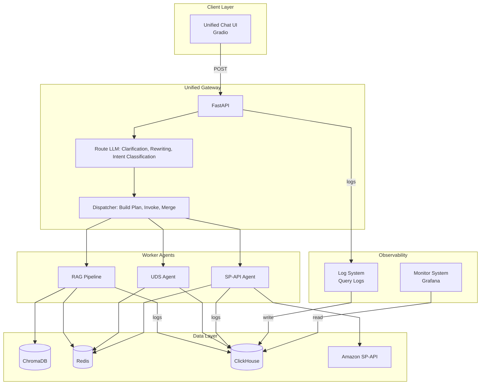

> **Note:** Route LLM outputs rewritten query + intents. Dispatcher builds execution plan (maps intents to workflows) and executes tasks.

---

**Five Workflows**

| # | Workflow | Gateway Route | Backend | Port | Data Source | Status |
|---|----------|---------------|---------|------|-------------|--------|
| 1 | General Knowledge | `general` | RAG (general mode) | 8002 | Remote LLM (DeepSeek / Ollama) | ✅ Ready |
| 2 | Amazon Document | `amazon_docs` | RAG (documents mode) | 8002 | ChromaDB retrieval | ✅ Ready |
| 3 | Enterprise/IC Document | `ic_docs` | RAG (documents mode) | 8002 | ChromaDB (not populated) | ⚠️ Placeholder |
| 4 | SP-API Agent | `sp_api` | SP-API Agent | 8003 | Amazon Seller API | ✅ Ready |
| 5 | UDS Agent | `uds` | UDS Agent | 8001 | ClickHouse (40M+ rows) | ✅ Ready |

> **IC docs:** Not ready yet — Chroma not populated. Gateway returns a friendly message; set `IC_DOCS_ENABLED=true` once populated.


## 2. Chat UI

The Chat UI is a unified Gradio front-end for authenticated multi-turn conversation with the gateway.


### 2.1 Responsibilities

| Responsibility | Behavior |
|---|---|
| Authentication | Supports sign-in and register; stores JWT in `auth_token_state`; toggles login/chat panels by auth status. |
| Session management | Maintains `session_id_state`; supports Clear Session (new UUID) and clears pending clarification cache. |
| Rewriting preview | Calls `/api/v1/rewrite` before `/api/v1/query`; displays Normalize, memory rounds, rewritten query, backend, rewrite latency, and intent classification summary. |
| Clarification follow-up | When clarification is required, stores `pending_query`; merges follow-up text with pending query on next submission. |
| User-scoped memory preload | After successful sign-in/register, fetches the last 3 rounds of conversation from Redis and preloads them into the chatbot. |
| Final answer display | Shows merged answer plus trace metadata (`routed_input`, rewrite backend/time, route source/confidence). |

### 2.2 UI Structure

- **Login Panel**
  - Tabs: `Sign In`, `Register`
  - Inputs: user name, password, optional email (register)
  - Output: status markdown message

- **Chat Panel**
  - Left column: workflow selector (`auto/general/amazon_docs/ic_docs/sp_api/uds`), user summary, session ID, clear session, gateway status
  - Right column: chatbot plus input box
  - Sign-out button at top-left of chat panel

### 2.3 Runtime State Model

| State | Purpose |
|---|---|
| `auth_token_state` | JWT token for authenticated API calls |
| `user_info_state` | user metadata (`user_id`, `user_name`, `role`) |
| `session_id_state` | conversation session identifier |
| `_pending_queries` (in-memory map) | client-side cache for clarification merge flow |

### 2.4 End-to-End Interaction

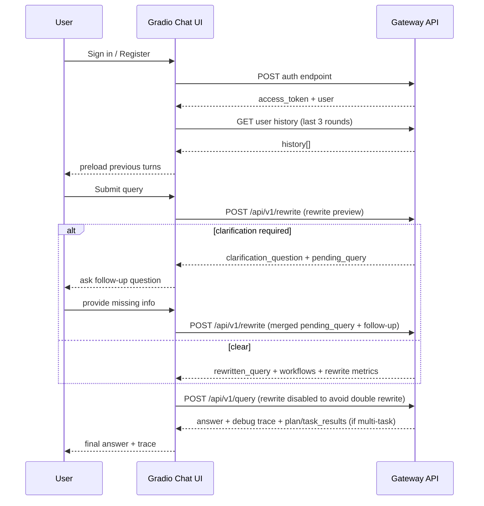

### 2.5 Chat Box UX Decisions

- Present conversation history on each login: every time the user signs in or registers, the chat box loads and displays the last 3 rounds of conversation from Redis so the user can continue in context.
- Rewriting is always enabled in UI (no toggle exposed to users).
- Rewritten query is rendered as a single-line trace value; intent splitting is handled downstream by intent classification and dispatcher.
- Chat container uses fixed-height flex layout and internal scrolling to keep input box visible.
- Auto-scroll is enforced with MutationObserver-based JavaScript to keep latest messages in view after send/receive.


## 3. ROUTE LLM

### 3.1 Query Clarification

First step of Route LLM; runs **before** rewriting. Detects ambiguous or incomplete queries and asks the user for missing information instead of guessing.

1. **Purpose**

   - Avoid rewriter and downstream guessing missing details (bias risk).
   - Get concrete identifiers (Order ID, ASIN, date range, fee type, store) so routing and execution are correct.

2. **When it runs**

   - On every rewrite/query request when clarification is enabled (default: on; configurable).
   - Same backend as rewriting (Ollama or DeepSeek).

3. **Inputs**

   - Current query (raw user message).
   - Optional conversation context: last 3–4 rounds from Redis. If present, do not ask again for info already given.

4. **Logic**

   - Skip for self-contained questions: documentation, policy, compliance, requirements, “what does Amazon say.”
   - Heuristic fast path: when no context, check known ambiguous patterns (e.g. inventory without ASIN/store, order without Order ID, fees without type/period, sales without date). Use fixed question or LLM-generated one.
   - LLM check: when context exists or heuristic does not apply, LLM decides clear vs needs_clarification and returns a short question. Output is structured (needs_clarification, clarification_question).
   - On LLM/backend failure: proceed without clarification (do not block).

5. **Outputs**

   - Clear: needs_clarification false → continue to rewriting and intent classification.
   - Ambiguous: needs_clarification true, clarification_question, pending_query. Client shows question; next user message is merged with pending_query and re-sent.

6. **What clarification does NOT do**

   - Does not rewrite the query.
   - Does not assign workflows or execute tasks.
   - Does not split intents; it only asks for missing info and returns a question.


### 3.2 Query Rewriting

Second step of Route LLM; runs **after** clarification (when the query is clear). Produces one clean, normalized sentence for downstream intent classification. Does not split intents or assign workflows.

1. **Responsibilities (from Rewriting_Responsibility)**

   - **Normalization:** lowercase, remove extra spaces and line breaks, unify punctuation, correct obvious typos (optional).
   - **Context completion:** resolve references (it / this / that → explicit entities); fill omitted information from conversation context.
   - **Rewrite for clarity:** colloquial → formal/standard; do not change meaning; **do not split sentences**.
   - **Remove useless tokens:** modal particles, polite phrases (optional).

2. **What rewriting does NOT do**

   - Does NOT split multi-intent queries into sub-questions.
   - Does NOT assign workflows or routing.
   - Does NOT output JSON or structured plans.
   - Output is always **plain text** — one clean, normalized sentence.

3. **When it runs**

   - After clarification (or when clarification is skipped). Only when rewrite is enabled (e.g. client sends rewrite_enable true).
   - Backend: Ollama or DeepSeek (same as clarification; configurable).

4. **Inputs**

   - **Current query:** normalized raw query (trim, collapse whitespace) from the previous step.
   - **Conversation context:** optional. Preloaded context (e.g. from clarification) is merged with Redis memory (user or session); turns are deduplicated and renumbered. Last N rounds (configurable) are formatted as "Turn K: User asked \"...\" -> Answer \"...\"" for the LLM.

5. **Pipeline (high level)**

   - Normalize query (trim, collapse whitespace). If empty, return empty; if rewrite disabled, return normalized.
   - Load and merge conversation context (preloaded + Redis); format for LLM.
   - Call LLM with rewrite prompt: rules (normalize, resolve refs, fill from context, clarity, preserve entities, no split, one line only). Input = context + current query.
   - Post-process: strip echoed trace/labels from LLM output; collapse newlines to one line; check responsibility compliance (plain text, no JSON/list). If non-compliant, fallback to normalized original query.
   - Return single-line rewritten query.

6. **Output**

   - One plain-text sentence. Passed to intent classification (which may split into sub-questions). On LLM/backend failure, returns normalized original query.

7. **Boundary with Intent Classification**

   - Intent splitting (multi-intent → sub-questions) is **not** part of rewriting; it is Step 1 of the Intent Classification workflow. Rewriting outputs a single sentence; the intent classifier consumes it and may split it there.


### 3.3 Intent Classification

Classify sub-intents from the rewritten query into executable workflows.

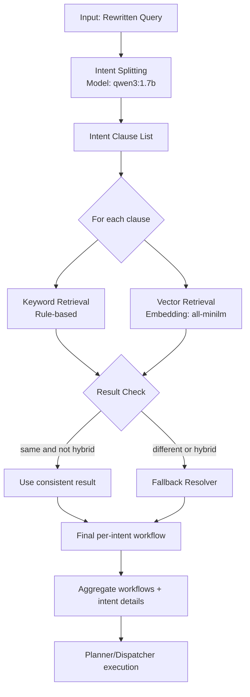

**Workflow steps**

1. Receive rewritten query (single line from 3.2) as input.
2. Split into intent clauses using qwen3:1.7b; output a list of sub-intents.
3. For each clause, run dual retrieval in parallel: keyword (rule-based) and vector (all-minilm + Chroma).
4. Compare keyword vs vector; if same and neither is `hybrid`, use that result.
5. If different or either is `hybrid`, run fallback resolver.
6. Fallback priority: keyword (if not hybrid) → vector (if not hybrid) → `general`.
7. Aggregate all final workflows into a deduplicated list plus per-intent details.
8. Pass to Planner/Dispatcher for plan build, task execution, and result merge.

**Fallback examples**

| Keyword | Vector | Final |
|---------|--------|-------|
| uds | uds | uds |
| uds | sp_api | uds |
| hybrid | sp_api | sp_api |
| amazon_docs | hybrid | amazon_docs |
| hybrid | hybrid | general |

**Runtime flags**

| Flag | Effect |
|------|--------|
| `GATEWAY_INTENT_CLASSIFICATION_ENABLED=true` | dual retrieval + fallback resolver |
| `GATEWAY_INTENT_CLASSIFICATION_ENABLED=false` | keep split list, heuristic workflow assignment |
| `GATEWAY_VECTOR_INTENT_ENABLED=true` | vector-intent path in planner execution |

Out of scope: rewriting text, clarification questions, downstream execution.


## 4. Memory Strategy

| Layer | Store | Purpose |
|-------|-------|---------|
| **Short-term** | Redis | Session-scoped conversation history, multi-turn context. TTL-based expiration (e.g., 24h). Fast access for real-time follow-up questions. |
| **Long-term** | ClickHouse | Query logs, audit trails, analytics. Historical retention for dashboards, evaluation, debugging. |

**Usage:** RAG Pipeline, UDS Agent, and SP-API Agent use Redis for short-term memory (session history, cache). Query logs and long-term analytics are stored in ClickHouse.

## 


---

## 4. Gateway Flow

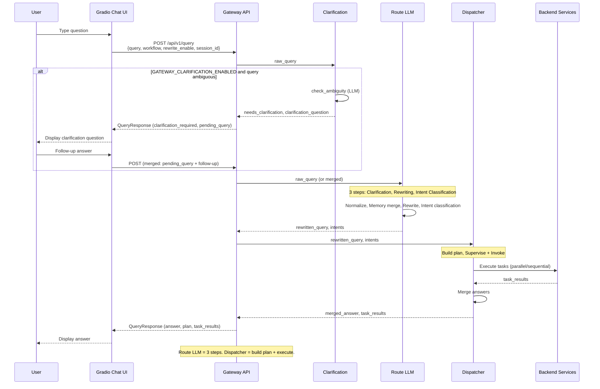

---

## 5. Routing Logic

```mermaid

```

### 5.1 Clarification (Question User)

Clarification is required by default. The gateway runs a clarification check **before** rewriting (set `GATEWAY_CLARIFICATION_ENABLED=false` to disable). The LLM (`check_ambiguity`) detects ambiguous queries (e.g. "Show me the fees" without specifying fee type or period) and returns a clarification question. The client stores `pending_query` and merges the user's follow-up with it on the next turn. If the query is clear, the flow proceeds to rewriting and execution.

**Example:** User asks "Show me the fees" → Gateway returns "Which type of fees do you mean? FBA, storage, or referral?" → User replies "FBA fees for last month" → Client sends merged query "Show me the fees FBA fees for last month" → Gateway proceeds to rewrite and route.

**Why clarification before rewriting:** Ambiguity is about missing information (which fees? what period?). The rewriter cannot invent information; it would guess and introduce bias. Clarifying first avoids wasted rewrite calls and ensures correct routing. See [ARCHITECTURE_DECISIONS.md](ARCHITECTURE_DECISIONS.md).

### 5.2 Route LLM Steps (3 steps)

Route LLM has exactly three steps:

1. **Clarification** (required) – Detect ambiguous queries; ask user for missing info (store, ASIN, Order ID, date range, fee type, etc.).

2. **Rewriting** – Three sub-steps:
   - **Normalize** – Trim and collapse whitespace.
   - **Memory merge** – Load last N turns from Redis; format as conversation context.
   - **Rewrite with context** – LLM produces retrieval-optimized query (Ollama / DeepSeek).

3. **Intent classification** – Extract distinct sub-questions from the optimized query. Output: `{"intents": ["...", "..."]}`.

**Dispatcher** (not Route LLM) is responsible for:
- Build execution plan – Map intents to workflows, create task_groups.
- Plan correction – Heuristic override for misclassifications.
- Expand merged tasks – Split tasks with multiple sub-questions.

### 5.3 Query Rewriting and Routing Rules

**File locations:**

| Component | File | Description |
|-----------|------|--------------|
| Clarification | `src/gateway/clarification.py` | `check_ambiguity()` – LLM detects ambiguous queries; asks user for clarification. Required by default. |
| Normalize, Memory merge, Rewrite | `src/gateway/router.py`, `rewriters.py` | `rewrite_query()`, `rewrite_with_context()` – LLM produces retrieval-optimized query. |
| Intent classification | `src/gateway/rewriters.py` | `rewrite_intents_only()` – extracts distinct sub-questions. |
| Build execution plan | `src/gateway/dispatcher.py` | `build_execution_plan()` – maps intents to workflows, creates task_groups. |
| Heuristic split | `src/gateway/routing_heuristics.py` | `split_multi_intent_clauses()` – fallback when intent classification fails. |
| Heuristic routing | `src/gateway/router.py` | `_route_workflow_heuristic()` – single-task workflow selection. |
| Plan correction | `src/gateway/dispatcher.py` | `_correct_plan_workflows()` – heuristic override for misclassifications. |

**Planner routing policy (rewriters.py):**

- **amazon_docs:** Amazon business rules, policies, requirements, fee definitions
- **uds:** Analytical/historical questions; prefer UDS when data is in warehouse snapshots
- **sp_api:** Real-time/current-state data only; SP-API has rate limits
- **sp_api must not** handle policy/business-rule explanation

**Heuristic keywords (router.py, priority order):**

| Workflow | Confidence | Keywords (examples) |
|----------|------------|---------------------|
| sp_api | 0.92 | order status, check order, inventory placement, inventory health, buy box status, check if asin, verify my seller |
| uds | 0.92 | top 5, top 10, products by, by refund, by product, refund count |
| uds | 0.85 | which table, schema, dataset, clickhouse, last month, trend, total, average, compare, breakdown, historical |
| amazon_docs | 0.9 | policy, requirements, fees, fee structure, guidelines, what does amazon |
| sp_api | 0.85 | sp-api, fba, shipment, catalog, seller api |
| general | 0.7 | fallback when no keyword match |

### 5.4 Multi-Task Execution Flow (Two-Phase Intent Split)

When `GATEWAY_REWRITE_PLANNER_ENABLED=true`, the gateway uses a two-phase flow to avoid LLM merging multiple sub-questions into one task:

1. **Phase 1 – Intent classification:** `rewrite_intents_only()` calls the LLM to list distinct sub-questions. Output: `{"intents": ["...", "..."]}`. On success, tasks are built from intents. On failure, heuristic split is used.

2. **Phase 2 – Task building (Dispatcher):** `build_execution_plan()` maps each intent to a workflow via heuristic. One task per intent.

**Heuristic split fallback:** When Phase 1 fails, `split_multi_intent_clauses()` splits the query by question-starter patterns (`get order`, `which`, `show me`, `what is`, etc.). Example: `"what is FBA get order 123 which table show me trend"` → 4 clauses → 4 tasks.

```mermaid
flowchart TB
    Q[User Query] --> PH1{Phase 1:\nIntent Classification}
    PH1 -->|LLM success| INT[Parse intents JSON]
    PH1 -->|LLM fail| HEUR[Heuristic split\n_split_multi_intent_clauses]
    INT --> ROUTE[Route each intent\n_route_workflow_heuristic]
    HEUR --> ROUTE
    ROUTE --> PLAN[Planner\nTask groups]
    PLAN --> CORR[Plan Correction\nHeuristic override]
    CORR --> SPLIT{Split into Tasks}
    
    SPLIT -->|general| G[General RAG\nRemote LLM]
    SPLIT -->|amazon_docs| A[Amazon Docs RAG\nChromaDB]
    SPLIT -->|ic_docs| IC[IC Docs RAG\nChromaDB]
    SPLIT -->|sp_api| SP[SP-API Agent\nAmazon API]
    SPLIT -->|uds| U[UDS Agent\nClickHouse]

    G -->|answer| M[Merge Answers\nconcat / compare / synthesize]
    A -->|answer| M
    IC -->|answer| M
    SP -->|answer| M
    U -->|answer| M

    M --> R[Final Response to User]

    style PH1 fill:#f9f,stroke:#333
    style PLAN fill:#f9f,stroke:#333
    style CORR fill:#ff9,stroke:#333
    style M fill:#9ff,stroke:#333
```

---

## 6. UDS Agent Flow

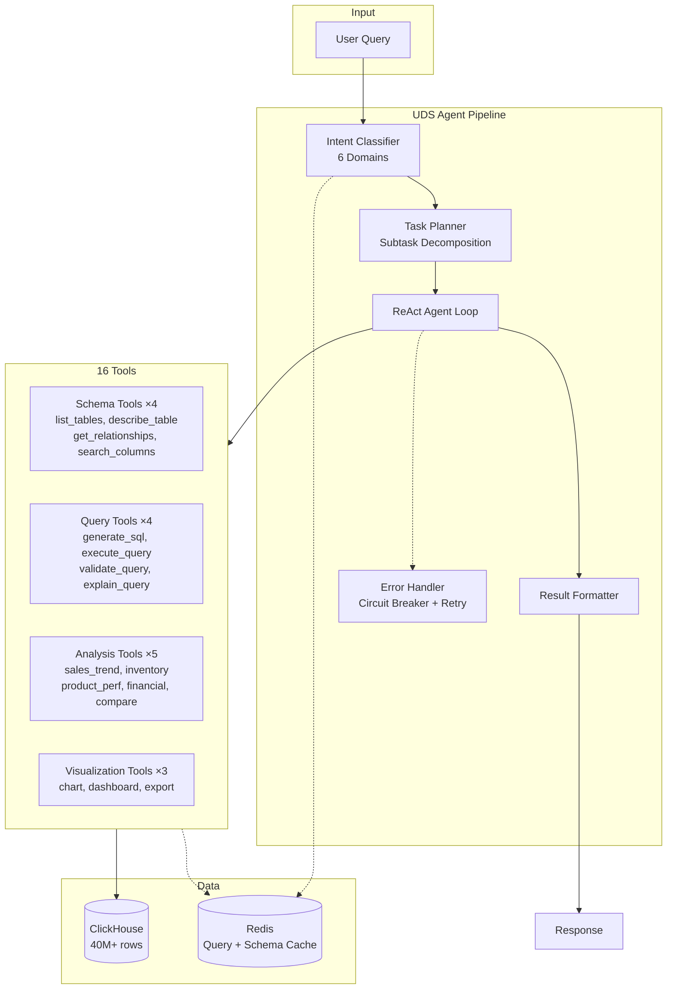

---

## 7. RAG Pipeline Flow

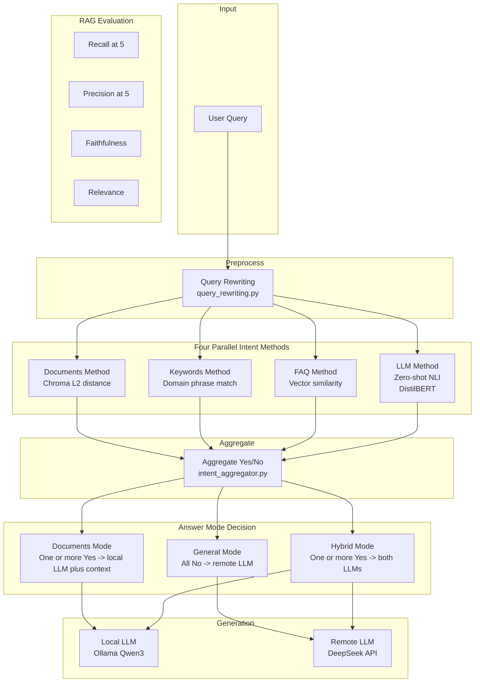

---

## 8. SP-API Agent Flow

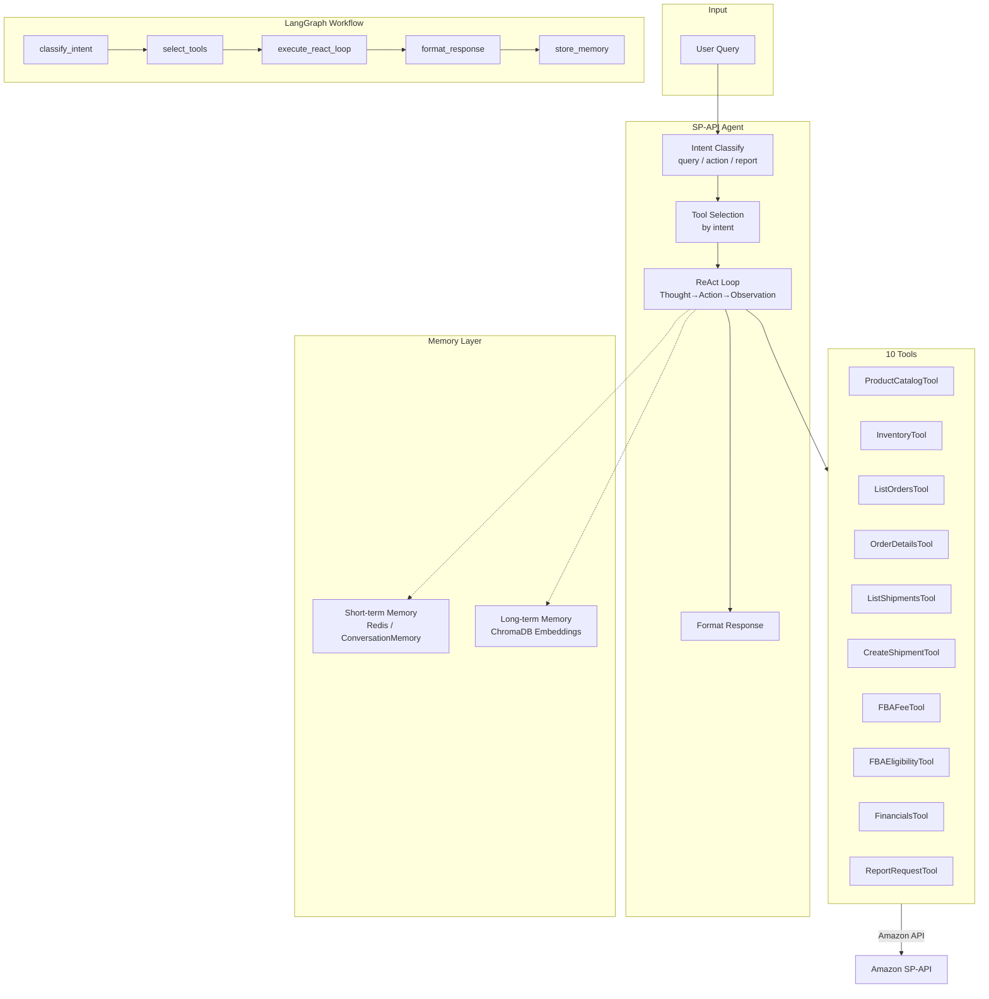

---

## 9. ReAct Agent Loop

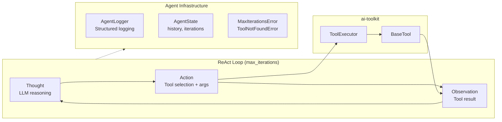

---

## 10. Data Flow

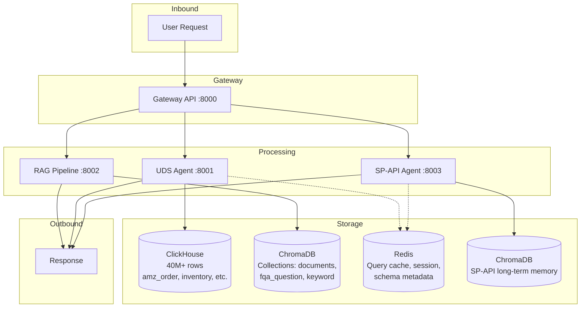

---

## 11. Deployment Architecture

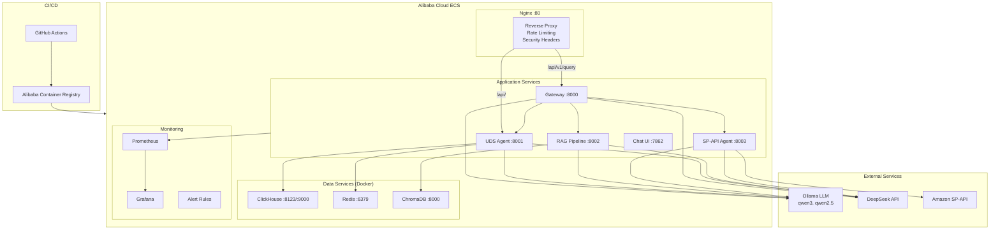

---

## 12. Technology Stack

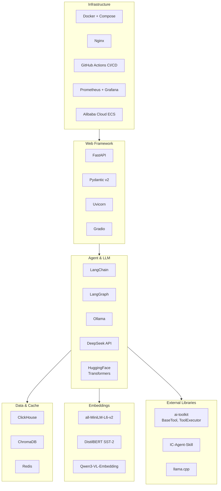

---

## 13. Directory Structure

```
IC-RAG-Agent/
├── src/
│   ├── gateway/        # Unified gateway (routing, rewriting, dispatch)
│   │   ├── api.py            # FastAPI app, POST /api/v1/query
│   │   ├── clarification.py  # check_ambiguity – question user when query ambiguous
│   │   ├── router.py         # Route LLM + heuristic fallback
│   │   ├── rewriters.py      # Ollama / DeepSeek query rewriting
│   │   ├── route_llm.py      # LLM-based workflow classifier
│   │   ├── services.py       # Backend HTTP dispatch
│   │   ├── schemas.py        # QueryRequest / QueryResponse
│   │   └── logging_utils.py  # Structured routing log helpers
│   ├── client/         # Unified chat client
│   │   ├── api_client.py     # GatewayClient (HTTP + mock mode)
│   │   └── gradio_ui.py      # Gradio Chat UI
│   ├── uds/            # UDS Agent (BI for Amazon data)
│   │   ├── api.py            # FastAPI :8001 (sync + streaming)
│   │   ├── uds_agent.py      # UDSAgent extends ReActAgent
│   │   ├── uds_client.py     # ClickHouse client + retry
│   │   ├── intent_classifier.py
│   │   ├── task_planner.py
│   │   ├── result_formatter.py
│   │   ├── cache.py          # Redis cache wrapper
│   │   ├── error_handler.py  # Circuit breaker + retry + backoff
│   │   ├── schemas.py        # Pydantic request/response
│   │   ├── tools/            # 16 tools (schema, query, analysis, viz)
│   │   ├── maintenance/      # quality_checks, statistics
│   │   └── data/             # Business glossary, schema metadata
│   ├── rag/            # RAG Pipeline (intent + retrieval + generation)
│   │   ├── rag_api.py        # FastAPI :8002
│   │   ├── query_pipeline.py # RAGPipeline.build() + query()
│   │   ├── intent_methods.py # 4 parallel intent methods
│   │   ├── intent_aggregator.py
│   │   ├── intent_classifier.py  # Zero-shot NLI
│   │   ├── query_rewriting.py
│   │   ├── chroma_loaders.py
│   │   ├── embeddings.py
│   │   ├── ingest_pipeline.py
│   │   └── evaluation/       # RAGAS metrics, dataset loader, reports
│   ├── agent/          # ReAct agent core (shared by UDS + SP-API)
│   │   ├── react_agent.py    # ReActAgent class
│   │   ├── models.py         # Action, Observation, AgentState
│   │   ├── agent_logger.py   # Structured agent logging
│   │   ├── exceptions.py     # MaxIterationsError, ToolNotFoundError
│   │   └── tools/            # Stub tools (uds_stubs, sp_api_stubs)
│   ├── sp_api/         # SP-API Agent (Amazon seller operations)
│   │   ├── fast_api.py       # FastAPI :8003 (SSE streaming)
│   │   ├── sp_api_agent.py   # SellerOperationsAgent extends ReActAgent
│   │   ├── sp_api_client.py  # Amazon SP-API HTTP client
│   │   ├── workflow.py       # LangGraph state machine
│   │   ├── long_term_memory.py   # ChromaDB semantic memory
│   │   ├── short_term_memory.py  # Redis conversation memory
│   │   ├── schemas.py
│   │   └── tools/            # 10 tools (catalog, orders, inventory, etc.)
│   └── draft/          # Prototypes and experiments
├── scripts/
│   ├── run_gateway.py        # Gateway launcher
│   ├── run_unified_chat.py   # Chat UI launcher
│   ├── run_all_tests.py      # Test runner
│   ├── run_evaluation.py     # RAG evaluation runner
│   ├── load_to_chroma.py     # RAG ingest helper
│   ├── query_rag.py          # RAG query helper
│   └── run_sp_api_gradio.py  # SP-API UI launcher
├── docker/
│   ├── docker-compose.yml    # Redis + ClickHouse + ChromaDB + Gateway
│   ├── Dockerfile.gateway    # Gateway Docker image
│   ├── nginx.conf            # Reverse proxy + rate limiting
│   └── docker-compose.*.yml  # ECS, prod, UDS variants
├── monitoring/
│   ├── prometheus.yml        # Prometheus scrape config
│   ├── alert-rules.yml       # Alert rules
│   └── grafana-dashboards/   # Overview, performance, errors, infra
├── tests/                    # 60+ test files
│   ├── test_gateway_*.py     # Gateway API, router, rewriters, services
│   ├── test_client_*.py      # Client API, Gradio UI
│   ├── test_uds_*.py         # UDS agent, API, client, integration
│   ├── test_rag_*.py         # RAG API, intent, pipeline
│   ├── test_*_agent.py       # ReAct agent, SP-API agent
│   └── *.py                  # Cache, error handling, security, load, UAT
├── tools/                    # Dev/ops utilities
│   ├── benchmark_api.py
│   ├── optimize_queries.py
│   └── generate_*.py         # Quality reports, schema metadata
├── bin/                      # Shell scripts
│   ├── run_rag_api.sh
│   ├── uds_ops.sh
│   └── download_models_from_hf.sh
├── db/                       # Database DDL
│   └── uds/
│       ├── create_tables.sql
│       └── create_indexes.sql
├── specs/                    # API specifications
│   └── UDS_API_SPEC.yaml
├── .github/workflows/        # CI/CD
│   └── deploy.yml            # GitHub Actions → Alibaba Cloud
├── external/
│   ├── ai-toolkit/           # BaseTool, ToolExecutor
│   ├── IC-Agent-Skill/       # Skill definitions
│   └── llama.cpp/            # Local LLM inference
├── models/                   # Local model weights
│   ├── all-MiniLM-L6-v2/
│   ├── distilbert-base-uncased-finetuned-sst-2-english/
│   ├── Qwen3-1.7B/
│   └── Qwen3-VL-Embedding-*/
└── data/
    ├── documents/            # Source documents for RAG
    ├── chroma_db/            # ChromaDB persistent storage
    ├── vector_store/         # Additional vector stores
    └── intent_classification/ # Intent training data
```

---

## 14. Key Integration Points

| From | To | Method | Purpose |
|------|----|--------|---------|
| Chat UI | Gateway | HTTP POST | Unified entry point for all queries |
| Gateway (Route LLM) | Gateway (Dispatcher) | Function call | Pass execution_plan (planning -> execution) |
| Dispatcher | RAG API | HTTP POST `/query` | General, Amazon docs, IC docs workflows |
| Dispatcher | UDS API | HTTP POST `/api/v1/uds/query` | BI analytics queries |
| Dispatcher | SP-API | HTTP POST `/api/v1/seller/query` | Seller operations |
| Gateway Router | Route LLM | Function call | LLM-based workflow classification |
| Gateway Router | Heuristic | Function call | Keyword-based fallback routing |
| Gateway Rewriter | Ollama/DeepSeek | HTTP | Query rewriting before routing |
| UDS Agent | ReAct Agent | Inheritance | Tool orchestration loop |
| SP-API Agent | ReAct Agent | Inheritance | Tool orchestration loop |
| SP-API Agent | LangGraph | StateGraph | Workflow state machine |
| UDS Agent | ClickHouse | clickhouse-connect | SQL query execution |
| UDS Agent | Redis | redis-py | Query + schema caching |
| RAG Pipeline | ChromaDB | chromadb | Document retrieval (L2 distance) |
| RAG Pipeline | HuggingFace | transformers | Zero-shot NLI intent classification |
| SP-API Agent | ChromaDB | chromadb | Long-term semantic memory |
| SP-API Agent | Redis | redis-py | Short-term conversation memory |
| All Agents | ai-toolkit | import | BaseTool, ToolExecutor |
| Nginx | Gateway | proxy_pass | Reverse proxy + rate limiting |
| GitHub Actions | Alibaba Cloud | SSH deploy | CI/CD pipeline |

---

## 15. API Contract

### 15.0 Service Health Endpoints

| Service | Base Port | Health Endpoint |
|---------|-----------|-----------------|
| Gateway | 8000 | `/health` |
| UDS API | 8001 | `/health` |
| RAG API | 8002 | `/health` |
| SP-API API | 8003 | `/api/v1/health` |

### 15.1 Gateway Request

```http
POST /api/v1/query
Content-Type: application/json

{
  "query": "What were my sales in October?",
  "workflow": "auto",
  "rewrite_enable": true,
  "rewrite_backend": "ollama",
  "route_backend": null,
  "session_id": "session-1234",
  "stream": false
}
```

### 15.2 Gateway Response

```json
{
  "answer": "Your total Amazon sales in October were $12,345.",
  "workflow": "uds",
  "routing_confidence": 0.96,
  "sources": [{"type": "table", "name": "amz_order"}],
  "request_id": "req-uuid",
  "error": null,
  "plan": {"plan_type": "hybrid", "task_groups": [...]},
  "task_results": [{"workflow": "uds", "status": "completed", "answer": "..."}],
  "merged_answer": "- [uds] Your total Amazon sales..."
}
```

When `GATEWAY_REWRITE_PLANNER_ENABLED=true`, the response includes `plan`, `task_results`, and `merged_answer` for multi-task execution.

---

## Related Documentation

- [PROJECT.md](PROJECT.md) – Project summary, metrics
- [OPERATIONS.md](OPERATIONS.md) – Operations manual
- [guides/UDS_DEVELOPER_GUIDE.md](guides/UDS_DEVELOPER_GUIDE.md) – Developer guide
- [guides/UDS_API_REFERENCE.md](guides/UDS_API_REFERENCE.md) – UDS API reference
- [guides/QUERY_REWRITING.md](guides/QUERY_REWRITING.md) – Query rewriting guide
- [archive/ARCHITECTURE_DECISIONS.md](archive/ARCHITECTURE_DECISIONS.md) – ADRs
- [archive/ANSWER_MODEL_IDENTITY.md](archive/ANSWER_MODEL_IDENTITY.md) – Answer model identity notes

