# IC-RAG-Agent System Framework

**Version:** 2.4.0  
**Last Updated:** 2026-03-26

This document describes the system framework for the IC-RAG-Agent project using Mermaid diagrams.

**How to view diagrams:** Open this file in Markdown preview mode (Mermaid rendering enabled).

---

## 1. System Overview

IC-RAG-Agent is an **Intent Classification + Retrieval-Augmented Generation** system with a **Unified Gateway** routing queries to five backend workflows:

- **Gateway** – Single entry point with Route LLM (clarification, rewriting, intent classification) and Dispatcher (build execution plan, execute worker agents, merge results)
- **UDS Agent** – Business Intelligence for Amazon seller data (ClickHouse + ReAct)
- **RAG Pipeline** – Document retrieval and hybrid generation with four parallel intent methods
- **SP-API Agent** – Seller Operations via Amazon SP-API (ReAct + LangGraph workflow)
- **Client** – Unified Gradio Chat UI calling the gateway

### 1.1 Framework


**Route LLM vs Dispatcher**

The gateway is organized into two conceptual groups:

| Group          | Responsibility                                  | Description                                                  |
| -------------- | ----------------------------------------------- | ------------------------------------------------------------ |
| **Route LLM**  | Clarification, Rewriting, Intent Classification | Three steps: (1) Clarification, (2) Rewriting (normalize, memory merge, rewrite with context), (3) Intent classification. Outputs rewritten query + intents. |
| **Dispatcher** | Build Plan, Execute, Merge                      | Builds execution plan from rewritten query + intents; invokes worker agents; executes tasks in parallel within groups; merges results. |

**Route LLM** outputs: rewritten query, intents (list of sub-questions).

**Dispatcher** inputs: rewritten query, intents. Builds execution plan (task_groups with workflow + query per task). Outputs: task_results, merged_answer, aggregated sources.

### 1.2 Gateway package layout (code)

The gateway code lives under `src/gateway/` in five logical groups plus shared modules:

| Group | Path | Responsibility |
|-------|------|----------------|
| **API** | `api/` | FastAPI app (`api.py`), JWT auth + routes (`auth.py`), config + logger (`config.py`), view helpers (`view_helpers.py`). Entry: `src.gateway.api.api:app` (see `scripts/run_gateway.py`). |
| **Route LLM** | `route_llm/` | Clarification (`clarification/`), rewriting + routing entry (`rewriting/router.py`, `rewriting/rewriters.py`), intent classification (`classification/`). |
| **Dispatcher** | `dispatcher/` | Execution plan build, worker invocation, merge (`dispatcher.py`, `services.py`). |
| **Memory** | `memory/` | Short-term Redis + event envelope + optional CH dual-write (`short_term.py`); ClickHouse client for message events (`long_term.py`). |
| **Shared** | gateway root | `schemas.py`, `prompt_loader.py`. |

Conceptually unchanged: **Route LLM** then **Dispatcher**; memory and logger integrate at the API and router layers.

### 1.3 Roles


| Role                             | Responsibility                                               | Module           |
| -------------------------------- | ------------------------------------------------------------ | ---------------- |
| **Decision Maker (Reason LLM)**  | Clarify needs, rewrite query, identify intents               | Route LLM        |
| **Project Manager (Supervisor)** | Build execution plan, assign tasks, supervise, aggregate results | Dispatcher       |
| **Worker**                       | Execute tasks, report results                                | RAG, SP-API, UDS |

**Design:** Route LLM outputs rewritten query + intents. Dispatcher builds execution plan (intent → workflow mapping) and executes tasks.


### 1.4 Workflow

````mermaid
graph TB
    subgraph "客户端层"
        UI[统一聊天UI<br/>Gradio界面]
    end
    
    subgraph "网关层"
        Gateway[统一网关]
        RouteLLM[路由LLM<br/>意图分类]
        Dispatcher[调度器<br/>任务分配]
    end
    
    subgraph "工作代理层"
        RAG[RAG管道<br/>文档检索与生成]
        UDS[UDS代理<br/>商业智能]
        SPAPI[SP-API代理<br/>卖家操作]
    end
    
    subgraph "数据层"
        Chroma[(ChromaDB<br/>向量数据库)]
        ClickHouse[(ClickHouse<br/>分析数据库)]
        Redis[(Redis<br/>缓存)]
        Amazon[(亚马逊SP-API)]
    end
    
    UI --> Gateway
    Gateway --> RouteLLM
    RouteLLM --> Dispatcher
    Dispatcher --> RAG
    Dispatcher --> UDS
    Dispatcher --> SPAPI
    
    RAG --> Chroma
    UDS --> ClickHouse
    UDS --> Redis
    SPAPI --> Amazon
    
    style UI fill:#e1f5fe
    style Gateway fill:#f3e5f5
    style RouteLLM fill:#f1f8e9
    style Dispatcher fill:#fff3e0
    style RAG fill:#e8f5e8
    style UDS fill:#e3f2fd
    style SPAPI fill:#fce4ec
    style Chroma fill:#f9fbe7
    style ClickHouse fill:#e0f2f1
    style Redis fill:#fff8e1
    style Amazon fill:#f3e5f5
````

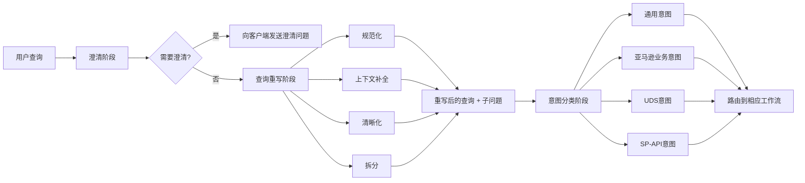


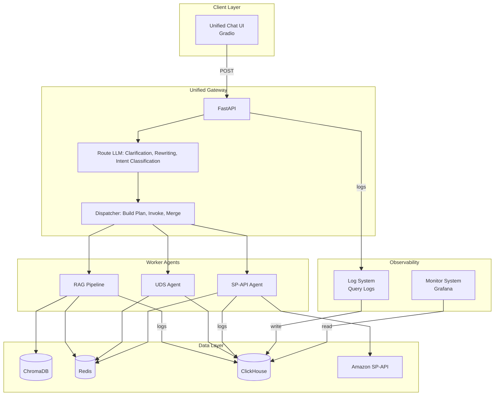

> **Note:** Route LLM outputs rewritten query + intents. Dispatcher builds execution plan (maps intents to workflows) and executes tasks.

---

**Five Workflows**

| # | Workflow | Gateway Route | Backend | Port | Data Source | Status |
|---|----------|---------------|---------|------|-------------|--------|
| 1 | General Knowledge | `general` | RAG (general mode) | 8002 | Remote LLM (DeepSeek / Ollama) | ✅ Ready |
| 2 | Amazon Document | `amazon_docs` | RAG (documents mode) | 8002 | ChromaDB retrieval | ✅ Ready |
| 3 | Enterprise/IC Document | `ic_docs` | RAG (documents mode) | 8002 | ChromaDB (not populated) | ⚠️ Placeholder |
| 4 | SP-API Agent | `sp_api` | SP-API Agent | 8003 | Amazon Seller API | ✅ Ready |
| 5 | UDS Agent | `uds` | UDS Agent | 8001 | ClickHouse (40M+ rows) | ✅ Ready |

> **IC docs:** Not ready yet — Chroma not populated. Gateway returns a friendly message; set `IC_DOCS_ENABLED=true` once populated.


## 2. Chat UI

The Chat UI is a unified Gradio front-end for authenticated multi-turn conversation with the gateway.


### 2.1 Responsibilities

| Responsibility | Behavior |
|---|---|
| Authentication | Supports sign-in and register; stores JWT in `auth_token_state`; toggles login/chat panels by auth status. |
| Session management | Maintains `session_id_state`; supports Clear Session (new UUID) and clears pending clarification cache. |
| Rewriting preview | Calls `/api/v1/rewrite` before `/api/v1/query`; displays Normalize, memory rounds, rewritten query, backend, rewrite latency, and intent classification summary. |
| Clarification follow-up | When clarification is required, stores `pending_query`; merges follow-up text with pending query on next submission. |
| User-scoped memory preload | After successful sign-in/register, fetches the last 3 rounds of conversation from Redis and preloads them into the chatbot. |
| Final answer display | Shows merged answer plus trace metadata (`routed_input`, rewrite backend/time, route source/confidence). |
| Authenticated gateway calls | After sign-in, `GatewayClient.rewrite_sync` / `query_sync` send `user_id` and `token` so memory, history, and protected routes are user-scoped. |

### 2.2 UI Structure

- **Login Panel**
  - Tabs: `Sign In`, `Register`
  - Inputs: user name, password, optional email (register)
  - Output: status markdown message

- **Chat Panel**
  - Left column: workflow selector (`auto/general/amazon_docs/ic_docs/sp_api/uds`), user summary, session ID, clear session, gateway status
  - Right column: chatbot plus input box
  - Sign-out button at top-left of chat panel

### 2.3 Runtime State Model

| State | Purpose |
|---|---|
| `auth_token_state` | JWT token for authenticated API calls |
| `user_info_state` | user metadata (`user_id`, `user_name`, `role`) |
| `session_id_state` | conversation session identifier |
| `_pending_queries` (in-memory map) | client-side cache for clarification merge flow |

### 2.4 End-to-End Interaction

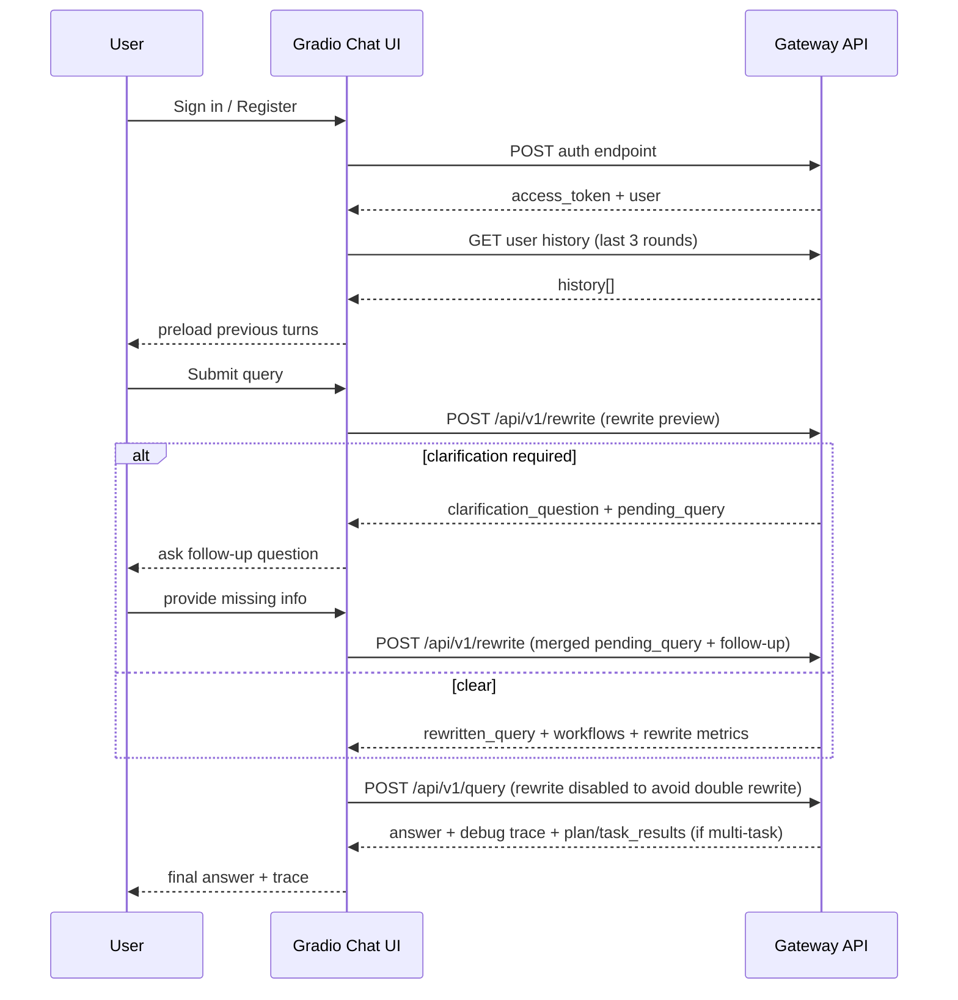

### 2.5 Chat Box UX Decisions

- Present conversation history on each login: every time the user signs in or registers, the chat box loads and displays the last 3 rounds of conversation from Redis so the user can continue in context.
- Rewriting is always enabled in UI (no toggle exposed to users).
- Rewritten query is rendered as a single-line trace value; intent splitting is handled downstream by intent classification and dispatcher.
- Chat container uses fixed-height flex layout and internal scrolling to keep input box visible.
- Auto-scroll is enforced with MutationObserver-based JavaScript to keep latest messages in view after send/receive.


## 3. ROUTE LLM

### 3.1 Query Clarification

First step of Route LLM; runs **before** rewriting. Decides whether the user must answer a clarification question or whether the pipeline may continue to unified rewrite. Aligned with `tasks/route_llm_optimization_scheme_new.md` §2 (L1 / L2 / L3).

**Implementation (code)**

| Piece | Location |
|-------|----------|
| Entry | `src/gateway/route_llm/clarification/clarification.py` — `check_ambiguity()` |
| L1 whitelist + L2 signals + shared regex corpora | `src/gateway/keyword_regular_match.py` — `RouteRulesMatcher`, `ClarificationLayer12Gate`, `ClarificationL3SkipEvaluator` |
| Optional Redis import of same datasets | `external/IC-Self-Study/redis/redis_clear_intent_sentence_ops.py` |

**On-disk rule data (gateway reads CSV by default)**

Directory: `external/IC-Self-Study/data/` unless overridden by `GATEWAY_ROUTE_RULES_DATA_DIR`.

| File | Dataset | Role in clarification |
|------|---------|------------------------|
| `amazon_business_intent_sentence.csv` | **clear_sentence** | **L1** — high-confidence whitelist (`sentence`, `workflow`) |
| `clarification_signals.csv` | **clarification** | **L2** — ambiguous context signals (tiers A/B) and **exclusion** rows |
| `regular_patterns.csv` | **regular_patterns** | UDS query-shape regexes; loaded in the same module for reuse by rewrite / intent (not required for L1/L2 skip logic) |

**Environment variables**

| Variable | Role |
|----------|------|
| `GATEWAY_CLARIFICATION_ENABLED` | Master switch; `false` → skip clarification entirely (`clarification_path: disabled`). |
| `GATEWAY_CLARIFICATION_BACKEND` | L3 LLM backend (`ollama` / `deepseek`). |
| `GATEWAY_CLARIFICATION_MEMORY_ROUNDS` | Prior turns passed as context for pronoun / continuity. |
| `GATEWAY_CLARIFICATION_LAYER1_L2_ENABLED` | Enables **L1+L2** fast path before L3 (doc name `GATEWAY_CLARIFICATION_LAYER1&2_ENABLED`; `&` is invalid in real env keys, hence `_L1_L2_`). |
| `GATEWAY_CLARIFICATION_LAYER3_FORCE` | Always run L3 LLM; bypasses L1/L2 skip (debug / incident). |
| `GATEWAY_ROUTE_RULES_DATA_DIR` | Optional path to the folder containing the three CSV files. |

**`clarification_path` (observability on the result dict)**  
`disabled` | `l1_skip` | `l2_skip` | `l3_llm`

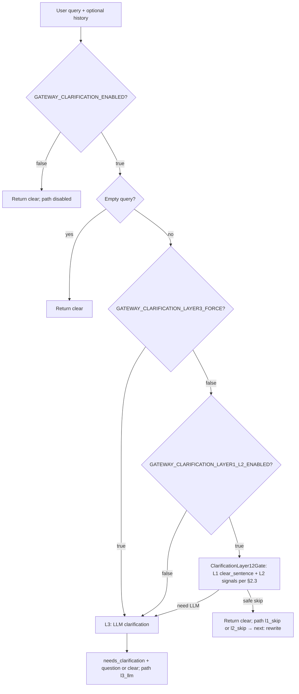

**Purpose**

- Avoid rewriter and downstream guessing when user intent is genuinely underspecified (bias and wrong-tool risk).
- Elicit concrete anchors (Order ID, ASIN, date range, fee type, store) when the L3 LLM marks the query ambiguous.

**Logic (as implemented)**

1. If clarification is disabled → do not load rules or call LLM; return clear.
2. If `GATEWAY_CLARIFICATION_LAYER3_FORCE=true` → always call L3 LLM (single structured prompt: detect ambiguity + optional short question).
3. Else if `GATEWAY_CLARIFICATION_LAYER1_L2_ENABLED=true` and CSV rules load successfully → apply §2.3: with **conversation history**, evaluate **L2** before trusting **L1**; without history, **L1** then **L2**; **exclusion** rows reduce false L2 triggers. If rules allow, return clear and skip L3 (`l1_skip` / `l2_skip`).
4. Otherwise → L3 LLM as above. Output shape: `needs_clarification`, `clarification_question` (with generic fallback if the model omits the question).
5. On LLM/backend failure: treat as clear and proceed (do not block the pipeline).

**Note:** Product copy and prompts may still describe “heuristic” ambiguity; the **executable** fast path is the CSV-driven L1/L2 layer in `keyword_regular_match.py`, not a separate legacy heuristic module in this path.


### 3.2 Query Rewriting (unified rewrite + split)

Second step of Route LLM; runs **after** clarification (when the query is clear). Produces `rewritten_display` and `intents[]` for intent classification—either via a **Redis fast path** (L1/L2) or the **unified rewrite LLM** (L3).

**Layer flags (env)**

| Variable | Layer | Behavior |
|----------|--------|----------|
| `GATEWAY_REWRITE_LAYER1_ENABLED` | L1 | If true, try Redis hash `clear_intent_sentence:data` (clear_sentence dataset): normalized exact match on the query. **On hit:** skip rewrite LLM; single intent = normalized query; go to intent classification. |
| `GATEWAY_REWRITE_LAYER2_ENABLED` | L2 | If L1 misses and this is true, try Redis hash `regular_patterns:data`: first matching regex wins. **On hit:** same as L1 (skip LLM). |
| `GATEWAY_REWRITE_LAYER3_FORCE` | L3 | If true, **always** run the unified rewrite LLM; L1/L2 are skipped (debug / parity with full model). |

**Decision chain**

1. If `GATEWAY_REWRITE_LAYER3_FORCE=true` → L3 only (prompt + LLM).
2. Else if L1 enabled and Redis matches clear_sentence → **l1_redis** path (no LLM).
3. Else if L2 enabled and Redis matches regular_patterns → **l2_redis** path (no LLM).
4. Else → **l3_llm**: one LLM call returns JSON (`intents`, optional `rewritten_display`; see `rewriting/rewrite_prompt.md`). Parsed in `route_llm.rewriting.rewrite_implement`.

Redis URL precedence for the rewrite cache: `GATEWAY_REWRITE_REDIS_URL`, then `GATEWAY_REDIS_URL`, then `REDIS_URL`, else local default. Process-local TTL cache over `HGETALL` is controlled by `GATEWAY_REWRITE_REDIS_CACHE_SECONDS` (default 60). If Redis is down or hashes are empty, L1/L2 miss and L3 runs (when not forced-only).

**Responsibilities (L3 LLM; aligned with Rewriting_Responsibility + split rules in the same prompt)**

- **Normalization:** fix typos, fillers, punctuation; preserve Amazon entities (ASIN, order IDs, dates).
- **Context completion:** resolve references using conversation history when unambiguous.
- **Clarity:** colloquial to formal; do not answer the user; do not assign workflows in prose.
- **Split:** emit one or more self-contained sub-questions in `intents`.

**What the L3 unified rewrite stage does**

- Rewrites the user query with conversation context (same product goals as legacy plain-text rewrite).
- Splits into one or more **self-contained sub-questions** in the same LLM response.
- Outputs **JSON only** (`intents`, optional `rewritten_display`). Parsed in `route_llm.rewriting.rewrite_implement`.
- Does **not** assign workflows; downstream intent classification does.

**L1/L2 note:** Fast path does not call the model; it emits a **single** intent string (normalized query) so the pipeline shape matches the JSON path. Product-level multi-clause split still requires L3.

**Boundary with intent classification**

- **Intent classification** maps each sub-string in `intents` to a workflow (keyword / vector / LLM). It does not perform rewrite or split.


### 3.3 Intent Classification

Classify each string in `intents` (from section 3.2) into executable workflows. Each clause is classified **independently** (batched with limited parallelism in `classify_intents_batch`).

**Optional Redis layers (before local keyword / vector / LLM)**

| Variable | Layer | Behavior |
|----------|--------|----------|
| `GATEWAY_INTENT_CLASSIFICATION_LAYER1_ENABLED` | L1 | If true, try Redis hash `clear_intent_sentence:data` (clear_sentence): normalized exact match on the **intent clause** text. **On hit:** `workflow` from the Redis row is the classification result (`source`: `redis_clear_sentence`). |
| `GATEWAY_INTENT_CLASSIFICATION_LAYER2_ENABLED` | L2 | If L1 misses and this is true, try Redis `regular_patterns:data`: first matching regex. **On hit:** use that row's `workflow` (`source`: `redis_regular_patterns`). |
| `GATEWAY_INTENT_CLASSIFICATION_LAYER3_FORCE` | L3 prep | If true, **skip** L1/L2 Redis only; then run the legacy stack below (keyword → vector → LLM). |

**Per-clause decision chain**

1. If `GATEWAY_INTENT_CLASSIFICATION_LAYER3_FORCE=true` → no Redis L1/L2.
2. Else if L1 enabled and Redis matches clear_sentence → return row `workflow` (high confidence).
3. Else if L2 enabled and Redis matches regular_patterns → return row `workflow` (high confidence).
4. Else **L3 (legacy stack):** **serial** short-circuit: keyword rules (`classification_data`) → vector retrieval (intent_registry Chroma) → parallel LLM prompts (sp_api / uds / amazon_docs) only if keyword and vector both miss.

Redis connection and `HGETALL` TTL cache are shared with rewrite fast path (`rewriting/rewrite_redis_fastpath.py`): URL precedence `GATEWAY_REWRITE_REDIS_URL`, `GATEWAY_REDIS_URL`, `REDIS_URL`, local default; optional `GATEWAY_REWRITE_REDIS_CACHE_SECONDS`.

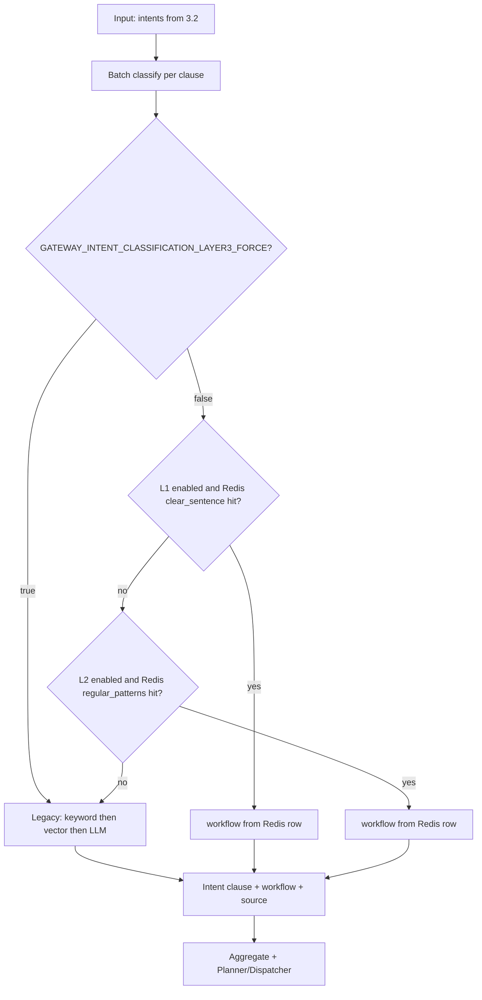

**Legacy L3 internals (serial keyword → vector → LLM)**

`ClassificationImplementMethod.detect` stops at the first hit: keyword match returns immediately; else vector match; else `ClassificationIntentVectorStore.llm_detect` runs **three** workflow-specific prompts in parallel and takes the first affirmative JSON match (else `general`). Keyword and vector layers use `KeywordRetrieval` scoring / hybrid labels where applicable; see `implement_methods.py` for details.

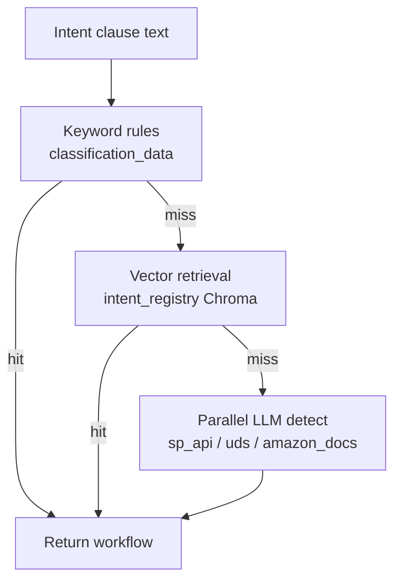

**Workflow steps (full pipeline summary)**

1. Receive `intents` list from the unified rewrite stage (3.2).
2. For each clause: optional Redis L1 → L2 as above; else serial keyword → vector → LLM (`ClassificationImplementMethod.detect` in `implement_methods.py`).
3. Aggregate all final workflows into a deduplicated list plus per-intent details.
4. Pass to Planner/Dispatcher for plan build, task execution, and result merge.

**Resolver-style examples (when both keyword and vector contribute scores — conceptual)**

| Keyword | Vector | Typical resolution |
|---------|--------|--------------------|
| uds | uds | uds |
| uds | sp_api | uds |
| hybrid | sp_api | sp_api |
| amazon_docs | hybrid | amazon_docs |
| hybrid | hybrid | general |

**Runtime flags**

| Flag | Effect |
|------|--------|
| `GATEWAY_VECTOR_INTENT_ENABLED=true` | vector-intent path in planner execution |

Out of scope: rewriting text, clarification questions, downstream execution.


## 4. Chroma data loading

Scope: **offline ingest only** (no ECS transfer in these steps).

- Two **separate** persist directories: `documents` vs `intent_registry`.
- Both loaders **truncate** before insert (full reset of that store).
- **Single embedding stack:** local **Ollama** only, model **`all-minilm:latest`** (pulled once; index and query must match).

---

### 4.1 Architecture (data + stores)

Embedding is **not** optional in this setup: both loaders call Ollama **`all-minilm:latest`** on the local machine (`ollama serve`).

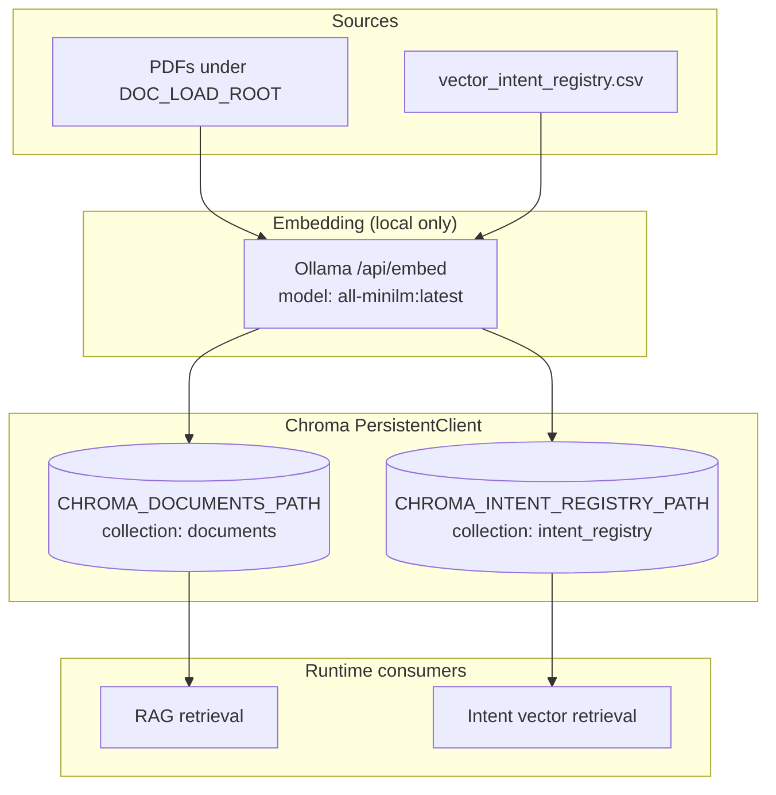

| Block | Meaning |
|-------|--------|
| **Sources** | PDFs for RAG chunks; intent registry CSV with columns `text`, `intent` (optional third `workflow`; if omitted, workflow stored as `intent`). |
| **Embedding** | **Ollama only**, **`all-minilm:latest`** (local download); same model for document chunks and intent rows. |
| **Chroma** | One SQLite + segment dir per persist path; collections are logical names inside each path. |
| **Consumers** | RAG reads `documents`; gateway intent classifier reads `intent_registry` when vector path is on. |

---

### 4.2 Workflow (operator sequence)

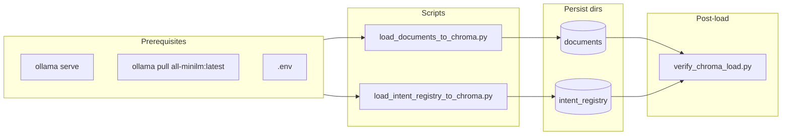

| Step | Artifact | Responsibility |
|------|----------|----------------|
| 1 | Ollama | Required for default embed; serves embed API on `GATEWAY_REWRITE_OLLAMA_URL` host. |
| 2 | `load_documents_to_chroma.py` | PDFs → chunk → embed → collection `documents`. |
| 3 | `load_intent_registry_to_chroma.py` | CSV → embed → collection `intent_registry`. |
| 4 | `verify_chroma_load.py` | Asserts min counts: `VERIFY_CHROMA_MIN_DOCUMENTS`, `VERIFY_CHROMA_MIN_INTENT_ROWS`. |

---

### 4.3 Code file structure (Chroma load feature)

```text
scripts/load_to_chroma/
  __init__.py
  load_documents_to_chroma.py      # PDF → documents collection
  load_intent_registry_to_chroma.py # CSV → intent_registry collection
  verify_chroma_load.py            # smoke check both stores

src/rag/
  chroma_loaders.py
  vector_registry_loader.py   # Ollama all-minilm:latest batch embed
  ingest_pipeline.py
  embeddings.py

src/gateway/route_llm/classification/classification_data/
  vector_intent_registry.csv   # default intent CSV in code (text, intent; optional workflow)

data/
  documents/               # default DOC_LOAD_ROOT (PDFs)
  intent_classification/vector_retrieval/
    vector_intent_registry.csv  # mirror copy (same 2-column schema)
  chroma_db/
    documents/               # created by document loader
    intent_registry/         # created by intent loader
```

---

### 4.4 File responsibilities

| File | Responsibility |
|------|----------------|
| `scripts/load_to_chroma/load_documents_to_chroma.py` | CLI; env defaults; Ollama URL/model for document embed; calls `load_documents_to_chroma`. |
| `scripts/load_to_chroma/load_intent_registry_to_chroma.py` | CLI; default `--embed-backend ollama` + `all-minilm:latest`; calls `load_vector_registry_local`. |
| `scripts/load_to_chroma/verify_chroma_load.py` | Opens both persist clients; prints counts; exit 1 if below minimum. |
| `scripts/load_to_chroma/__init__.py` | Package marker. |
| `src/rag/chroma_loaders.py` | Dotenv bootstrap; document ingest entry; CSV→Chroma helpers. |
| `src/rag/vector_registry_loader.py` | Truncate collection; batch Ollama `/api/embed`; Chroma add. |
| `src/rag/ingest_pipeline.py` | End-to-end document pipeline into one collection. |
| `src/rag/embeddings.py` | LangChain-compatible embed factories. |

---

### 4.5 Commands

```bash
ollama serve
ollama pull all-minilm:latest

python scripts/load_to_chroma/load_documents_to_chroma.py
python scripts/load_to_chroma/load_intent_registry_to_chroma.py
python scripts/load_to_chroma/verify_chroma_load.py
```

---

### 4.6 Environment (minimal)

| Variable | Role |
|----------|------|
| `CHROMA_DOCUMENTS_PATH` | Document Chroma root. |
| `CHROMA_DOCUMENTS_COLLECTION` | Default `documents`. |
| `DOC_LOAD_ROOT` | PDF root. |
| `DOC_LOAD_EMBED_MODEL` | Default `ollama` (pair with `all-minilm:latest`). |
| `DOC_LOAD_OLLAMA_MODEL` | `all-minilm:latest` (recommended; matches local Ollama image). |
| `CHROMA_INTENT_REGISTRY_PATH` | Intent Chroma root. |
| `CHROMA_INTENT_REGISTRY_COLLECTION` | Default `intent_registry`. |
| `INTENT_REGISTRY_EMBED_BACKEND` | Default `ollama`. |
| `GATEWAY_REWRITE_OLLAMA_URL` | Ollama host (strip `/api/generate` in loaders). |
| `GATEWAY_INTENT_EMBEDDING_MODEL` | Use `all-minilm:latest` (same as document ingest). |
| `VECTOR_REGISTRY_CSV` | Optional CSV override. |
| `VERIFY_CHROMA_MIN_DOCUMENTS` | Verify threshold. |
| `VERIFY_CHROMA_MIN_INTENT_ROWS` | Verify threshold. |

---

## 5. Logger System

Scope: **gateway observability** — dual-write **short-term** (Redis) and **long-term** (ClickHouse). Package name **`logger`** (not `logging`, stdlib conflict).

- **Redis:** session/user-scoped lists, TTL, capped length per key.
- **ClickHouse:** durable rows, filter by user/session/workflow.
- **Public API:** `get_logger_facade()` only from gateway code.
- **Storage clients** (`redis_client`, `ch_client`) stay under `src/logger/` (log-specific; not generic DB layer).

---

### 5.1 Architecture (writes + stores)

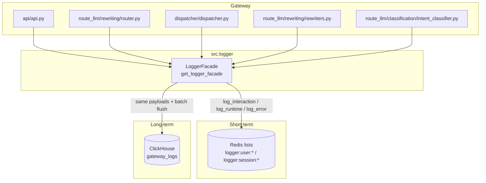

| Block | Meaning |
|-------|--------|
| **Gateway** | Calls facade; failures do not break requests (warnings only). |
| **Facade** | Validates via Pydantic; `_dual_write` to Redis then CH; optional redaction. |
| **Redis** | JSON lines per event; `ltrim` + `expire` per settings. |
| **ClickHouse** | Table ensured on init; buffered inserts when batch enabled. |

---

### 5.2 Request logging flow (simplified)

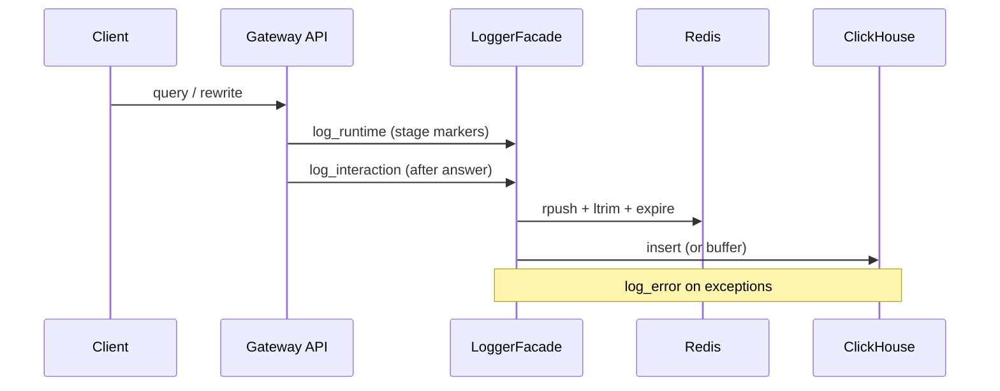

| Step | Responsibility |
|------|----------------|
| 1 | Runtime events mark stages (rewrite, classify, dispatch). |
| 2 | Interaction event captures query, clarification, rewrite, intents, answer, latency. |
| 3 | Error event adds stacktrace when handler fails. |

---

### 5.3 Code file structure (logger feature)

```text
src/logger/
  __init__.py          # exports get_logger_facade, models, LoggerSettings
  settings.py          # LoggerSettings.from_env()
  models.py            # InteractionLog, RuntimeLog, ErrorLog, LogKind, LogStatus
  base.py              # with_retry, safe_json_dumps, redact_payload
  redis_client.py      # RedisLogClient (short-term lists)
  ch_client.py         # ClickHouseLogClient (long-term table)
  logger.py            # LoggerFacade, singleton get_logger_facade
```

---

### 5.4 File responsibilities

| File | Responsibility |
|------|----------------|
| `logger/__init__.py` | Public exports; stable import surface. |
| `logger/settings.py` | Env → `LoggerSettings`; Redis/CH URLs, TTL, batch, retry, redaction fields. |
| `logger/models.py` | Pydantic events; `to_storage_dict()` for storage. |
| `logger/base.py` | Retry wrapper; JSON safe dump; payload redaction. |
| `logger/redis_client.py` | Write/read by `user_id` or `session_id`; key prefix `logger:` |
| `logger/ch_client.py` | Connect lazy; `ensure_table`; write + read_events + flush. |
| `logger/logger.py` | `from_runtime()` builds clients; dual-write; `read_short_term` / `read_long_term`. |

---

### 5.5 Environment (logger)

| Variable | Role |
|----------|------|
| `LOGGER_ENABLED` | Master switch (default on). |
| `LOGGER_REDIS_ENABLED` | Short-term sink. |
| `LOGGER_CLICKHOUSE_ENABLED` | Long-term sink. |
| `LOGGER_REDIS_URL` | Fallback: `GATEWAY_REDIS_URL`. |
| `LOGGER_REDIS_TTL_SECONDS` | Key TTL. |
| `LOGGER_REDIS_MAX_EVENTS_PER_KEY` | List cap after rpush. |
| `LOGGER_CH_HOST` | Fallback: `CH_HOST`. |
| `LOGGER_CH_PORT` | Fallback: `CH_PORT`. |
| `LOGGER_CH_USER` / `LOGGER_CH_PASSWORD` / `LOGGER_CH_DATABASE` | CH auth + DB. |
| `LOGGER_CH_TABLE` | Default `gateway_logs`. |
| `LOGGER_CH_BATCH_ENABLED` / `LOGGER_CH_BATCH_SIZE` | Buffered CH writes. |
| `LOGGER_RETRY_*` | Redis/CH write retries. |
| `LOGGER_REDACTION_ENABLED` / `LOGGER_REDACTION_FIELDS` | Strip sensitive keys. |

---

### 5.6 Operations

| Action | Instruction |
|--------|-------------|
| Disable all logging | `LOGGER_ENABLED=false`. |
| Redis only | `LOGGER_CLICKHOUSE_ENABLED=false`. |
| CH only | `LOGGER_REDIS_ENABLED=false`. |


## 6. Short-term and long-term memory

Scope: **event-based conversation memory** shared by Redis (short-term, TTL) and ClickHouse (long-term, full history). Same message envelope; dual-write; no transformation.

- **Redis:** Fast read for next request (rewrite context, UI history). Recent days only (TTL + LTRIM).
- **ClickHouse:** Durable rows for analytics, audit, replay. Table `rag_agent_message_event`.
- **Event envelope:** 8 fields; one logical message; two physical layouts.

---

### 6.1 Architecture (data + stores)

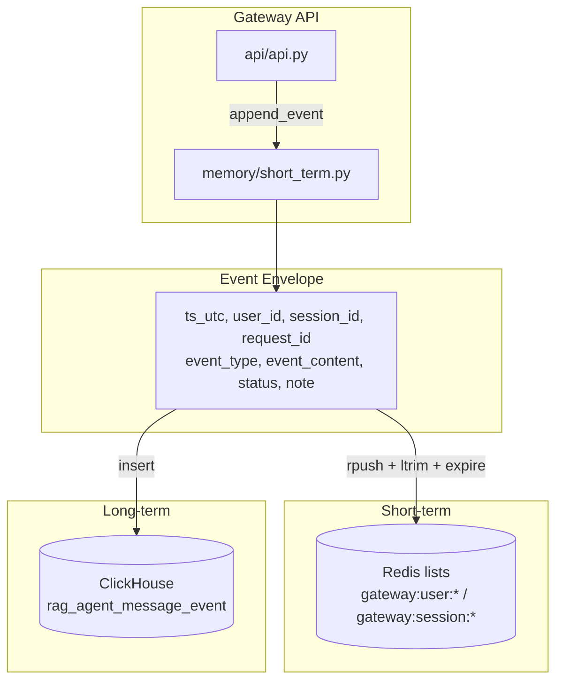

| Block | Meaning |
|-------|--------|
| **Gateway** | Emits events at each Route LLM stage; `append_event` best-effort (failures do not break requests). |
| **Envelope** | Shared 8-field structure; `request_id` correlates all events for one gateway call. |
| **Redis** | JSON per list element; TTL; LTRIM cap (e.g. 200 events per user). |
| **ClickHouse** | One row per event; partition by month; order by user_id, session_id, ts, request_id. |

---

### 6.2 Event types and flow

| `event_type` | When emitted | Typical `event_content` |
|--------------|--------------|--------------------------|
| `user_query` | User message accepted | Raw user text or JSON |
| `query_clarification` | After clarification step | Clarification question or JSON |
| `query_rewriting` | After rewrite step | Rewritten single line |
| `intent_classification` | After intent step | JSON: workflows / clauses |
| `llm_answer` | Final user-visible answer | Answer text |
| `turn_summary` | After full turn | JSON `{"query","answer","workflow"}` for rewrite context |

---

### 6.3 How to identify which answer belongs to which query

**Correlation key:** `request_id`. Each gateway request gets one `request_id` at entry; all events for that turn share it.

| Correlation | How |
|-------------|-----|
| Same turn | Same `request_id` |
| Query | `event_type = 'user_query'` or parse `turn_summary.event_content` |
| Answer | `event_type = 'llm_answer'` or parse `turn_summary.event_content` |
| Order | `ts` within each `request_id` |

**Example SQL (ClickHouse):**

```sql
-- All events for one turn
SELECT ts, event_type, event_content
FROM rag_agent_message_event
WHERE request_id = 'abc123-def456-...'
ORDER BY ts;

-- Query–answer pairs per turn (using turn_summary)
SELECT request_id, event_content
FROM rag_agent_message_event
WHERE event_type = 'turn_summary'
ORDER BY ts DESC;
```

`turn_summary` stores both query and answer in one JSON: `{"query":"...","answer":"...","workflow":"..."}`.

---

### 6.4 Workflow (dual-write)

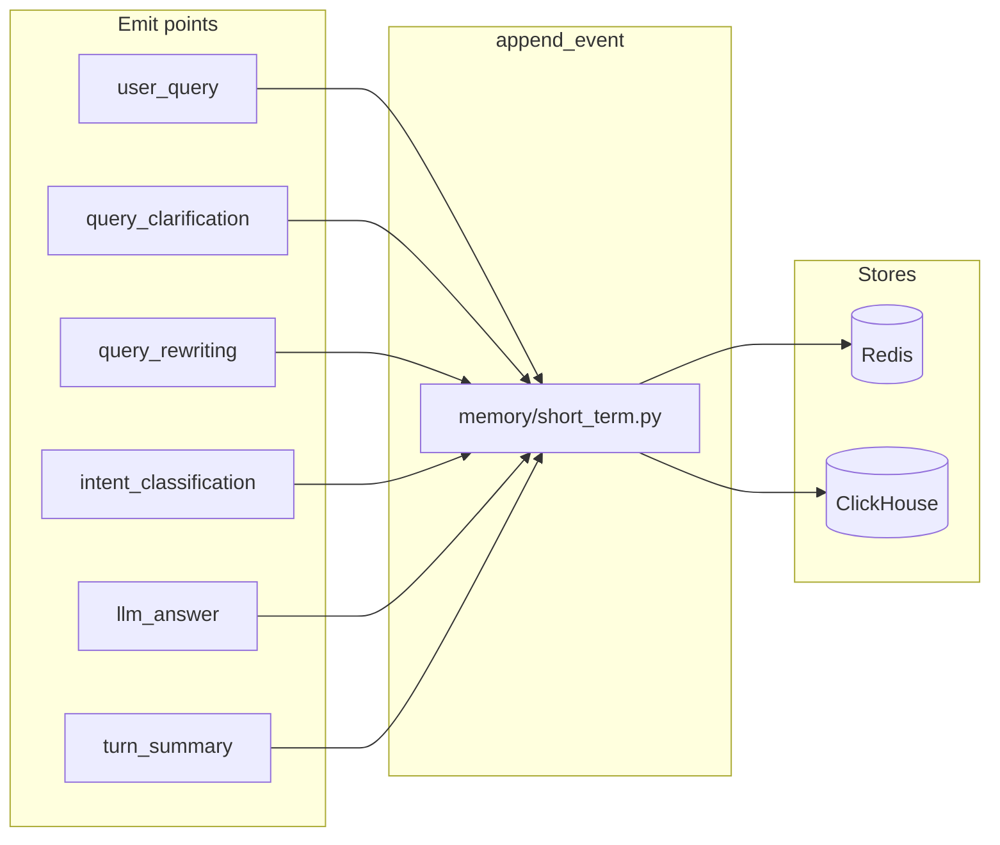

| Step | Responsibility |
|------|----------------|
| 1 | `api/api.py` emits events at clarification, rewrite, intent, answer, and turn_summary stages. |
| 2 | `append_event` validates via `MemoryEvent` (in `memory/short_term.py`); writes to Redis user key (and optional session key). |
| 3 | Optional CH write when `GATEWAY_MEMORY_CH_ENABLED=true`; same payload, no transformation. |

---

### 6.5 Code file structure

```text
src/gateway/
  api/
    api.py                 # Emit points: _append_memory_event at each stage; FastAPI app
  memory/
    short_term.py          # MemoryEvent model; GatewayConversationMemory: append_event, get_history*, save_turn
    long_term.py           # GatewayMemoryCHClient (ClickHouse rag_agent_message_event)
  route_llm/rewriting/
    router.py              # uses message.py format_history_for_llm_markdown for context

scripts/
  create_gateway_memory_events.sql   # DDL for rag_agent_message_event
```

Run gateway: `python scripts/run_gateway.py` (Uvicorn: `src.gateway.api.api:app`).

---

### 6.6 File responsibilities

| File | Responsibility |
|------|----------------|
| `memory/short_term.py` | Pydantic `MemoryEvent`; Redis append; optional CH dual-write via long_term client; `save_turn` (legacy); `append_event` (v1). |
| `memory/long_term.py` | ClickHouse connect; `ensure_table`; `write_event` to `rag_agent_message_event`. |
| `api/api.py` | Generate `request_id`; call `_append_memory_event` at each stage; pass `request_id` through. |
| `route_llm/rewriting/router.py` | Uses `ConversationHistoryHandler.format_history_for_llm_markdown` (message.py) for history context. |
| `create_gateway_memory_events.sql` | DDL: MergeTree, partition by month, order by user_id, session_id, ts, request_id. |

---

### 6.7 Environment

| Variable | Role |
|----------|------|
| `GATEWAY_REDIS_URL` | Redis for short-term memory. |
| `GATEWAY_SESSION_TTL` | Key TTL (default 86400). |
| `GATEWAY_MEMORY_WRITE_SESSION_KEY` | When true, also write to session key for `/api/v1/session/{id}`. |
| `GATEWAY_MEMORY_CH_ENABLED` | When true, dual-write to ClickHouse. |
| `GATEWAY_MEMORY_CH_TABLE` | Table name (default `rag_agent_message_event`). |
| `LOGGER_CH_HOST` / `LOGGER_CH_PORT` / `LOGGER_CH_*` | ClickHouse connection (shared with logger). |

---

### 6.8 Operations

| Action | Instruction |
|--------|-------------|
| Disable CH dual-write | `GATEWAY_MEMORY_CH_ENABLED=false`. |
| Create table on ECS | Run `scripts/create_gateway_memory_events.sql` via `clickhouse-client` or HTTP. See `docs/guides/GATEWAY_MEMORY_EVENTS_CLICKHOUSE.md`. |
| Verify table | `DESCRIBE TABLE rag_agent_message_event;` |
