# IC-RAG-Agent System Framework

**Version:** 2.4.0  
**Last Updated:** 2026-03-13

This document describes the system framework for the IC-RAG-Agent project using Mermaid diagrams.

**How to view diagrams:** Open this file in Markdown preview mode (Mermaid rendering enabled).

---

## 1. System Overview

IC-RAG-Agent is an **Intent Classification + Retrieval-Augmented Generation** system with a **Unified Gateway** routing queries to five backend workflows:

- **Gateway** – Single entry point with Route LLM (clarification, rewriting, intent classification) and Dispatcher (build execution plan, execute worker agents, merge results)
- **UDS Agent** – Business Intelligence for Amazon seller data (ClickHouse + ReAct)
- **RAG Pipeline** – Document retrieval and hybrid generation with four parallel intent methods
- **SP-API Agent** – Seller Operations via Amazon SP-API (ReAct + LangGraph workflow)
- **Client** – Unified Gradio Chat UI calling the gateway

### 1.1 Framework

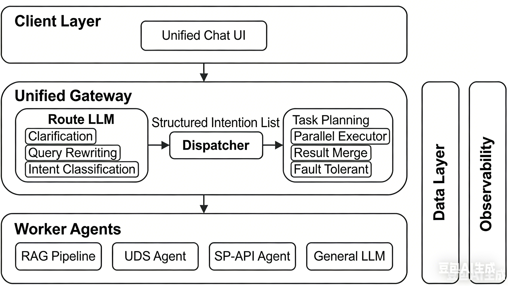

**Route LLM vs Dispatcher**

The gateway is organized into two conceptual groups:

| Group          | Responsibility                                  | Description                                                  |
| -------------- | ----------------------------------------------- | ------------------------------------------------------------ |
| **Route LLM**  | Clarification, Rewriting, Intent Classification | Three steps: (1) Clarification, (2) Rewriting (normalize, memory merge, rewrite with context), (3) Intent classification. Outputs rewritten query + intents. |
| **Dispatcher** | Build Plan, Execute, Merge                      | Builds execution plan from rewritten query + intents; invokes worker agents; executes tasks in parallel within groups; merges results. |

**Route LLM** outputs: rewritten query, intents (list of sub-questions).

**Dispatcher** inputs: rewritten query, intents. Builds execution plan (task_groups with workflow + query per task). Outputs: task_results, merged_answer, aggregated sources.

### 1.2 Gateway package layout (code)

The gateway code lives under `src/gateway/` in five logical groups plus shared modules:

| Group | Path | Responsibility |
|-------|------|----------------|
| **API and auth** | `api_and_auth/` | FastAPI app (`api.py`), JWT auth + routes (`auth.py`), config + logger (`config.py`), view helpers (`view_helpers.py`). Entry: `src.gateway.api_and_auth.api:app` (see `scripts/run_gateway.py`). |
| **Route LLM** | `route_llm/` | Clarification (`clarification/`), rewriting + routing entry (`rewriting/router.py`, `rewriting/rewriters.py`), intent classification (`classification/`). |
| **Dispatcher** | `dispatcher/` | Execution plan build, worker invocation, merge (`dispatcher.py`, `services.py`). |
| **Memory** | `memory/` | Short-term Redis + event envelope + optional CH dual-write (`short_term.py`); ClickHouse client for message events (`long_term.py`). |
| **Shared** | gateway root | `schemas.py`, `prompt_loader.py`, `logging_utils.py`. |

Conceptually unchanged: **Route LLM** then **Dispatcher**; memory and logger integrate at the API and router layers.

### 1.3 Roles

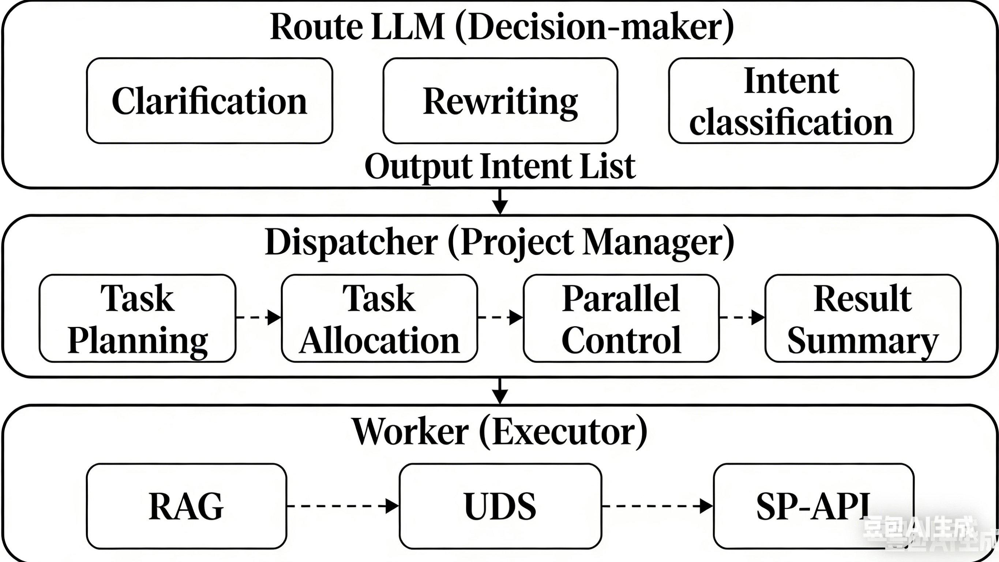

| Role                             | Responsibility                                               | Module           |
| -------------------------------- | ------------------------------------------------------------ | ---------------- |
| **Decision Maker (Reason LLM)**  | Clarify needs, rewrite query, identify intents               | Route LLM        |
| **Project Manager (Supervisor)** | Build execution plan, assign tasks, supervise, aggregate results | Dispatcher       |
| **Worker**                       | Execute tasks, report results                                | RAG, SP-API, UDS |

**Design:** Route LLM outputs rewritten query + intents. Dispatcher builds execution plan (intent → workflow mapping) and executes tasks.


### 1.4 Workflow

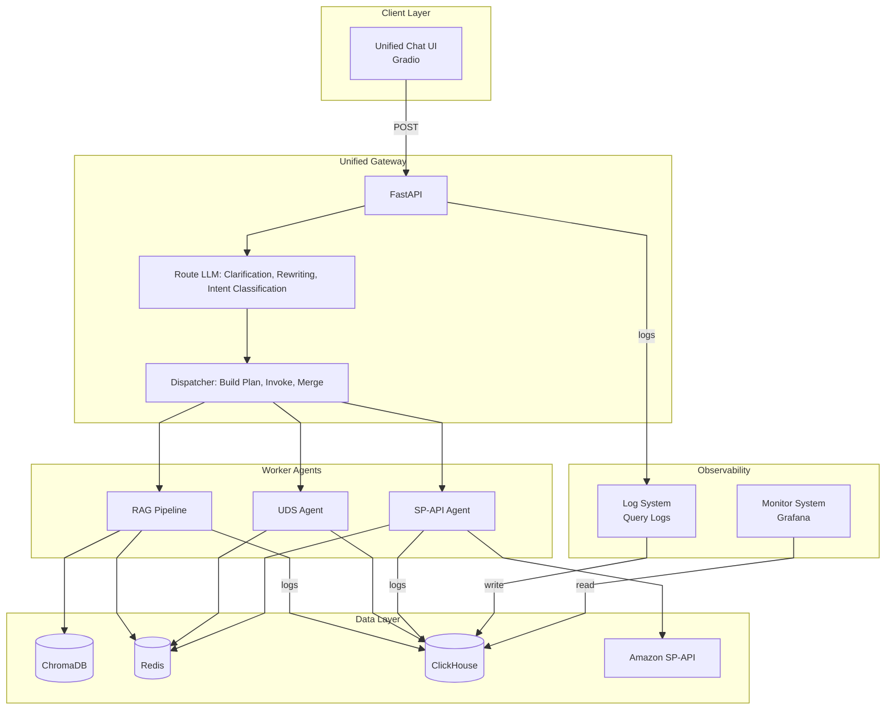

> **Note:** Route LLM outputs rewritten query + intents. Dispatcher builds execution plan (maps intents to workflows) and executes tasks.

---

**Five Workflows**

| # | Workflow | Gateway Route | Backend | Port | Data Source | Status |
|---|----------|---------------|---------|------|-------------|--------|
| 1 | General Knowledge | `general` | RAG (general mode) | 8002 | Remote LLM (DeepSeek / Ollama) | ✅ Ready |
| 2 | Amazon Document | `amazon_docs` | RAG (documents mode) | 8002 | ChromaDB retrieval | ✅ Ready |
| 3 | Enterprise/IC Document | `ic_docs` | RAG (documents mode) | 8002 | ChromaDB (not populated) | ⚠️ Placeholder |
| 4 | SP-API Agent | `sp_api` | SP-API Agent | 8003 | Amazon Seller API | ✅ Ready |
| 5 | UDS Agent | `uds` | UDS Agent | 8001 | ClickHouse (40M+ rows) | ✅ Ready |

> **IC docs:** Not ready yet — Chroma not populated. Gateway returns a friendly message; set `IC_DOCS_ENABLED=true` once populated.


## 2. Chat UI

The Chat UI is a unified Gradio front-end for authenticated multi-turn conversation with the gateway.

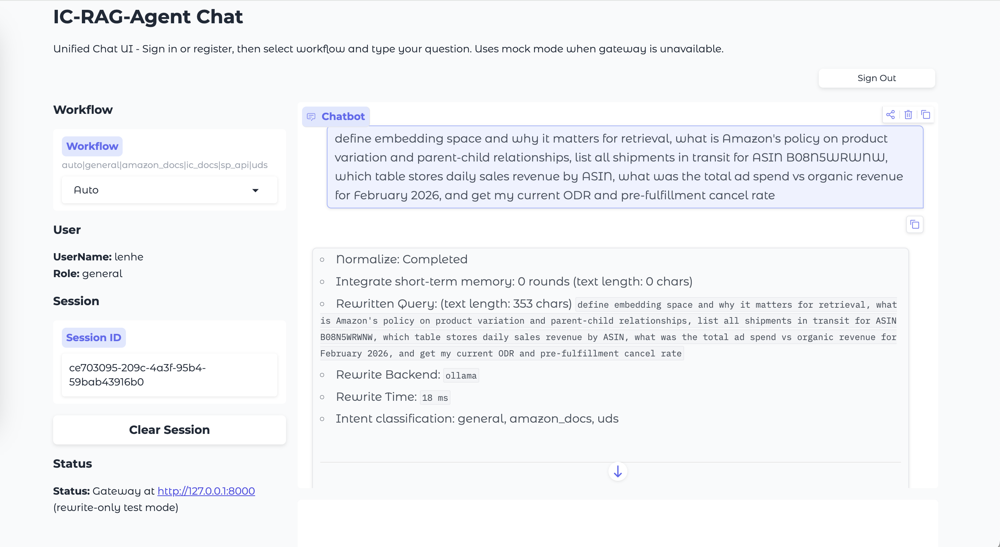

### 2.1 Responsibilities

| Responsibility | Behavior |
|---|---|
| Authentication | Supports sign-in and register; stores JWT in `auth_token_state`; toggles login/chat panels by auth status. |
| Session management | Maintains `session_id_state`; supports Clear Session (new UUID) and clears pending clarification cache. |
| Rewriting preview | Calls `/api/v1/rewrite` before `/api/v1/query`; displays Normalize, memory rounds, rewritten query, backend, rewrite latency, and intent classification summary. |
| Clarification follow-up | When clarification is required, stores `pending_query`; merges follow-up text with pending query on next submission. |
| User-scoped memory preload | After successful sign-in/register, fetches the last 3 rounds of conversation from Redis and preloads them into the chatbot. |
| Final answer display | Shows merged answer plus trace metadata (`routed_input`, rewrite backend/time, route source/confidence). |
| Authenticated gateway calls | After sign-in, `GatewayClient.rewrite_sync` / `query_sync` send `user_id` and `token` so memory, history, and protected routes are user-scoped. |

### 2.2 UI Structure

- **Login Panel**
  - Tabs: `Sign In`, `Register`
  - Inputs: user name, password, optional email (register)
  - Output: status markdown message

- **Chat Panel**
  - Left column: workflow selector (`auto/general/amazon_docs/ic_docs/sp_api/uds`), user summary, session ID, clear session, gateway status
  - Right column: chatbot plus input box
  - Sign-out button at top-left of chat panel

### 2.3 Runtime State Model

| State | Purpose |
|---|---|
| `auth_token_state` | JWT token for authenticated API calls |
| `user_info_state` | user metadata (`user_id`, `user_name`, `role`) |
| `session_id_state` | conversation session identifier |
| `_pending_queries` (in-memory map) | client-side cache for clarification merge flow |

### 2.4 End-to-End Interaction

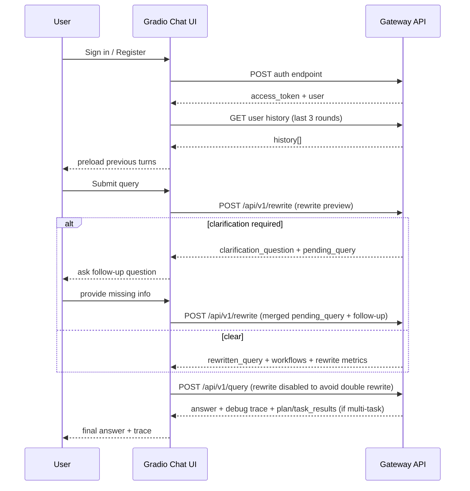

### 2.5 Chat Box UX Decisions

- Present conversation history on each login: every time the user signs in or registers, the chat box loads and displays the last 3 rounds of conversation from Redis so the user can continue in context.
- Rewriting is always enabled in UI (no toggle exposed to users).
- Rewritten query is rendered as a single-line trace value; intent splitting is handled downstream by intent classification and dispatcher.
- Chat container uses fixed-height flex layout and internal scrolling to keep input box visible.
- Auto-scroll is enforced with MutationObserver-based JavaScript to keep latest messages in view after send/receive.


## 3. ROUTE LLM

### 3.1 Query Clarification

First step of Route LLM; runs **before** rewriting. Detects ambiguous or incomplete queries and asks the user for missing information instead of guessing.

**Purpose**

- Avoid rewriter and downstream guessing missing details (bias risk).
- Get concrete identifiers (Order ID, ASIN, date range, fee type, store) so routing and execution are correct.

**When it runs**

- On every rewrite/query request when clarification is enabled (default: on; configurable).
- Same backend as rewriting (Ollama or DeepSeek).

**Inputs**

- Current query (raw user message).
- Optional conversation context: last 3–4 rounds from Redis. If present, do not ask again for info already given.

**Logic**

- Skip for self-contained questions: documentation, policy, compliance, requirements, “what does Amazon say.”
- Heuristic fast path: when no context, check known ambiguous patterns (e.g. inventory without ASIN/store, order without Order ID, fees without type/period, sales without date). Use fixed question or LLM-generated one.
- LLM check: when context exists or heuristic does not apply, LLM decides clear vs needs_clarification and returns a short question. Output is structured (needs_clarification, clarification_question).
- On LLM/backend failure: proceed without clarification (do not block).

**Outputs**

- Clear: needs_clarification false → continue to rewriting and intent classification.
- Ambiguous: needs_clarification true, clarification_question, pending_query. Client shows question; next user message is merged with pending_query and re-sent.

**What clarification does NOT do**

- Does not rewrite the query.
- Does not assign workflows or execute tasks.
- Does not split intents; it only asks for missing info and returns a question.


### 3.2 Query Rewriting

Second step of Route LLM; runs **after** clarification (when the query is clear). Produces one clean, normalized sentence for downstream intent classification. Does not split intents or assign workflows.

**Responsibilities (from Rewriting_Responsibility)**

- **Normalization:** lowercase, remove extra spaces and line breaks, unify punctuation, correct obvious typos (optional).
- **Context completion:** resolve references (it / this / that → explicit entities); fill omitted information from conversation context.
- **Rewrite for clarity:** colloquial → formal/standard; do not change meaning; **do not split sentences**.
- **Remove useless tokens:** modal particles, polite phrases (optional).

**What rewriting does NOT do**

- Does NOT split multi-intent queries into sub-questions.
- Does NOT assign workflows or routing.
- Does NOT output JSON or structured plans.
- Output is always **plain text** — one clean, normalized sentence.

**When it runs**

- After clarification (or when clarification is skipped). Only when rewrite is enabled (e.g. client sends rewrite_enable true).
- Backend: Ollama or DeepSeek (same as clarification; configurable).

**Inputs**

- **Current query:** normalized raw query (trim, collapse whitespace) from the previous step.
- **Conversation context:** optional. Preloaded context (e.g. from clarification) is merged with Redis memory (user or session); turns are deduplicated and renumbered. Last N rounds (configurable) are formatted as "Turn K: User asked \"...\" -> Answer \"...\"" for the LLM.

**Pipeline (high level)**

- Normalize query (trim, collapse whitespace). If empty, return empty; if rewrite disabled, return normalized.
- Load and merge conversation context (preloaded + Redis); format for LLM.
- Call LLM with rewrite prompt: rules (normalize, resolve refs, fill from context, clarity, preserve entities, no split, one line only). Input = context + current query.
- Post-process: strip echoed trace/labels from LLM output; collapse newlines to one line; check responsibility compliance (plain text, no JSON/list). If non-compliant, fallback to normalized original query.
- Return single-line rewritten query.

**Output**

- One plain-text sentence. Passed to intent classification (which may split into sub-questions). On LLM/backend failure, returns normalized original query.

**Boundary with Intent Classification**

- Intent splitting (multi-intent → sub-questions) is **not** part of rewriting; it is Step 1 of the Intent Classification workflow. Rewriting outputs a single sentence; the intent classifier consumes it and may split it there.


### 3.3 Intent Classification

Classify sub-intents from the rewritten query into executable workflows.

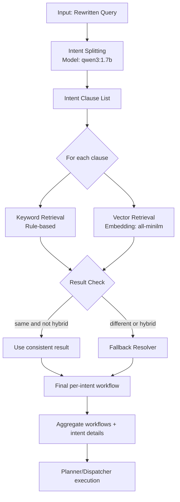

**Workflow steps**

1. Receive rewritten query (single line from 3.2) as input.
2. Split into intent clauses using qwen3:1.7b; output a list of sub-intents.
3. For each clause, run dual retrieval in parallel: keyword (rule-based) and vector (all-minilm + Chroma).
4. Compare keyword vs vector; if same and neither is `hybrid`, use that result.
5. If different or either is `hybrid`, run fallback resolver.
6. Fallback priority: keyword (if not hybrid) → vector (if not hybrid) → `general`.
7. Aggregate all final workflows into a deduplicated list plus per-intent details.
8. Pass to Planner/Dispatcher for plan build, task execution, and result merge.

**Fallback examples**

| Keyword | Vector | Final |
|---------|--------|-------|
| uds | uds | uds |
| uds | sp_api | uds |
| hybrid | sp_api | sp_api |
| amazon_docs | hybrid | amazon_docs |
| hybrid | hybrid | general |

**Runtime flags**

| Flag | Effect |
|------|--------|
| `GATEWAY_INTENT_CLASSIFICATION_ENABLED=true` | dual retrieval + fallback resolver |
| `GATEWAY_INTENT_CLASSIFICATION_ENABLED=false` | keep split list, heuristic workflow assignment |
| `GATEWAY_VECTOR_INTENT_ENABLED=true` | vector-intent path in planner execution |

Out of scope: rewriting text, clarification questions, downstream execution.


## 4. Chroma data loading

Scope: **offline ingest only** (no ECS transfer in these steps).

- Two **separate** persist directories: `documents` vs `intent_registry`.
- Both loaders **truncate** before insert (full reset of that store).
- **Single embedding stack:** local **Ollama** only, model **`all-minilm:latest`** (pulled once; index and query must match).

---

### 4.1 Architecture (data + stores)

Embedding is **not** optional in this setup: both loaders call Ollama **`all-minilm:latest`** on the local machine (`ollama serve`).

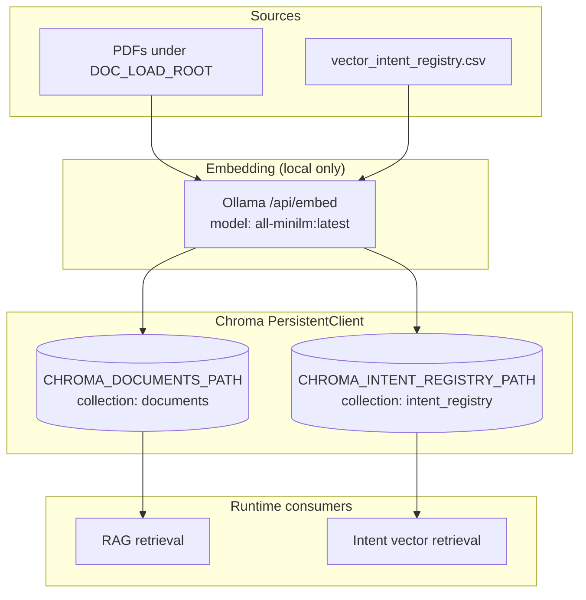

| Block | Meaning |
|-------|--------|
| **Sources** | PDFs for RAG chunks; CSV rows (`text`, `intent`, `workflow`) for routing examples. |
| **Embedding** | **Ollama only**, **`all-minilm:latest`** (local download); same model for document chunks and intent rows. |
| **Chroma** | One SQLite + segment dir per persist path; collections are logical names inside each path. |
| **Consumers** | RAG reads `documents`; gateway intent classifier reads `intent_registry` when vector path is on. |

---

### 4.2 Workflow (operator sequence)

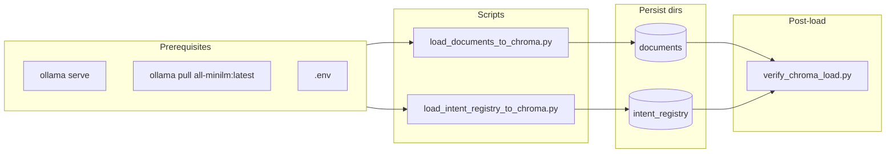

| Step | Artifact | Responsibility |
|------|----------|----------------|
| 1 | Ollama | Required for default embed; serves embed API on `GATEWAY_REWRITE_OLLAMA_URL` host. |
| 2 | `load_documents_to_chroma.py` | PDFs → chunk → embed → collection `documents`. |
| 3 | `load_intent_registry_to_chroma.py` | CSV → embed → collection `intent_registry`. |
| 4 | `verify_chroma_load.py` | Asserts min counts: `VERIFY_CHROMA_MIN_DOCUMENTS`, `VERIFY_CHROMA_MIN_INTENT_ROWS`. |

---

### 4.3 Code file structure (Chroma load feature)

```text
scripts/load_to_chroma/
  __init__.py
  load_documents_to_chroma.py      # PDF → documents collection
  load_intent_registry_to_chroma.py # CSV → intent_registry collection
  verify_chroma_load.py            # smoke check both stores

src/rag/
  chroma_loaders.py
  vector_registry_loader.py   # Ollama all-minilm:latest batch embed
  ingest_pipeline.py
  embeddings.py

data/
  documents/               # default DOC_LOAD_ROOT (PDFs)
  intent_classification/vector_retrieval/
    vector_intent_registry.csv  # default intent CSV
  chroma_db/
    documents/               # created by document loader
    intent_registry/         # created by intent loader
```

---

### 4.4 File responsibilities

| File | Responsibility |
|------|----------------|
| `scripts/load_to_chroma/load_documents_to_chroma.py` | CLI; env defaults; Ollama URL/model for document embed; calls `load_documents_to_chroma`. |
| `scripts/load_to_chroma/load_intent_registry_to_chroma.py` | CLI; default `--embed-backend ollama` + `all-minilm:latest`; calls `load_vector_registry_local`. |
| `scripts/load_to_chroma/verify_chroma_load.py` | Opens both persist clients; prints counts; exit 1 if below minimum. |
| `scripts/load_to_chroma/__init__.py` | Package marker. |
| `src/rag/chroma_loaders.py` | Dotenv bootstrap; document ingest entry; CSV→Chroma helpers. |
| `src/rag/vector_registry_loader.py` | Truncate collection; batch Ollama `/api/embed`; Chroma add. |
| `src/rag/ingest_pipeline.py` | End-to-end document pipeline into one collection. |
| `src/rag/embeddings.py` | LangChain-compatible embed factories. |

---

### 4.5 Commands

```bash
ollama serve
ollama pull all-minilm:latest

python scripts/load_to_chroma/load_documents_to_chroma.py
python scripts/load_to_chroma/load_intent_registry_to_chroma.py
python scripts/load_to_chroma/verify_chroma_load.py
```

---

### 4.6 Environment (minimal)

| Variable | Role |
|----------|------|
| `CHROMA_DOCUMENTS_PATH` | Document Chroma root. |
| `CHROMA_DOCUMENTS_COLLECTION` | Default `documents`. |
| `DOC_LOAD_ROOT` | PDF root. |
| `DOC_LOAD_EMBED_MODEL` | Default `ollama` (pair with `all-minilm:latest`). |
| `DOC_LOAD_OLLAMA_MODEL` | `all-minilm:latest` (recommended; matches local Ollama image). |
| `CHROMA_INTENT_REGISTRY_PATH` | Intent Chroma root. |
| `CHROMA_INTENT_REGISTRY_COLLECTION` | Default `intent_registry`. |
| `INTENT_REGISTRY_EMBED_BACKEND` | Default `ollama`. |
| `GATEWAY_REWRITE_OLLAMA_URL` | Ollama host (strip `/api/generate` in loaders). |
| `GATEWAY_INTENT_EMBEDDING_MODEL` | Use `all-minilm:latest` (same as document ingest). |
| `VECTOR_REGISTRY_CSV` | Optional CSV override. |
| `VERIFY_CHROMA_MIN_DOCUMENTS` | Verify threshold. |
| `VERIFY_CHROMA_MIN_INTENT_ROWS` | Verify threshold. |

---

## 5. Logger System

Scope: **gateway observability** — dual-write **short-term** (Redis) and **long-term** (ClickHouse). Package name **`logger`** (not `logging`, stdlib conflict).

- **Redis:** session/user-scoped lists, TTL, capped length per key.
- **ClickHouse:** durable rows, filter by user/session/workflow.
- **Public API:** `get_logger_facade()` only from gateway code.
- **Storage clients** (`redis_client`, `ch_client`) stay under `src/logger/` (log-specific; not generic DB layer).

---

### 5.1 Architecture (writes + stores)

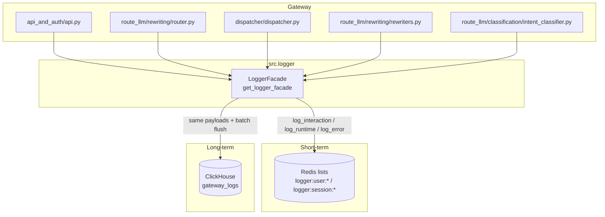

| Block | Meaning |
|-------|--------|
| **Gateway** | Calls facade; failures do not break requests (warnings only). |
| **Facade** | Validates via Pydantic; `_dual_write` to Redis then CH; optional redaction. |
| **Redis** | JSON lines per event; `ltrim` + `expire` per settings. |
| **ClickHouse** | Table ensured on init; buffered inserts when batch enabled. |

---

### 5.2 Request logging flow (simplified)

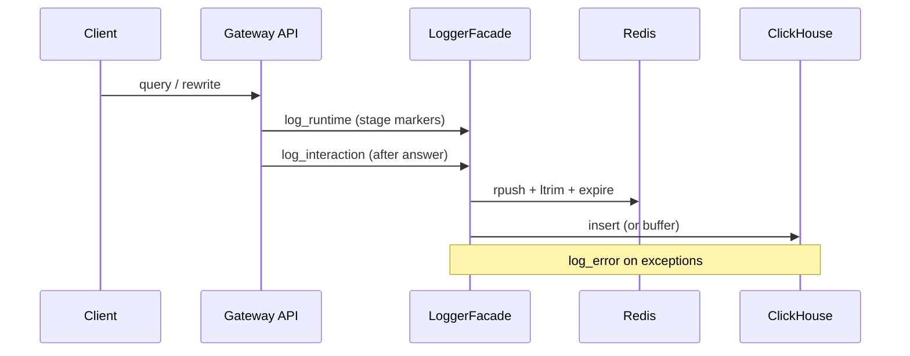

| Step | Responsibility |
|------|----------------|
| 1 | Runtime events mark stages (rewrite, classify, dispatch). |
| 2 | Interaction event captures query, clarification, rewrite, intents, answer, latency. |
| 3 | Error event adds stacktrace when handler fails. |

---

### 5.3 Code file structure (logger feature)

```text
src/logger/
  __init__.py          # exports get_logger_facade, models, LoggerSettings
  settings.py          # LoggerSettings.from_env()
  models.py            # InteractionLog, RuntimeLog, ErrorLog, LogKind, LogStatus
  base.py              # with_retry, safe_json_dumps, redact_payload
  redis_client.py      # RedisLogClient (short-term lists)
  ch_client.py         # ClickHouseLogClient (long-term table)
  logger.py            # LoggerFacade, singleton get_logger_facade
```

---

### 5.4 File responsibilities

| File | Responsibility |
|------|----------------|
| `logger/__init__.py` | Public exports; stable import surface. |
| `logger/settings.py` | Env → `LoggerSettings`; Redis/CH URLs, TTL, batch, retry, redaction fields. |
| `logger/models.py` | Pydantic events; `to_storage_dict()` for storage. |
| `logger/base.py` | Retry wrapper; JSON safe dump; payload redaction. |
| `logger/redis_client.py` | Write/read by `user_id` or `session_id`; key prefix `logger:` |
| `logger/ch_client.py` | Connect lazy; `ensure_table`; write + read_events + flush. |
| `logger/logger.py` | `from_runtime()` builds clients; dual-write; `read_short_term` / `read_long_term`. |

---

### 5.5 Environment (logger)

| Variable | Role |
|----------|------|
| `LOGGER_ENABLED` | Master switch (default on). |
| `LOGGER_REDIS_ENABLED` | Short-term sink. |
| `LOGGER_CLICKHOUSE_ENABLED` | Long-term sink. |
| `LOGGER_REDIS_URL` | Fallback: `GATEWAY_REDIS_URL`. |
| `LOGGER_REDIS_TTL_SECONDS` | Key TTL. |
| `LOGGER_REDIS_MAX_EVENTS_PER_KEY` | List cap after rpush. |
| `LOGGER_CH_HOST` | Fallback: `CH_HOST`. |
| `LOGGER_CH_PORT` | Fallback: `CH_PORT`. |
| `LOGGER_CH_USER` / `LOGGER_CH_PASSWORD` / `LOGGER_CH_DATABASE` | CH auth + DB. |
| `LOGGER_CH_TABLE` | Default `gateway_logs`. |
| `LOGGER_CH_BATCH_ENABLED` / `LOGGER_CH_BATCH_SIZE` | Buffered CH writes. |
| `LOGGER_RETRY_*` | Redis/CH write retries. |
| `LOGGER_REDACTION_ENABLED` / `LOGGER_REDACTION_FIELDS` | Strip sensitive keys. |

---

### 5.6 Operations

| Action | Instruction |
|--------|-------------|
| Disable all logging | `LOGGER_ENABLED=false`. |
| Redis only | `LOGGER_CLICKHOUSE_ENABLED=false`. |
| CH only | `LOGGER_REDIS_ENABLED=false`. |


## 6. Short-term and long-term memory

Scope: **event-based conversation memory** shared by Redis (short-term, TTL) and ClickHouse (long-term, full history). Same message envelope; dual-write; no transformation.

- **Redis:** Fast read for next request (rewrite context, UI history). Recent days only (TTL + LTRIM).
- **ClickHouse:** Durable rows for analytics, audit, replay. Table `rag_agent_message_event`.
- **Event envelope:** 8 fields; one logical message; two physical layouts.

---

### 6.1 Architecture (data + stores)

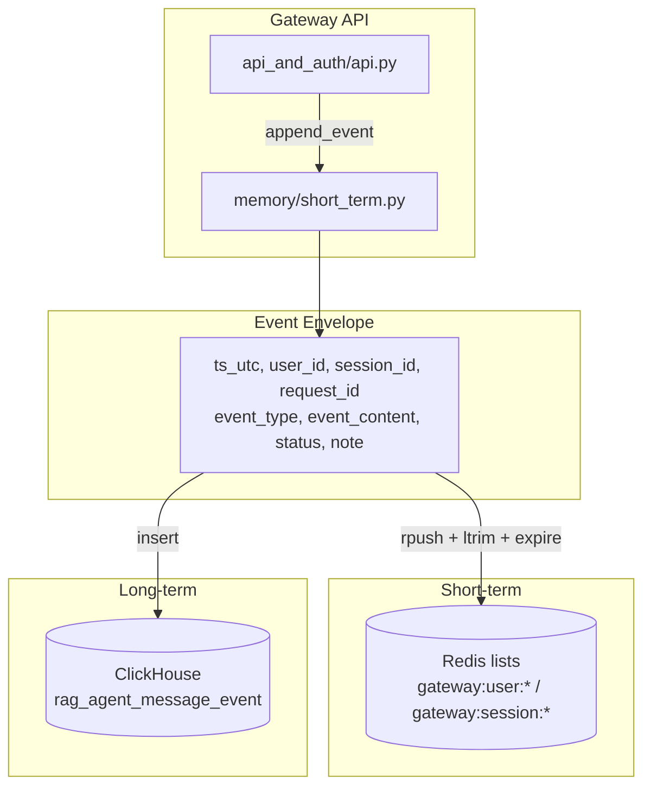

| Block | Meaning |
|-------|--------|
| **Gateway** | Emits events at each Route LLM stage; `append_event` best-effort (failures do not break requests). |
| **Envelope** | Shared 8-field structure; `request_id` correlates all events for one gateway call. |
| **Redis** | JSON per list element; TTL; LTRIM cap (e.g. 200 events per user). |
| **ClickHouse** | One row per event; partition by month; order by user_id, session_id, ts, request_id. |

---

### 6.2 Event types and flow

| `event_type` | When emitted | Typical `event_content` |
|--------------|--------------|--------------------------|
| `user_query` | User message accepted | Raw user text or JSON |
| `query_clarification` | After clarification step | Clarification question or JSON |
| `query_rewriting` | After rewrite step | Rewritten single line |
| `intent_classification` | After intent step | JSON: workflows / clauses |
| `llm_answer` | Final user-visible answer | Answer text |
| `turn_summary` | After full turn | JSON `{"query","answer","workflow"}` for rewrite context |

---

### 6.3 How to identify which answer belongs to which query

**Correlation key:** `request_id`. Each gateway request gets one `request_id` at entry; all events for that turn share it.

| Correlation | How |
|-------------|-----|
| Same turn | Same `request_id` |
| Query | `event_type = 'user_query'` or parse `turn_summary.event_content` |
| Answer | `event_type = 'llm_answer'` or parse `turn_summary.event_content` |
| Order | `ts` within each `request_id` |

**Example SQL (ClickHouse):**

```sql
-- All events for one turn
SELECT ts, event_type, event_content
FROM rag_agent_message_event
WHERE request_id = 'abc123-def456-...'
ORDER BY ts;

-- Query–answer pairs per turn (using turn_summary)
SELECT request_id, event_content
FROM rag_agent_message_event
WHERE event_type = 'turn_summary'
ORDER BY ts DESC;
```

`turn_summary` stores both query and answer in one JSON: `{"query":"...","answer":"...","workflow":"..."}`.

---

### 6.4 Workflow (dual-write)

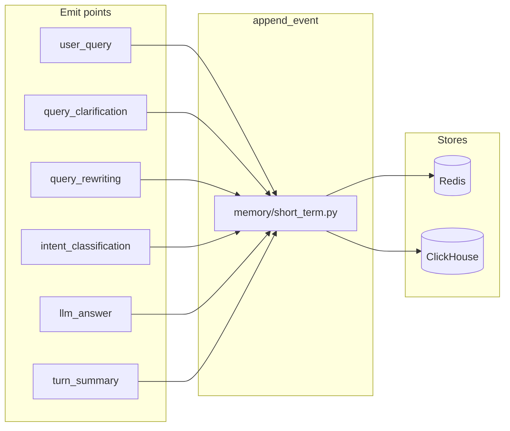

| Step | Responsibility |
|------|----------------|
| 1 | `api_and_auth/api.py` emits events at clarification, rewrite, intent, answer, and turn_summary stages. |
| 2 | `append_event` validates via `MemoryEvent` (in `memory/short_term.py`); writes to Redis user key (and optional session key). |
| 3 | Optional CH write when `GATEWAY_MEMORY_CH_ENABLED=true`; same payload, no transformation. |

---

### 6.5 Code file structure

```text
src/gateway/
  api_and_auth/
    api.py                 # Emit points: _append_memory_event at each stage; FastAPI app
  memory/
    short_term.py          # MemoryEvent model; GatewayConversationMemory: append_event, get_history*, save_turn
    long_term.py           # GatewayMemoryCHClient (ClickHouse rag_agent_message_event)
  route_llm/rewriting/
    router.py              # uses message.py format_history_for_llm_markdown for context

scripts/
  create_gateway_memory_events.sql   # DDL for rag_agent_message_event
```

Run gateway: `python scripts/run_gateway.py` (Uvicorn: `src.gateway.api_and_auth.api:app`).

---

### 6.6 File responsibilities

| File | Responsibility |
|------|----------------|
| `memory/short_term.py` | Pydantic `MemoryEvent`; Redis append; optional CH dual-write via long_term client; `save_turn` (legacy); `append_event` (v1). |
| `memory/long_term.py` | ClickHouse connect; `ensure_table`; `write_event` to `rag_agent_message_event`. |
| `api_and_auth/api.py` | Generate `request_id`; call `_append_memory_event` at each stage; pass `request_id` through. |
| `route_llm/rewriting/router.py` | Uses `ConversationHistoryHandler.format_history_for_llm_markdown` (message.py) for history context. |
| `create_gateway_memory_events.sql` | DDL: MergeTree, partition by month, order by user_id, session_id, ts, request_id. |

---

### 6.7 Environment

| Variable | Role |
|----------|------|
| `GATEWAY_REDIS_URL` | Redis for short-term memory. |
| `GATEWAY_SESSION_TTL` | Key TTL (default 86400). |
| `GATEWAY_MEMORY_WRITE_SESSION_KEY` | When true, also write to session key for `/api/v1/session/{id}`. |
| `GATEWAY_MEMORY_CH_ENABLED` | When true, dual-write to ClickHouse. |
| `GATEWAY_MEMORY_CH_TABLE` | Table name (default `rag_agent_message_event`). |
| `LOGGER_CH_HOST` / `LOGGER_CH_PORT` / `LOGGER_CH_*` | ClickHouse connection (shared with logger). |

---

### 6.8 Operations

| Action | Instruction |
|--------|-------------|
| Disable CH dual-write | `GATEWAY_MEMORY_CH_ENABLED=false`. |
| Create table on ECS | Run `scripts/create_gateway_memory_events.sql` via `clickhouse-client` or HTTP. See `docs/guides/GATEWAY_MEMORY_EVENTS_CLICKHOUSE.md`. |
| Verify table | `DESCRIBE TABLE rag_agent_message_event;` |
