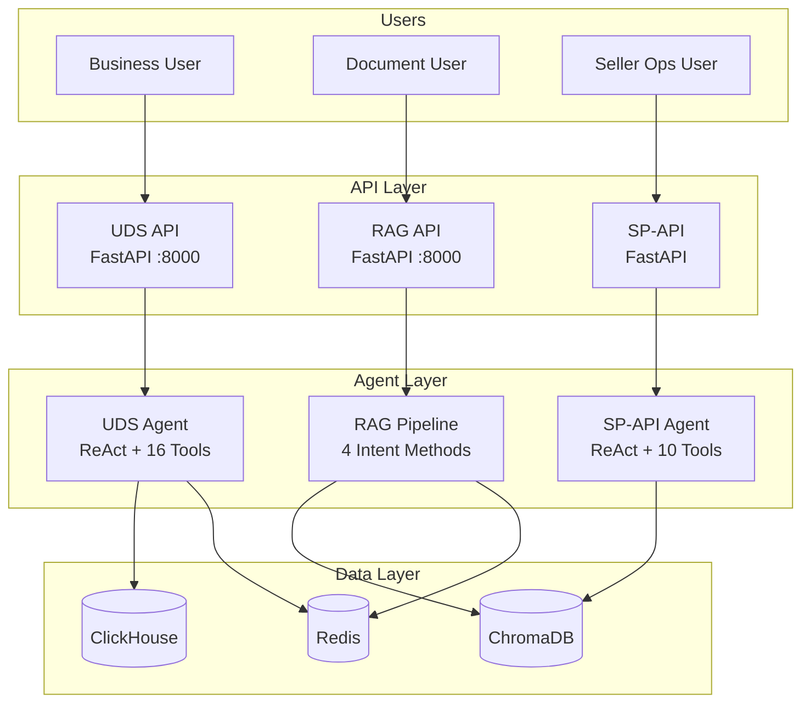
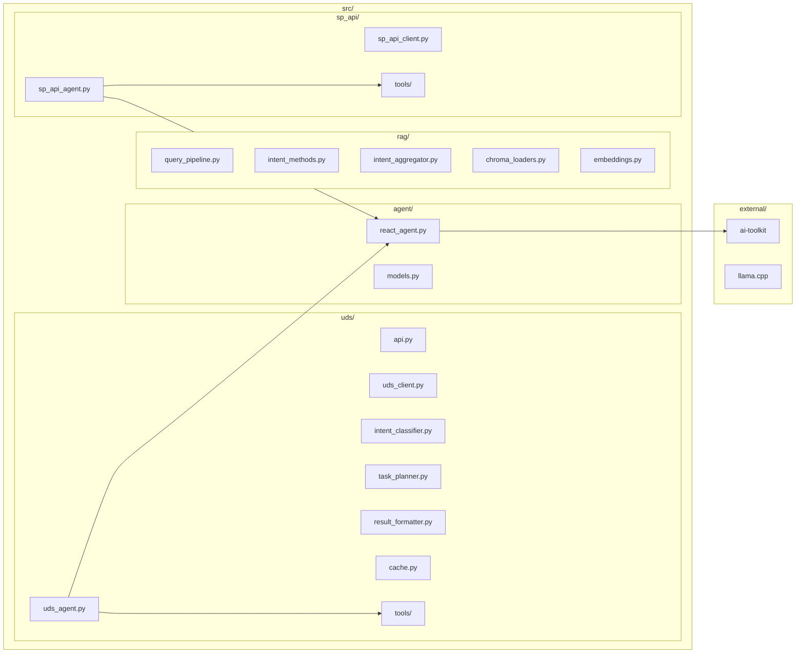
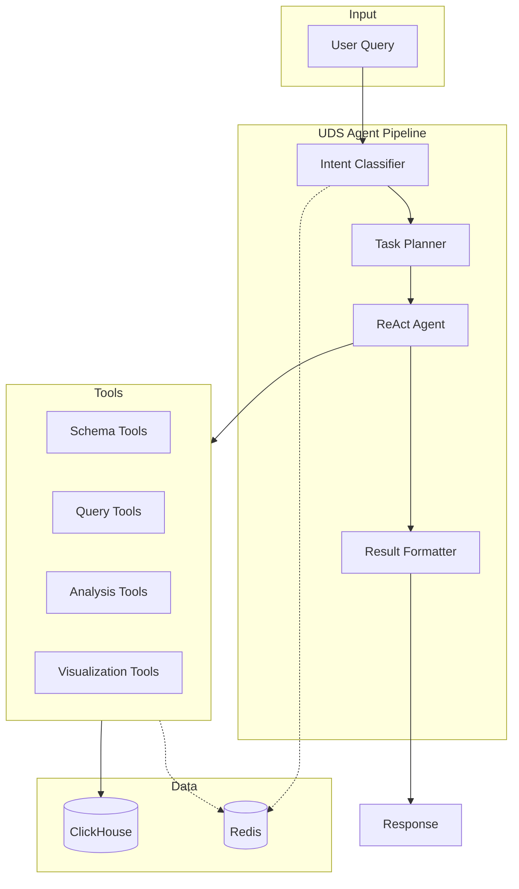
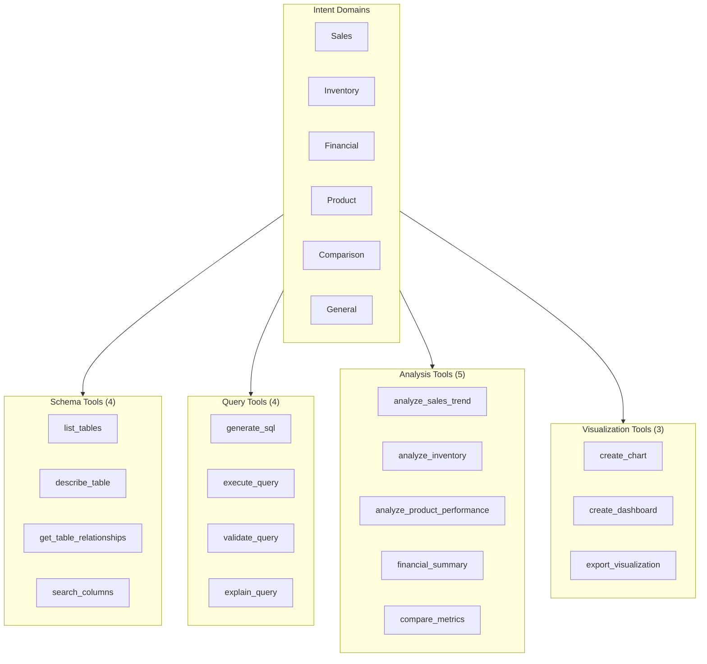
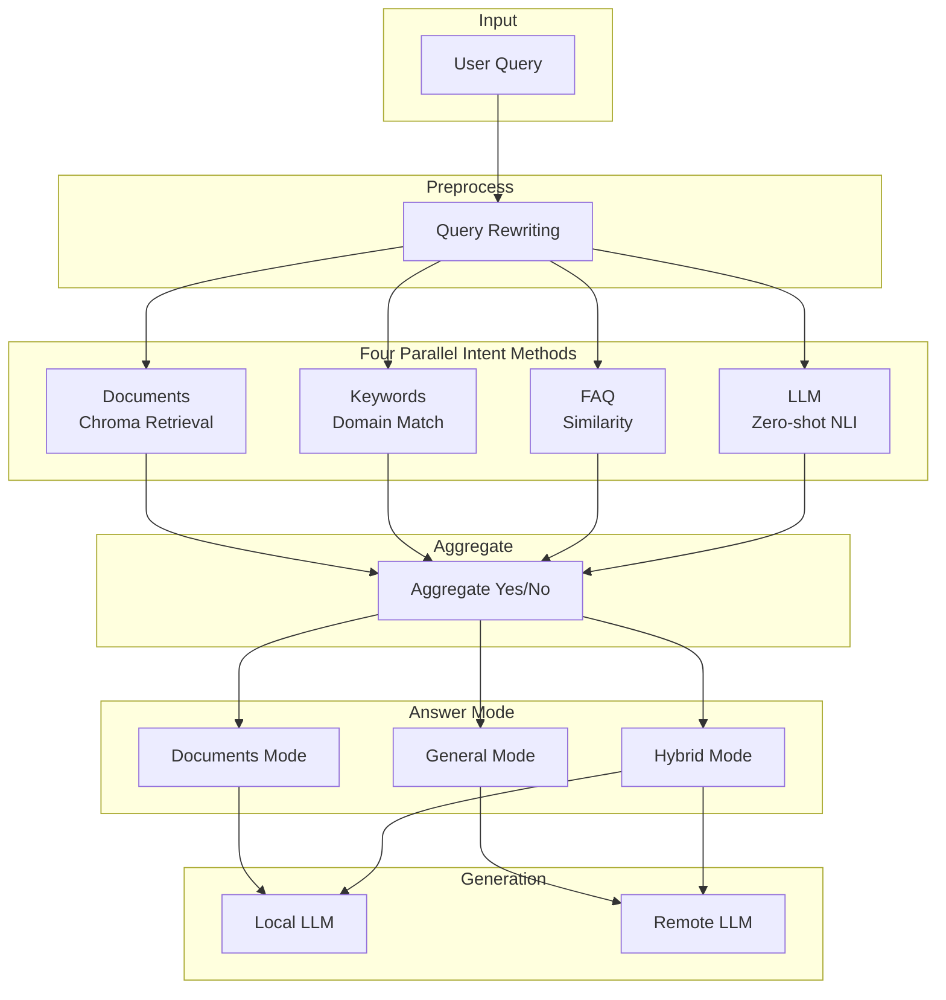
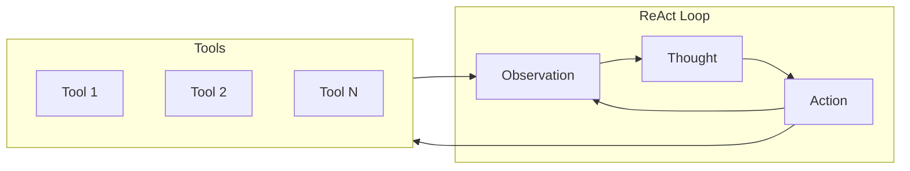
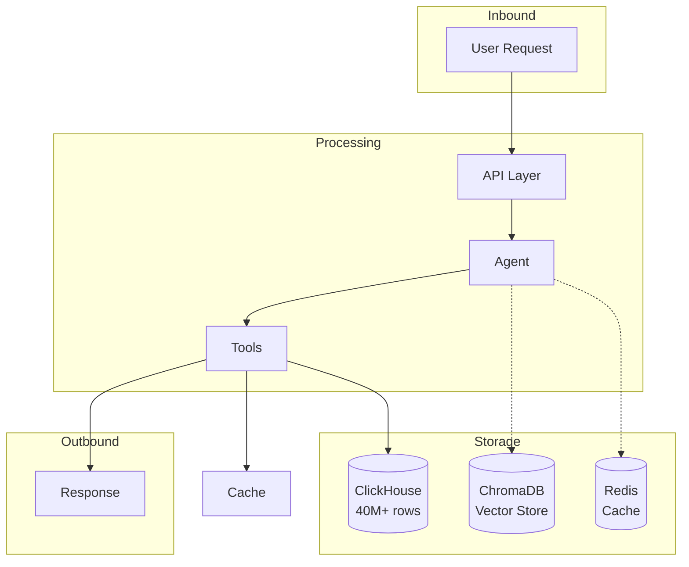
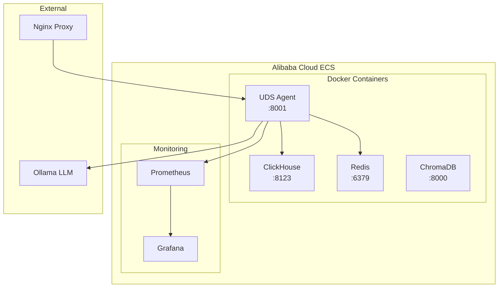
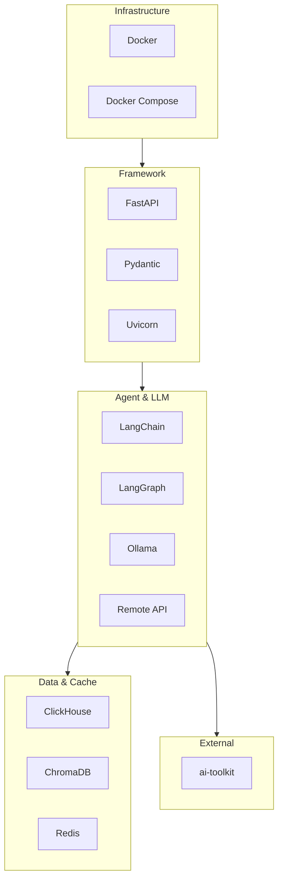

# IC-RAG-Agent System Framework

**Version:** 1.0.0  
**Last Updated:** 2026-03-06

This document describes the system framework for the IC-RAG-Agent project using Mermaid diagrams.

---

## 1. System Overview

IC-RAG-Agent is an **Intent Classification + Retrieval-Augmented Generation** system with three main subsystems:

- **UDS Agent** – Business Intelligence for Amazon seller data (ClickHouse)
- **RAG Pipeline** – Document retrieval and hybrid generation with intent classification
- **SP-API Agent** – Seller Operations API integration for Amazon marketplace



---

## 1.1 Unified Gateway and Five Workflows

The unified gateway (port 8000) routes each query to one of five workflows:

| Workflow | Backend | Port | Note |
|----------|---------|------|------|
| General Knowledge | RAG (general mode) | 8002 | Remote LLM (e.g. DeepSeek) via RAG config. |
| Amazon Document | RAG (documents mode) | 8002 | Chroma retrieval, Amazon-docs bias. |
| Enterprise/IC Document | RAG (documents mode) or skip | 8002 | **Not ready yet:** Chroma not populated; gateway returns a friendly message when routed to IC docs. Workflow remains in diagrams. |
| SP-API Agent | SP-API Agent | 8003 | Seller operations. |
| UDS Agent | UDS Agent | 8001 | BI/analytics (ClickHouse). |

**IC docs:** Retrieval is not ready yet (Chroma not populated). The gateway still shows this workflow and returns a friendly message when the route is IC docs; set `IC_DOCS_ENABLED=true` once Chroma is populated.

---

## 2. Architecture Layers

```mermaid
flowchart TB
    subgraph Layer1["API Layer"]
        FastAPI[FastAPI]
        Uvicorn[Uvicorn]
    end

    subgraph Layer2["Agent Layer"]
        ReAct[ReAct Agent]
        Intent[Intent Classifier]
        Planner[Task Planner]
    end

    subgraph Layer3["Tool Layer"]
        UDS_Tools[UDS Tools (16)]
        SP_Tools[SP-API Tools (10)]
    end

    subgraph Layer4["Data Layer"]
        ClickHouse[ClickHouse]
        ChromaDB[ChromaDB]
        Redis[Redis]
    end

    subgraph Layer5["LLM Layer"]
        Ollama[Ollama]
        Remote[Remote API]
    end

    Layer1 --> Layer2
    Layer2 --> Layer3
    Layer3 --> Layer4
    Layer2 --> Layer5
```

---

## 3. Module Structure



---

## 4. UDS Agent Flow



---

## 5. UDS Intent and Tool Categories



---

## 6. RAG Pipeline Flow



---

## 7. ReAct Agent Loop



---

## 8. Data Flow



---

## 9. Deployment Architecture



---

## 10. Technology Stack



---

## 11. Directory Structure

```
IC-RAG-Agent/
├── src/
│   ├── uds/           # UDS Agent (BI for Amazon data)
│   ├── rag/           # RAG pipeline (intent + retrieval)
│   ├── agent/         # ReAct agent core
│   ├── sp_api/        # SP-API Agent

│   ├── tools/         # Shared utilities
│   └── draft/         # Prototypes
├── docs/
│   ├── guides/        # User, Developer, API, Deployment, Operations
│   ├── archive/       # Historical docs
│   └── FRAMEWORK.md   # This file
├── tests/
├── scripts/
├── docker/
├── monitoring/
├── external/
│   ├── ai-toolkit/    # BaseTool, ToolExecutor
│   ├── IC-Agent-Skill/
│   └── llama.cpp/
└── data/
```

---

## 12. Key Integration Points

| From | To | Purpose |
|------|-----|---------|
| UDS API | UDS Agent | Query processing |
| UDS Agent | ReAct Agent | Tool orchestration |
| UDS Agent | Intent Classifier | Domain classification |
| UDS Agent | Task Planner | Subtask decomposition |
| UDS Tools | UDS Client | ClickHouse queries |
| UDS Client | Redis | Query caching |
| RAG Pipeline | ChromaDB | Document retrieval |
| SP-API Agent | Long-term Memory | Uses RAG embeddings |
| All Agents | ai-toolkit | BaseTool, ToolExecutor |

---

## Related Documentation

- [PROJECT.md](PROJECT.md) – Project summary, metrics
- [OPERATIONS.md](OPERATIONS.md) – Operations manual
- [guides/UDS_DEVELOPER_GUIDE.md](guides/UDS_DEVELOPER_GUIDE.md) – Developer guide
- [archive/ARCHITECTURE_DECISIONS.md](archive/ARCHITECTURE_DECISIONS.md) – ADRs
