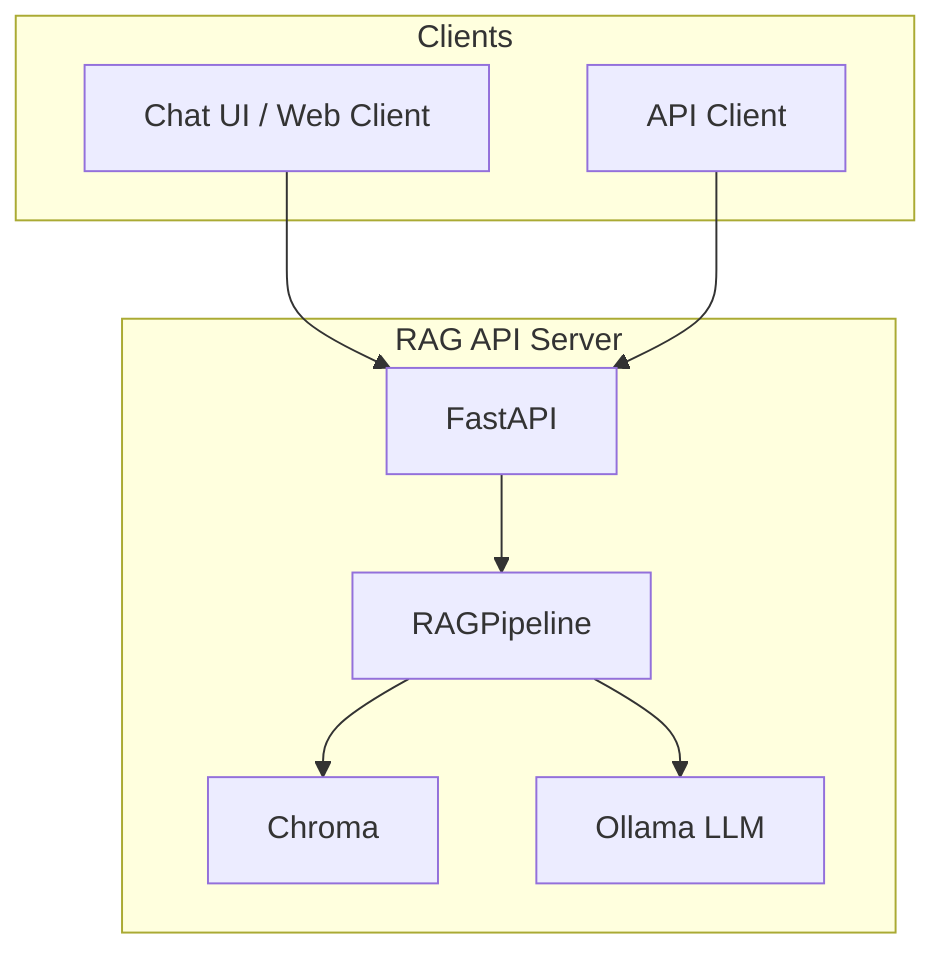

# RAG Multi-User Service Plan

**Goal:** Serve 10+ users via IC-RAG-Agent with a REST API and chat UI client.

**Current state:** [scripts/query_rag.py](scripts/query_rag.py) works as a CLI; [RAGPipeline](src/rag/query_pipeline.py) (query) and [rag_ingest_pipeline](src/rag/ingest_pipeline.py) (ingest) are reusable.

---

## Architecture Overview



---

## Phase 1: REST API

### 1.1 Create RAG API module

- **File:** `src/rag/api.py` or `scripts/rag_api.py`
- **Framework:** FastAPI
- **Startup:** Build `RAGPipeline` once via lifespan; reuse for all requests
- **Endpoints:**
  - `POST /query` – single query
    - Body: `{ "question": str, "mode": "documents"|"general"|"hybrid" }`
    - Response: `{ "answer": str, "source": str, "sources": [{ "file": str, "page": str }] }`
  - `GET /health` – health check (pipeline ready, Chroma reachable)

### 1.2 Config and env

- Reuse `.env` (CHROMA_DOCUMENTS_PATH, RAG_LLM_MODEL, etc.)
- Add `RAG_API_HOST`, `RAG_API_PORT` if needed

### 1.3 Run with Uvicorn

- Entry: `uvicorn scripts.rag_api:app --host 0.0.0.0 --port 8000`
- Add `scripts/run_rag_api.sh` for convenience

---

## Phase 2: Concurrency and Reliability (implemented)

### 2.1 Request handling

- [x] Use `run_in_executor` for sync `RAGPipeline.query()`
- [x] Add request timeout (`RAG_QUERY_TIMEOUT`, default 120s)
- [x] Add basic error handling and 500/503/504 responses

### 2.2 Request queue

- [x] Semaphore limits concurrent LLM calls (`RAG_MAX_CONCURRENT_QUERIES`, default 10)
- [x] Queue timeout: 503 if wait exceeds `RAG_QUEUE_TIMEOUT` (default 30s)

### 2.3 CORS

- [x] Enable CORS for chat UI origin (e.g. `http://localhost:5173`)

### 2.4 Uvicorn (run_rag_api.sh)

- [x] `--limit-concurrency 20` (configurable via `RAG_LIMIT_CONCURRENCY`)
- [x] `--timeout-keep-alive 30` (configurable via `RAG_TIMEOUT_KEEP_ALIVE`)

---

## Phase 3: Deployment

### 3.1 Docker

- **Dockerfile:** Python base, install deps, copy project, run Uvicorn
- **Note:** Ollama typically runs on host; API container connects to `host.docker.internal:11434`

### 3.2 Docker Compose (optional)

- Services: `rag-api`, `ollama` (if containerized)
- Volumes for Chroma data

### 3.3 Production checklist

- [ ] Reverse proxy (Nginx/Caddy) for TLS
- [ ] Process manager (e.g. systemd) or Docker
- [ ] Logging to file/stdout

---

## Phase 4: Chat UI Client

### 4.1 Chat UI stack

- **Option A:** Simple HTML + JS (fetch API) – minimal setup
- **Option B:** React/Vue/Svelte SPA – better UX, more setup
- **Recommendation:** Start with Option A; migrate to Option B if needed

### 4.2 Chat UI features

- Input box for question
- Mode selector: Documents only | General knowledge | Hybrid
- Send button
- Message list: user question + assistant answer + source label
- Source links (file, page) when available
- Loading state while waiting for API
- Error display on failure

### 4.3 Layout

- Single-page chat layout
- Messages in chronological order
- Source section under each answer

### 4.4 File structure

```
frontend/                 # or web/ or client/
  index.html
  style.css
  app.js                  # fetch to /query, render messages
  # OR (if SPA):
  package.json
  src/
    App.jsx
    components/
      ChatBox.jsx
      MessageList.jsx
      ModeSelector.jsx
```

### 4.5 Serving the chat UI

- **Dev:** Vite/parcel dev server, or static files via FastAPI `StaticFiles`
- **Prod:** Serve static files from FastAPI, or separate static host

---

## Phase 5: Optional Enhancements

| Feature        | When to add |
|----------------|-------------|
| API key auth   | Multi-tenant or external users |
| Rate limiting  | Public or untrusted clients |
| Streaming      | Long answers, better UX |
| Session/chat history | Multi-turn conversations |
| Logging/metrics | Debugging and monitoring |

---

## Implementation Order

| Step | Task                          | Deliverable                    |
|------|-------------------------------|--------------------------------|
| 1    | Create `rag_api.py`           | `POST /query`, `GET /health`   |
| 2    | Add run script                | `run_rag_api.sh`               |
| 3    | Test API with curl/Postman    | Verified API                   |
| 4    | Create simple chat HTML/JS    | `frontend/` with chat UI       |
| 5    | Connect chat to API           | End-to-end flow                |
| 6    | Add Dockerfile                | Containerized API              |
| 7    | (Optional) Upgrade to SPA     | React/Vue chat                 |

---

## Key Files to Create/Modify

| File                    | Action                                      |
|-------------------------|---------------------------------------------|
| `scripts/rag_api.py`    | Create – FastAPI app, /query, /health       |
| `scripts/run_rag_api.sh`| Create – Uvicorn launcher                   |
| `frontend/index.html`   | Create – Chat page structure                |
| `frontend/app.js`       | Create – Fetch, render, mode selector       |
| `frontend/style.css`    | Create – Chat layout and styling            |
| `Dockerfile`            | Create – API container                      |
| `requirements.txt`      | Update – Add fastapi, uvicorn               |

---

## Dependencies to Add

```
fastapi>=0.100.0
uvicorn[standard]>=0.22.0
```

---

## Example API Request/Response

**Request:**
```http
POST /query HTTP/1.1
Content-Type: application/json

{"question": "what is amazon fba?", "mode": "documents"}
```

**Response:**
```json
{
  "answer": "Fulfillment by Amazon (FBA) is a program that allows sellers to store their products in Amazon's warehouses...",
  "source": "Document(s) (5 chunks)",
  "sources": [
    {"file": "Amazon Lending Automated Repayment terms.pdf", "page": "4"},
    {"file": "Amazon Lending with Lendistry.pdf", "page": "0"}
  ]
}
```
