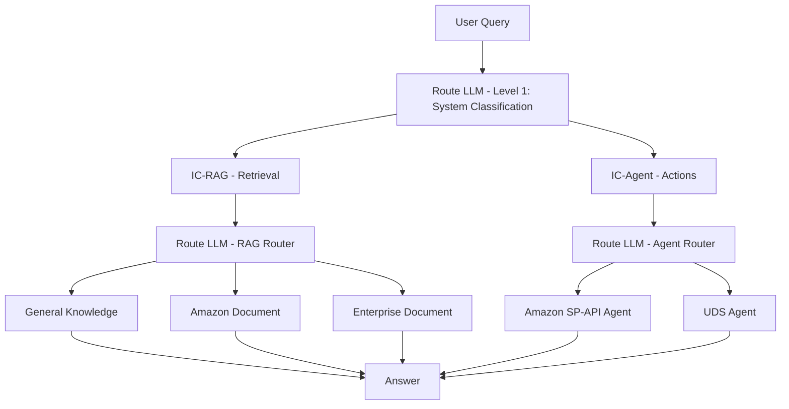

# IC-Agent - Project Outline

**Project:** IC-Agent (Intelligent Agent System)  
**Part of:** IC-RAG-Agent  
**Status:** Planning  
**Owner:** Kiro (Project Manager)  
**Last Updated:** 2026-03-03

---

## Overview

IC-Agent is the agent subsystem of IC-RAG-Agent. It provides autonomous action capabilities for Amazon cross-border e-commerce operations, complementing the existing IC-RAG retrieval system.

```
IC-RAG-Agent
├── IC-RAG  ✅ Complete  - Retrieval system (4 parallel intent classification methods)
└── IC-Agent 🚧 Building - Autonomous agent system (SP-API + UDS)
```

---

## System Architecture



**Level 1 Router:** Classifies query as retrieval (IC-RAG) or action (IC-Agent).  
**Level 2 Router:** Routes to specific knowledge source or agent.

---

## Architecture Decision: Tools in ai-toolkit

**Decision (Approved):** Generic tool infrastructure lives in `libs/ai-toolkit`, not in IC-RAG-Agent.

| Component | Location | Reason |
|-----------|----------|--------|
| BaseTool, ToolParameter, ToolResult | `ai-toolkit` | Reusable across all projects |
| ToolExecutor (retry, timeout, errors) | `ai-toolkit` | Centralized maintenance |
| CalculatorTool (reference impl) | `ai-toolkit` | Pattern demonstration |
| SP-API tools, UDS tools, ReAct Agent | `IC-RAG-Agent` | Domain-specific |

**Import pattern:**
```python
from ai_toolkit.tools import BaseTool, ToolExecutor, ToolResult

class ProductCatalogTool(BaseTool):
    def execute(self, identifier: str, identifier_type: str):
        # SP-API specific implementation
        pass
```

---

## Outline

### Part 0: Foundation (ai-toolkit)
> Generic, reusable tool infrastructure — lives in `libs/ai-toolkit`

- 0.1 Tool base class (BaseTool, ToolParameter)
- 0.2 Tool result model (ToolResult)
- 0.3 Tool executor (ToolExecutor — retry, timeout, error handling)
- 0.4 Calculator tool (reference implementation)

**Spec:** `libs/ai-toolkit/.kiro/specs/agent-tools-infrastructure/`  
**Task:** `tasks/20260303-000001-ai-toolkit-agent-tools-infrastructure-claude-code.md`  
**Timeline:** 9-13 hours

---

### Part 1: ReAct Agent Core
> The reasoning engine powering all agents — lives in `src/agent/`

- 1.1 Agent state management (AgentState, Action, Observation)
- 1.2 ReAct loop (Thought → Action → Observation)
- 1.3 Tool registry and selection
- 1.4 Agent logging and observability
- 1.5 Integration with ai-toolkit ToolExecutor

**Plan:** `ic_agent_docs/REACT_AGENT_IMPLEMENTATION_PLAN.md`  
**Spec:** `.kiro/specs/agent-integration/` (Phase 1)  
**Timeline:** 1 week

---

### Part 2: Amazon SP-API Agent
> Seller operations agent — lives in `src/sp_api/` (module renamed)

- 2.1 SP-API client wrapper (auth, rate limiting, caching)
- 2.2 SP-API tools (10 tools: catalog, inventory, orders, shipments, FBA, etc.)
- 2.3 Conversation memory (Redis-based session management)
- 2.4 LangGraph workflow orchestration
- 2.5 Seller Operations Agent (intent classification, RAG integration)
- 2.6 FastAPI REST API (streaming, SSE, session endpoints)

**Plan:** `ic_agent_docs/SP_API_AGENT_PLAN.md`  
**Spec:** `.kiro/specs/sp-api-agent/`  
**Timeline:** 6 weeks

**Status:** ✅ Implementation complete. Delivered components include:
    * `SPAPIClient` with LWA OAuth2, per-endpoint token-bucket rate limiting, and
        optional Redis caching layer.
    * Ten domain tools (`catalog`, `inventory_summary`, `list_orders`,
        `order_details`, `list_shipments`, `create_shipment`, `fba_fees`,
        `fba_eligibility`, `financials`, `request_report`) each subclassing
        `ai_toolkit.BaseTool` with parameter validation and SP-API interaction.
    * `SellerOperationsAgent` subclass of `ReActAgent` registering all tools,
        performing intent classification, and enriching queries with conversation
        history.
    * Redis-backed `ConversationMemory` plus a LangGraph workflow for structured
        query processing.
    * FastAPI REST API (`api.py` and `schemas.py`) exposing sync and streaming
        query endpoints along with health and session management.
    * Unit tests covering client logic, agent behavior, workflow, and API.
        Tools are exercised via mocks; integration tests are pending.


---

### Part 3: UDS Agent
> Business intelligence agent — lives in `src/uds/`

**Data Foundation:** ✅ Complete (40.3M rows loaded into ClickHouse)
- 9 tables: orders, transactions, inventory, products, fees, listings
- Date range: October 2025 (primary period)
- Database: `ic_agent` on ClickHouse (8.163.3.40:8123)

**Implementation Phases:**

**Phase 1: Data Foundation Layer (Weeks 1-2)**
- 1.1 Schema documentation (metadata, ERD, business glossary)
- 1.2 Data quality & statistics (profiling, quality dashboard)
- 1.3 Query pattern library (50+ common analytical queries)
- 1.4 ClickHouse client library (connection pooling, streaming)

**Phase 2: UDS Agent Tools (Weeks 3-4)**
- 2.1 Schema inspection tools (list tables, describe, relationships)
- 2.2 Query generation tools (NL→SQL, execute, validate)
- 2.3 Analysis tools (sales, inventory, financial, performance)
- 2.4 Visualization tools (charts, dashboards, export)

**Phase 3: UDS Agent Core (Weeks 5-6)**
- 3.1 Task planner (decompose complex queries into subtasks)
- 3.2 UDS Agent implementation (ReAct-based orchestration)
- 3.3 Intent classification & context enrichment
- 3.4 Result formatting (tables, charts, insights)

**Phase 4: Integration & Testing (Weeks 7-8)**
- 4.1 RAG integration (documentation & example retrieval)
- 4.2 REST API (query endpoints, streaming, table metadata)
- 4.3 Comprehensive testing (unit, integration, performance)

**Phase 5: Documentation & Deployment (Weeks 9-10)**
- 5.1 Documentation (API, user guide, developer guide)
- 5.2 Deployment (Docker, AWS ECS, monitoring, alerting)

**Plans:** 
- `ic_agent_docs/UDS_DATA_FOUNDATION_PLAN.md` ✅ Complete
- `ic_agent_docs/UDS_AGENT_PLAN.md` *(detailed implementation plan - to be created)*

**Specs:** `.kiro/specs/uds-agent/` *(specs to be created per phase)*  
**Timeline:** 10 weeks (2.5 months)

---

### Part 4: Prompt Engineering System
> Dynamic prompt management — lives in `src/prompts/`

- 4.1 Template manager (versioning, rollback, domain organization)
- 4.2 Dynamic prompt generator (placeholder replacement, CoT)
- 4.3 Few-shot example manager (vector similarity retrieval)
- 4.4 Initial templates (20+) and examples (50+)
- 4.5 Agent integration (replace hardcoded prompts)

**Plan:** `ic_agent_docs/PROMPT_ENGINEERING_PLAN.md` *(to be created)*  
**Spec:** `.kiro/specs/agent-integration/` (Phase 4)  
**Timeline:** 3 weeks

---

### Part 5: Cross-Cutting Concerns
> System-wide concerns applied across all parts

- 5.1 RAG integration (agents query IC-RAG for documentation)
- 5.2 Security & privacy (data isolation, auth, PII redaction)
- 5.3 Deployment (Docker, AWS Lambda, AWS ECS)
- 5.4 Monitoring & observability (Prometheus, health checks, alerting)
- 5.5 Performance optimization (caching, connection pooling, scaling)

**Plan:** `ic_agent_docs/CROSS_CUTTING_PLAN.md` *(to be created)*  
**Spec:** `.kiro/specs/agent-integration/` (Cross-cutting tasks)  
**Timeline:** Ongoing alongside Parts 2-4

---

## Implementation Order

| Part | Name | Dependency | Timeline | Status |
|------|------|------------|----------|--------|
| 0 | ai-toolkit Foundation | None | 9-13 hrs | ✅ Complete |
| 1 | ReAct Agent Core | Part 0 | 1 week | ✅ Complete |
| 2 | SP-API Agent | Part 1 | 6 weeks | ✅ Complete |
| 3 | UDS Agent | Part 1 | 8 weeks | 🔲 Not Started |
| 4 | Prompt Engineering | Parts 2+3 | 3 weeks | 🔲 Not Started |
| 5 | Cross-Cutting | All | Ongoing | 🔲 Not Started |

**Total:** ~20 weeks

---

## Technology Stack

- **Language:** Python 3.10+
- **LLM Framework:** LangChain, LangGraph
- **Vector DB:** ChromaDB
- **Memory:** Redis
- **API:** FastAPI
- **Local LLM:** Ollama (qwen3:1.7b)
- **Remote LLM:** Deepseek, Qwen, GLM
- **Database:** ClickHouse (UDS Agent)
- **Deployment:** AWS Lambda (SP-API Agent), AWS ECS (UDS Agent)

---

## File Organization

```
docs/ic_agent_docs/
├── IC_AGENT_OUTLINE.md              ← This file (master outline)
├── REACT_AGENT_IMPLEMENTATION_PLAN.md ← Part 1 detailed plan
├── SP_API_AGENT_PLAN.md             ← Part 2 detailed plan (TODO)
├── UDS_AGENT_PLAN.md                ← Part 3 detailed plan (TODO)
├── PROMPT_ENGINEERING_PLAN.md       ← Part 4 detailed plan (TODO)
└── CROSS_CUTTING_PLAN.md            ← Part 5 detailed plan (TODO)

tasks/
├── 20260303-000001-ai-toolkit-agent-tools-infrastructure-claude-code.md  ← Part 0 task (Claude Code)
└── YYYYMMDD-HHMMSS-{task-name}-rpt-HHMMSS.md               ← Completion reports
```

---

**Document Owner:** Kiro (AI Project Manager)
