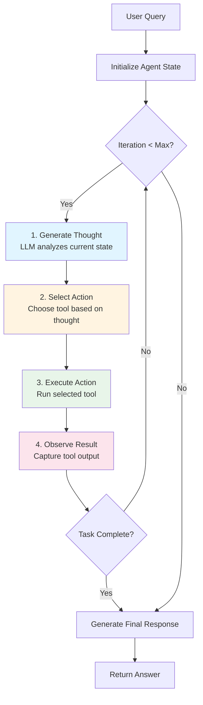

# ReAct Agent Foundation - Implementation Plan

**Phase:** Phase 1 of Agent Integration  
**Duration:** 1 week (5 working days)  
**Goal:** Build the core ReAct Agent engine that will power all agents (SP-API, UDS)

**Note:** Timeline optimized for highly skilled team members (Cursor, Claude Code)

---

## Overview

The ReAct Agent Foundation implements the Thought → Action → Observation loop, providing the reasoning engine for autonomous task execution. This foundation will be used by both Amazon SP-API Agent and UDS Agent.

---

## ReAct Agent Logic Flow



**Key Concepts:**
1. **Thought:** LLM reasons about what to do next
2. **Action:** Select and invoke a tool with parameters
3. **Observation:** Capture tool result and update state
4. **Loop:** Repeat until task complete or max iterations reached

---

## Day 1: Core Architecture & Base Classes

### Morning: Project Setup & Integration with ai-toolkit

**Objective:** Set up project structure and integrate with ai-toolkit agent tools infrastructure

**Tasks:**
1. Create directory structure for agent module
2. Import Tool base class, ToolExecutor, ToolResult from ai-toolkit
3. Define data models: AgentState, Action, Observation
4. Set up pytest configuration for agent tests
5. Create custom exception classes

**Deliverables:**
- Agent module structure ready
- ai-toolkit tools imported and available
- Data models for agent state tracking
- Project structure ready for implementation

**File Structure:**
```
src/agent/
├── __init__.py
├── models.py            # AgentState, Action, Observation
├── react_agent.py       # ReAct Agent core
├── exceptions.py        # Custom exceptions
└── tests/
    └── __init__.py
```

**Note:** Tool base class, ToolExecutor, and ToolResult come from ai-toolkit, not implemented here.

---

### Afternoon: ReAct Agent Core

**Objective:** Build the main agent class with tool management using ai-toolkit infrastructure

**Tasks:**
1. Implement ReActAgent class initialization
2. Initialize ToolExecutor from ai-toolkit
3. Implement tool registration system
4. Implement tool listing and schema generation
5. Create agent state management
6. Add configuration options (max_iterations, timeout)

**Key Components:**
- Agent initialization with LLM and tools
- ToolExecutor from ai-toolkit for tool execution
- Tool registry (dictionary mapping tool names to instances)
- Tool schema generation for LLM function calling
- State tracking across iterations

**Logic:**
- Agent maintains a registry of available tools
- Each tool inherits from ai-toolkit BaseTool
- Tools can be registered dynamically
- Agent uses ToolExecutor for all tool executions
- Agent can list all available tools with schemas

---

## Day 2: ReAct Loop Implementation

**Objective:** Implement the core Thought → Action → Observation loop

**Tasks:**
1. Implement main run() method (full execution)
2. Implement step() method (single iteration)
3. Implement _generate_thought() (LLM reasoning)
4. Implement _select_action() (tool selection)
5. Implement _execute_action() (tool invocation)
6. Implement _observe() (result capture)
7. Implement _should_continue() (completion check)

**Loop Logic:**
1. **Initialize:** Create AgentState with query
2. **Loop:** While not complete and under max iterations:
   - Generate thought using LLM
   - Select action (tool + parameters) based on thought
   - Execute action using tool
   - Observe result and update state
   - Check if task is complete
3. **Finalize:** Generate final response from state

**Completion Criteria:**
- LLM indicates task is complete
- Max iterations reached
- Error that cannot be recovered

---

## Day 3: Tool Execution & Error Handling

### Morning: Tool Executor Integration

**Objective:** Integrate with ai-toolkit ToolExecutor for robust tool execution

**Tasks:**
1. Configure ToolExecutor from ai-toolkit
2. Set up timeout and retry configurations
3. Handle ToolResult responses
4. Integrate error handling from ai-toolkit
5. Add execution metrics tracking

**Error Handling Strategy (provided by ai-toolkit):**
- **Validation Errors:** Return immediately with error message
- **Transient Errors:** Retry with exponential backoff (3 attempts)
- **Timeout Errors:** Cancel and return timeout error
- **Fatal Errors:** Return immediately, no retry

**Retry Logic (provided by ai-toolkit):**
- Attempt 1: Immediate
- Attempt 2: Wait 2 seconds
- Attempt 3: Wait 4 seconds
- After 3 failures: Return error

**Note:** Error handling and retry logic are provided by ai-toolkit ToolExecutor, not implemented here.

---

### Afternoon: Domain-Specific Tools Implementation

**Objective:** Create domain-specific tools for Amazon SP-API and UDS

**Tasks:**
1. Create SP-API tool stubs:
   - ProductCatalogToolStub
   - InventorySummaryToolStub
   - OrderDetailsToolStub
2. Create UDS tool stubs:
   - UDSQueryToolStub
   - UDSReportGeneratorToolStub
3. Implement parameter validation for each tool
4. Return mock data from stubs

**Tool Design Pattern:**
- Each tool inherits from ai-toolkit BaseTool
- Implements execute() method
- Validates parameters using validate_parameters()
- Returns result (handled by ToolExecutor)
- Includes metadata for debugging

**Stub Behavior:**
- Accept correct parameters
- Return realistic mock data
- Simulate success/failure scenarios
- Include "stub": true in metadata

**Note:** Calculator tool is provided by ai-toolkit as a reference implementation.

---

## Day 4: Testing & Integration

### Morning: Logging & Observability

**Objective:** Add comprehensive logging for debugging and monitoring

**Tasks:**
1. Implement AgentLogger class
2. Add structured JSON logging
3. Log thoughts at each iteration
4. Log actions (tool selection + parameters)
5. Log observations (tool results)
6. Add log levels (DEBUG, INFO, WARNING, ERROR)
7. Create log formatters for readability

**Logging Strategy:**
- **Thought logs:** Iteration number, thought content
- **Action logs:** Tool name, parameters, reasoning
- **Observation logs:** Success status, output, errors
- **Error logs:** Stack traces, context information

**Log Format:**
```json
{
  "timestamp": "2026-03-03T10:30:00Z",
  "level": "INFO",
  "event": "agent_thought",
  "iteration": 1,
  "thought": "I need to calculate the result"
}
```

---

### Afternoon: Unit Tests

**Objective:** Achieve 80%+ code coverage with comprehensive tests

**Tasks:**
1. Write tests for Tool base class
2. Write tests for ReActAgent initialization
3. Write tests for ReAct loop execution
4. Write tests for ToolExecutor
5. Write tests for Calculator tool
6. Write tests for error handling
7. Write tests for retry logic
8. Create mock LLM for testing
9. Test edge cases and failure scenarios

**Test Categories:**
- **Unit Tests:** Individual components in isolation
- **Integration Tests:** Components working together
- **Edge Case Tests:** Boundary conditions, errors
- **Performance Tests:** Execution time, memory usage

**Mock Strategy:**
- Mock LLM responses for predictable testing
- Mock tool execution for controlled scenarios
- Mock external dependencies

---

## Day 5: Advanced Features & Documentation

### Morning: Integration with AI Toolkit

**Objective:** Connect agent with existing LLM infrastructure

**Tasks:**
1. Integrate with AI Toolkit ModelManager
2. Test with Ollama local LLM (qwen3:1.7b)
3. Test with remote LLMs (Deepseek, Qwen, GLM)
4. Create example usage scripts
5. Test streaming responses
6. Verify prompt formatting
7. Test error handling with real LLMs

**Integration Points:**
- Use ModelManager to create LLM instances
- Support both local and remote LLMs
- Handle LLM-specific errors
- Test with different model configurations

---

### Midday: Tool Chaining

**Objective:** Use tool chaining from ai-toolkit

**Tasks:**
1. Use ToolExecutor.execute_chain() from ai-toolkit
2. Test chaining with stub tools
3. Handle chain failures gracefully
4. Write tests for tool chaining
5. Create chaining examples

**Chaining Logic (provided by ai-toolkit):**
1. Define chain of steps (tool + parameters)
2. Execute first tool
3. Store output in context
4. Resolve parameters for next tool from context
5. Execute next tool with resolved parameters
6. Repeat until chain complete
7. Return final output

**Use Case Example:**
- Step 1: Search for product → Get ASIN
- Step 2: Get product details using ASIN → Get price
- Step 3: Calculate fees using price → Get total cost

**Note:** Tool chaining is provided by ai-toolkit ToolExecutor.execute_chain(), not implemented here.

---

### Afternoon: Documentation & Examples

**Objective:** Create comprehensive documentation for users and developers

**Tasks:**
1. Write API documentation
2. Create usage examples (basic, advanced, custom tools)
3. Document tool creation guide
4. Write troubleshooting guide
5. Document configuration options
6. Create architecture diagrams
7. Write best practices guide

**Documentation Sections:**
- **Getting Started:** Quick start guide
- **API Reference:** All classes and methods
- **Tool Development:** How to create custom tools
- **Examples:** Common use cases
- **Troubleshooting:** Common issues and solutions
- **Architecture:** System design and flow

---

## Success Criteria

### Day 1
- ✅ Base classes implemented
- ✅ ReActAgent core structure complete

### Day 2
- ✅ ReAct loop fully functional
- ✅ Can execute complete agent runs

### Day 3
- ✅ ToolExecutor with retry logic
- ✅ 5+ tools implemented (1 real + 4 stubs)

### Day 4
- ✅ Comprehensive logging
- ✅ 80%+ test coverage

### Day 5
- ✅ Integration with AI Toolkit complete
- ✅ Tool chaining working
- ✅ Documentation complete

---

## Testing Checklist

- [ ] Tool base class tests
- [ ] ReActAgent initialization tests
- [ ] ReAct loop execution tests
- [ ] Tool executor tests
- [ ] Error handling tests
- [ ] Retry logic tests
- [ ] Timeout tests
- [ ] Calculator tool tests
- [ ] Tool chaining tests
- [ ] Integration tests with AI Toolkit
- [ ] Mock LLM tests
- [ ] Real LLM tests (Ollama)

---

## Dependencies

### Python Packages
```txt
# Already installed
langchain>=0.1.0
langchain-core>=0.1.0

# May need to add
tenacity>=8.2.0  # For retry logic
```

### External Services
- Ollama (local LLM) - already installed
- AI Toolkit - already available at `libs/ai-toolkit/`

---

## File Structure After Week 3

```
src/agent/
├── __init__.py
├── base.py                 # Tool base class
├── models.py               # Data models
├── exceptions.py           # Custom exceptions
├── react_agent.py          # ReAct Agent core
├── executor.py             # Tool executor
├── chaining.py             # Tool chaining
├── logging.py              # Agent logger
├── tools/
│   ├── __init__.py
│   ├── calculator.py       # Calculator tool
│   ├── sp_api_stubs.py     # SP-API stubs
│   └── uds_stubs.py        # UDS stubs
└── tests/
    ├── __init__.py
    ├── test_base.py
    ├── test_react_agent.py
    ├── test_executor.py
    ├── test_chaining.py
    └── test_tools.py

examples/
├── basic_agent_example.py
├── tool_chaining_example.py
└── custom_tool_example.py

docs/
└── REACT_AGENT_API.md
```

---

## Next Steps After Phase 1

Once Phase 1 is complete, you can:

1. **Phase 2:** Build Amazon SP-API Agent
   - Replace SP-API stubs with real implementations
   - Add conversation memory (Redis)
   - Add LangGraph workflow
   - Build FastAPI REST API

2. **Phase 3:** Build UDS Agent
   - Replace UDS stubs with real implementations
   - Add task planning
   - Add report generation

---

## Daily Standup Format

**What I did yesterday:**
- Implemented X
- Fixed Y
- Tested Z

**What I'm doing today:**
- Implement A
- Test B
- Document C

**Blockers:**
- None / Need help with X

---

**Ready to start?** Let me know and I can help you begin with Day 1 tasks!


---

**Ready to start?** Begin with Day 1 tasks: Project setup and base classes.
