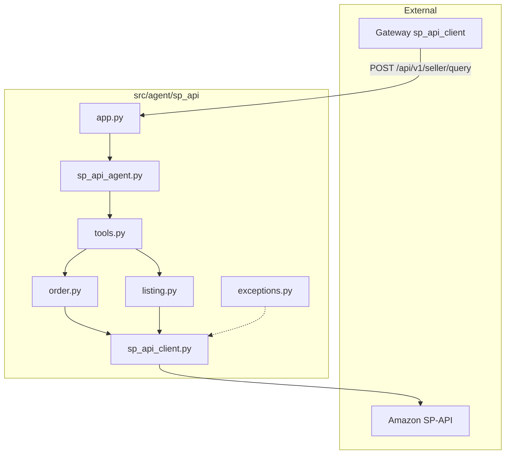

# SP-API Seller Agent

Read-only [Selling Partner API](https://developer-docs.amazon.com/sp-api/) integration: **Orders v0 getOrder** and **Listings Items 2021-08-01 getListingsItem**, exposed through a **ReAct** agent and a **FastAPI** service for the IC-RAG gateway.

## Endpoints

| Method | Path | Description |
|--------|------|-------------|
| GET | `/api/v1/health` | Liveness |
| POST | `/api/v1/seller/query` | Body: `{"query": "...", "session_id": "?"}` returns `{"response": "..."}` or `{"error", "error_type"}` |

## Run (local)

```bash
# From repo root, with PYTHONPATH including project root
python -m uvicorn src.agent.sp_api.app:app --host 0.0.0.0 --port 8003
```

Or use `bin/project_stack.sh start sp_api`, or the full stack via `./bin/ic.sh start --with-ui`.

## Environment variables

| Variable | Required | Description |
|----------|----------|-------------|
| `SP_API_REFRESH_TOKEN` | Yes (live) | LWA refresh token (or use `SP_API_SNB_NA_REFRESH_TOKEN` if that is the only token in `.env`) |
| `SP_API_CLIENT_ID` | Yes (live) | LWA client id |
| `SP_API_CLIENT_SECRET` | Yes (live) | LWA client secret |
| `SP_API_SELLER_ID` | For listings | Selling partner id (getListingsItem path); if unset, `SNB_NA_SELLER_ID` is used when present |
| `SP_API_MARKETPLACE_ID` | No | Default marketplace (e.g. `ATVPDKIKX0DER`) |
| `SP_API_ENDPOINT` | No | SP-API host, default `https://sellingpartnerapi-na.amazon.com` |
| `SP_API_TEST_MODE` | No | `true` echoes the query without calling Amazon |
| `SP_API_LLM_PROVIDER` | No | Overrides `UDS_LLM_PROVIDER`; default `ollama` |
| `SP_API_LLM_MODEL` | No | Model name for the agent |
| `SP_API_MAX_ITERATIONS` | No | ReAct cap (default `8`) |

## Chat UI vs. direct script

- **`scripts/test_get_amazon_order.py`** prints raw JSON from getOrder.
- **Chat UI** goes through a ReAct LLM: if the model invents YAML or “order details,” it can disagree with Amazon. The agent now returns **tool-generated YAML only** after a successful `sp_api_get_orders` call, aligned with the same `ok` / `order_id` / `sp_api_response` shape as the test script.
- **getOrder** returns the **order header** only; it does **not** include order line items (no SKU list). Use Orders APIs that expose order items if you need line-level data.

## API notes

- **Orders v0 getOrder** is [deprecated](https://developer-docs.amazon.com/sp-api/reference/getorder) in favor of newer Orders APIs; migration to **Orders v2026-01-01** can be scheduled later.
- **Buyer PII** and other restricted fields require a **Restricted Data Token** (RDT); not implemented in this read-only baseline.
- Batch order and SKU calls are **sequential** and respect per-route token buckets (`/orders/` vs `/listings/`).

## Package layout

| File | Responsibility |
|------|----------------|
| `__init__.py` | Public exports: FastAPI `app`, `SPAPIClient`, `SPAPICredentials`, `SPAPIAuthError` |
| `exceptions.py` | Auth and client error types (e.g. `SPAPIAuthError`) |
| `sp_api_client.py` | LWA access token, per-route rate limits, optional Redis cache, signed GET requests |
| `order.py` | getOrder helpers (single and batch, dedupe, per-item errors) |
| `order_yaml.py` | Format full getOrder JSON as readable YAML for chat output |
| `listing.py` | getListingsItem helpers (single and batch, dedupe, per-item errors) |
| `tools.py` | ReAct `BaseTool` implementations: `sp_api_get_orders`, `sp_api_get_listings` |
| `sp_api_agent.py` | Builds `SpApiReActAgent` (appends full order YAML to answers when needed) |
| `app.py` | FastAPI application: health and seller query endpoint |

## How files relate (call flow)

The IC-RAG gateway HTTP client (`src/gateway/dispatcher/clients/sp_api_client.py`) calls this service. Inside the package, the HTTP layer invokes the ReAct agent; tools call domain modules, which use the shared HTTP client.



## Operations and tests

- Repo-wide operations notes: [docs/OPERATIONS.md](../../../docs/OPERATIONS.md)
- Automated tests: `tests/test_sp_api_order_listing.py`
