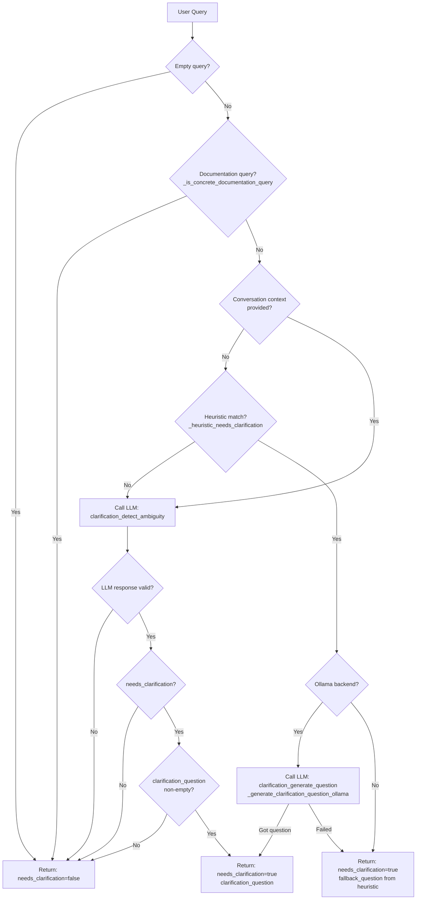

# Clarification Stage

Detects ambiguous or incomplete Amazon seller queries **before** rewriting. When the query lacks critical identifiers (ASIN, Order ID, date range, fee type, store), the gateway asks the user for clarification instead of guessing.

---

## How Clarification Works

Clarification runs as the **first step** of Route LLM, before rewriting and intent classification. It:

1. **Skips** documentation/policy/compliance questions (self-contained, no identifiers needed).
2. **Heuristic path:** Always runs heuristic pattern matching. When heuristic matches (inventory, order, fees, sales without required identifiers):
   - **No context:** Returns clarification (with optional LLM-generated question).
   - **Context exists:** Calls LLM to decide. If LLM says `needs_clarification=false` (user may have provided info in prior turn), trust it. If LLM fails or returns true, return clarification.
3. **Full path:** When heuristic does not match, calls LLM to decide.

On LLM failure or timeout, clarification returns `needs_clarification: false` so the normal flow proceeds.

---

## Workflow Diagram



---

## Function Reference

| Function | Where Used | Purpose |
|----------|------------|---------|
| `check_ambiguity` | `api.py` (rewrite L596, query L818) | Public entry point. Returns `{needs_clarification, clarification_question}`. |
| `_is_concrete_documentation_query` | `check_ambiguity` | Skip clarification for docs/policy/compliance/requirements questions. |
| `_heuristic_needs_clarification` | `check_ambiguity` | Fast path: pattern-match inventory, order, fees, sales without required identifiers. |
| `_generate_clarification_question_ollama` | `check_ambiguity` | When heuristic matches + ollama backend: call LLM to generate contextual question (uses `clarification_generate_question.txt`). |
| `_call_clarification_ollama` | `check_ambiguity` | Full path: call Ollama with `clarification_detect_ambiguity.txt` to decide ambiguity. |
| `_call_clarification_deepseek` | `check_ambiguity` | Full path: call DeepSeek with `clarification_detect_ambiguity.txt` to decide ambiguity. |
| `_build_user_input` | All three LLM callers | Build prompt input: optional conversation history + user query. |
| `_get_timeout` | All three LLM callers | Read `GATEWAY_REWRITE_TIMEOUT` from env. |
| `_strip_markdown_fences` | `_generate_clarification_question_ollama`, `check_ambiguity` | Remove ``` fences from LLM output. |
| `_extract_first_json_object` | `_generate_clarification_question_ollama`, `check_ambiguity` | Extract first `{...}` JSON from text. |

---

## Prompt Files

### clarification_detect_ambiguity.txt

**Effect:** Instructs the LLM to decide whether the query is ambiguous and needs clarification.

- **Used by:** `_call_clarification_ollama`, `_call_clarification_deepseek` (full path).
- **Input:** System prompt + user query + optional conversation history.
- **Output:** JSON only:
  - `{"needs_clarification": true, "clarification_question": "..."}` when ambiguous.
  - `{"needs_clarification": false}` when clear.

**Rules encoded in the prompt:**
- Ask for clarification when query lacks: store/ASIN/SKU, Order ID, date range, fee type, marketplace.
- Do NOT ask when: info already in conversation history, or query is about documentation/policy/compliance/guidelines.
- Examples: "What's my inventory?" → needs_clarification; "What are Amazon's product compliance requirements" → no clarification.

---

### clarification_generate_question.txt

**Effect:** Instructs the LLM to generate a short clarification question when the query is ambiguous.

- **Used by:** `_generate_clarification_question_ollama` (heuristic fast path only).
- **When:** Heuristic has already detected ambiguity (e.g. "Show me the fees"); we want a contextual question instead of the fixed heuristic fallback.
- **Input:** System prompt + user query + optional conversation history.
- **Output:** JSON only: `{"clarification_question": "your short question here or empty"}`.

**Rules encoded in the prompt:**
- Review conversation history first; do not ask for info already provided.
- Possible missing items: store, ASIN, SKU, Order ID, date range, fee type, marketplace, time period.
- If query is clear (alone or with history), output empty string.
- Output only JSON, no extra text.

---

## File Layout

```
clarification/
  README.md                          # This file
  __init__.py                        # Exports check_ambiguity
  clarification.py                   # Implementation
  clarification_detect_ambiguity.txt # Prompt: decide if ambiguous
  clarification_generate_question.txt # Prompt: generate question (heuristic path)
```

---

## Environment

| Variable | Role |
|----------|------|
| `GATEWAY_REWRITE_BACKEND` | `ollama` or `deepseek` |
| `GATEWAY_REWRITE_OLLAMA_URL` | Ollama API URL |
| `GATEWAY_REWRITE_OLLAMA_MODEL` | Model (default `qwen3:1.7b`) |
| `GATEWAY_REWRITE_TIMEOUT` | Timeout in seconds (default 10) |
| `DEEPSEEK_API_KEY` | Required for DeepSeek backend |
