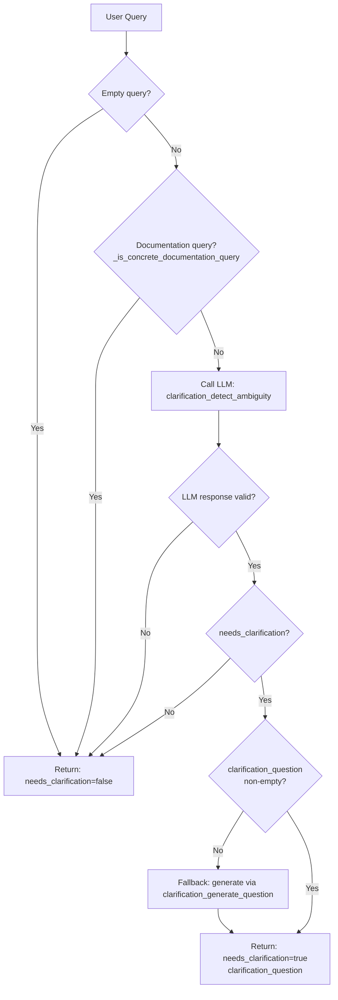

# Clarification Stage

Detects ambiguous or incomplete Amazon seller queries **before** rewriting. When the query lacks critical identifiers or has referential ambiguity, the gateway asks the user for clarification instead of guessing.

**Implementation:** 方案一 统一 LLM (see `tasks/clarification_unified_llm_plan.md`).

---

## How Clarification Works

Clarification runs as the **first step** of Route LLM, before rewriting and intent classification. It:

1. **Skips** documentation/policy/compliance questions (self-contained, no identifiers needed).
2. **Single LLM path:** Calls `clarification_detect_ambiguity.txt` to decide if clarification is needed.
   - Covers: referent not in history, multiple referents, semantically vague query, conflict with history, missing identifiers.
   - General knowledge (FBA, ASIN, compliance) -> no clarification.
3. **Fallback:** When LLM returns `needs_clarification=true` but empty question, calls `clarification_generate_question.txt` to generate one.

On LLM failure or timeout, clarification returns `needs_clarification: false` so the normal flow proceeds.

---

## Workflow Diagram



---

## Ambiguity Types (from prompt)

| Type | Description |
|------|--------------|
| Referent not in history | Thing mentioned in query cannot be found in history |
| Multiple referents | Multiple candidates in history, query does not specify which |
| Semantically vague | Query has no specific reference (e.g. "what is the plan", "how does it work") |
| Conflict with history | Query conflicts with what was discussed in history |
| Missing identifiers | Lacks store/ASIN/Order ID/date/fee type and history does not provide |

**No clarification:** General knowledge (FBA, ASIN, compliance), info already in history, documentation/policy questions.

---

## Function Reference

| Function | Where Used | Purpose |
|----------|------------|---------|
| `check_ambiguity` | `api.py` (rewrite L596, query L818) | Public entry point. Returns `{needs_clarification, clarification_question}`. |
| `_is_concrete_documentation_query` | `check_ambiguity` | Skip clarification for docs/policy/compliance/requirements questions. |
| `_generate_clarification_question_ollama` | `check_ambiguity` | Fallback: generate question when LLM returns needs_clarification=true but empty question. |
| `_call_clarification_ollama` | `check_ambiguity` | Call Ollama with `clarification_detect_ambiguity.txt` to decide ambiguity. |
| `_build_user_input` | LLM callers | Build prompt input: optional conversation history + user query. |
| `_get_timeout` | LLM callers | Read `GATEWAY_CLARIFICATION_TIMEOUT` from env. |
| `_strip_markdown_fences` | `_generate_clarification_question_ollama`, `check_ambiguity` | Remove ``` fences from LLM output. |
| `_extract_first_json_object` | `_generate_clarification_question_ollama`, `check_ambiguity` | Extract first `{...}` JSON from text. |

---

## Prompt Files

### clarification_detect_ambiguity.txt

**Effect:** Instructs the LLM to decide whether the query is ambiguous and needs clarification.

- **Used by:** `_call_clarification_ollama`.
- **Input:** System prompt + user query + optional conversation history.
- **Output:** JSON only:
  - `{"needs_clarification": true, "clarification_question": "..."}` when ambiguous.
  - `{"needs_clarification": false}` when clear.

**Rules encoded in the prompt:**
- Ask when: referent not in history, multiple referents, semantically vague, conflict with history, missing identifiers.
- Do NOT ask when: general knowledge (FBA, ASIN, compliance), info already in history, documentation/policy questions.

---

### clarification_generate_question.txt

**Effect:** Instructs the LLM to generate a short clarification question when the query is ambiguous.

- **Used by:** `_generate_clarification_question_ollama` (fallback when detect_ambiguity returns empty question).
- **Input:** System prompt + user query + optional conversation history.
- **Output:** JSON only: `{"clarification_question": "your short question here or empty"}`.

---

## File Layout

```
clarification/
  README.md                          # This file
  __init__.py                        # Exports check_ambiguity
  clarification.py                   # Implementation
  clarification_detect_ambiguity.txt # Prompt: decide if ambiguous
  clarification_generate_question.txt # Prompt: generate question (fallback)
```

---

## Environment

All clarification env vars are **required** (no defaults). Missing values raise `ValueError`.

| Variable | Role |
|----------|------|
| `GATEWAY_CLARIFICATION_ENABLED` | Enable/disable clarification (`true`/`false`) |
| `GATEWAY_CLARIFICATION_BACKEND` | `ollama` or `deepseek` (required) |
| `GATEWAY_CLARIFICATION_TIMEOUT` | Timeout in seconds (required) |
| `GATEWAY_CLARIFICATION_MODEL` | Model name (required; e.g. `deepseek-chat` or `llama3.2:latest`) |
| `GATEWAY_CLARIFICATION_OLLAMA_URL` | Ollama generate endpoint (required; e.g. `http://localhost:11434/api/generate`) |
| `GATEWAY_CLARIFICATION_DEEPSEEK_BASE_URL` | DeepSeek API base URL (required when backend=deepseek; e.g. `https://api.deepseek.com`) |
| `DEEPSEEK_API_KEY` | DeepSeek API key (required when backend=deepseek) |
| `GATEWAY_CLARIFICATION_MEMORY_ROUNDS` | Conversation rounds for clarification context |
